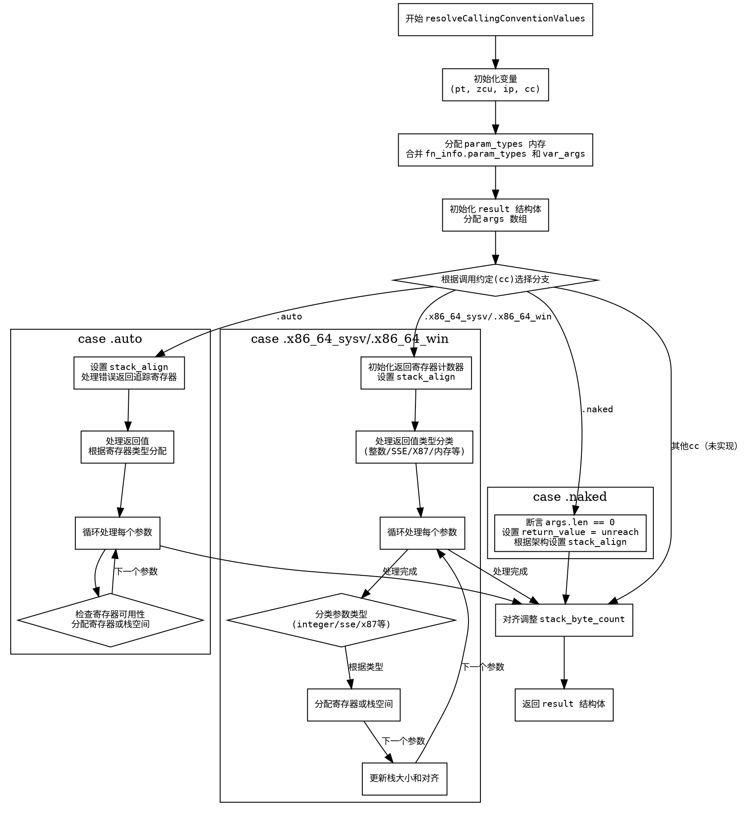

嗯，我需要为这个Zig函数绘制一个流程图。首先，我得仔细读一下这个函数的代码，理解它的结构和流程。

函数名是resolveCallingConventionValues，看起来是处理调用约定的，包括参数传递和返回值的位置。参数有self、fn_info、var_args、stack_frame_base，返回的是CallMCValues结构。

首先，函数开始处定义了一些变量，比如pt、zcu、ip、cc等。然后有一个ExpectedContents的结构体，接着分配内存给param_types，将fn_info的参数类型和可变参数合并进去。之后初始化result变量，包含args数组、return_value等字段，可能后续填充这些字段。

接下来是一个大的switch语句，根据cc（调用约定）的不同来处理不同的情况。比如naked、x86_64_sysv、x86_64_win、auto等分支。每个分支里处理返回值和参数的分配，可能涉及到寄存器、栈位置等。

对于每个case，比如naked的情况，直接设置返回值为unreach，栈对齐根据架构决定。而x86_64_sysv和x86_64_win则更复杂，需要处理返回值的分类（整数寄存器、SSE寄存器等），参数的寄存器分配，以及栈空间的计算。auto分支可能处理Zig特有的调用约定，同样要考虑寄存器和栈的使用。

在参数处理部分，循环遍历每个参数类型，根据不同的调用约定决定参数存放在寄存器还是栈上，可能需要调整栈的对齐和大小。同时，处理返回值的寄存器分配，如使用整数寄存器或SSE寄存器，或者间接通过内存传递。

流程图中需要体现这些分支结构，特别是主switch语句的不同case，以及每个case内部的逻辑，如返回值的处理、参数的循环处理、栈空间的计算等。需要注意条件判断、循环结构，以及可能出现的错误处理（如errdefer）。

可能的难点在于如何将复杂的条件分支和循环结构用图形化的方式清晰表达，尤其是嵌套的结构。比如在x86_64_sysv分支中，处理返回值的循环分类，以及参数处理时的多个条件判断和循环。

需要确保每个分支的路径都被正确表示，例如naked分支直接返回，而其他分支可能有更多的步骤。同时，注意函数末尾对stack_byte_count进行对齐调整，并返回结果。

总结步骤：
1. 函数入口，初始化变量。
2. 分配param_types内存，合并参数。
3. 初始化result结构体。
4. 根据cc的不同，进入不同的处理分支：
   a. naked：直接设置返回值和栈对齐。
   b. x86_64_sysv/x86_64_win：处理返回值的分类，参数寄存器和栈分配。
   c. auto：处理Zig调用约定，分配寄存器和栈空间。
5. 每个分支内处理参数循环，决定每个参数的位置。
6. 最终调整栈对齐，返回result。

在流程图中，需要将这些步骤用图形表示，包括判断节点、循环节点、处理步骤等，确保逻辑清晰，结构正确。
================================================
