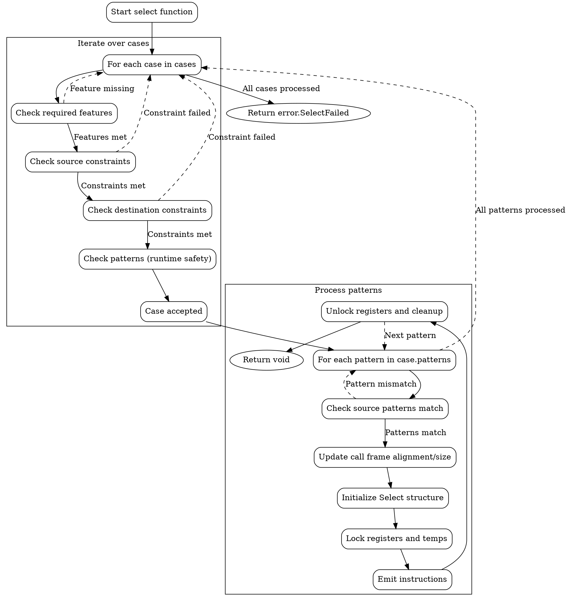

好的，我需要为提供的Zig函数`select`生成一个Graphviz的流程图。首先，我得仔细理解这个函数的结构和逻辑流程。

函数`select`接收多个参数，包括代码生成器`cg`、目标临时变量`dst_temps`、类型`dst_tys`、源临时变量`src_temps`和多个`cases`。它遍历每个case，检查各种约束条件，然后处理每个case中的模式（patterns），生成相应的代码。

首先，函数开始于遍历所有的`cases`。对于每个case，它检查所需的CPU特性是否满足，源和目标约束是否符合。如果某个条件不满足，就跳过当前case。接着，处理每个case中的模式，调整调用帧的对齐和大小，初始化选择结构`s`，处理临时变量和寄存器锁定，生成代码，最后进行清理工作，如解锁寄存器和释放临时变量。

接下来，我需要将这些步骤转化为流程图中的节点和边。每个主要的循环和条件分支都需要成为流程图中的决策节点。例如，遍历cases是一个循环，每个case内部又有多个循环和条件检查。需要特别注意`continue :cases`和`continue :patterns`这样的控制流，它们会导致跳转到外层循环的继续。

处理调用帧对齐、初始化结构`s`、处理临时变量和寄存器锁定，以及生成代码的步骤应作为不同的处理节点。然后，每个模式处理完成后，会进行资源释放和返回，或者继续下一个模式。

需要注意的是，流程图中需要正确表示循环结构、条件判断、并行处理（如多个for循环）以及可能的错误返回。此外，函数末尾的`return error.SelectFailed`表示当所有case都不满足时的错误返回。

在绘制Graphviz图时，使用节点表示处理步骤，菱形表示条件判断，箭头表示流程方向。需要确保所有的循环和条件分支正确连接，避免遗漏任何可能的路径。

最后，验证流程图的逻辑是否与代码一致，确保每个判断和处理步骤都正确反映在图中。
================================================
