好的，我现在需要帮助用户根据提供的Zig代码生成一个Graphviz的流程图。首先，我需要仔细阅读并理解这段代码的结构和逻辑。

这个函数名为`next`，属于一个反汇编器（Disassembler），返回一个`Instruction`或者错误。函数的主要逻辑是根据不同的操作码编码（`enc.data.op_en`）来处理不同的指令格式。每个`case`分支处理一种特定的操作数编码类型，比如`.z`、`.o`、`.zo`等等，每个分支构造并返回相应的指令。

接下来，我需要确定如何将这些条件分支转化为流程图的结构。通常，流程图开始于函数的入口点，然后根据不同的条件分支展开。每个条件分支对应一个不同的处理路径，最后汇聚到共同的出口点，即返回指令。

考虑到代码中有多个`switch case`，每个case对应不同的处理逻辑，我需要将这些case作为不同的节点。函数开始时调用`parsePrefixes`，如果出错则返回null或错误。然后解析编码（`parseEncoding`），如果失败则返回错误。之后根据`enc.data.op_en`的不同值进入不同的处理分支，每个分支可能包含进一步的解析步骤，如解析ModRM字节、SIB字节、立即数等，最后调用`inst`函数生成指令并返回。

需要注意的地方是，有些分支内部还有条件判断，比如在处理`.m`, `.mi`等分支时，会检查`modrm.direct()`，这会导致子分支。这时候需要在流程图中体现这些嵌套的条件结构。

另外，代码末尾有一些未实现的case（如`.rm0`, `.vm`等），这些应该作为单独的节点，可能标记为“未实现”或“TODO”。

在绘制流程图时，需要确保每个条件分支正确连接，并且流程的逻辑顺序与代码一致。可能需要使用判断节点（菱形）来表示条件分支，处理节点（矩形）表示具体操作，箭头表示流程方向。

现在，我需要将这些逻辑步骤转化为Graphviz的DOT语言结构。首先定义各个节点，然后根据代码逻辑连接它们。例如：

- 开始节点：函数入口。
- 解析前缀（parsePrefixes），错误处理。
- 解析编码（parseEncoding），错误处理。
- 主switch节点，根据`enc.data.op_en`分支出多个case。
- 每个case内部的处理步骤，可能包含子条件判断。
- 最终生成指令并返回。

需要确保所有可能的路径都被覆盖，包括错误处理和正常返回。同时，要注意代码中的返回语句可能出现在各个分支中，因此每个分支可能直接指向出口节点。

最后，将整个结构用DOT语法描述出来，确保语法正确，节点和边正确对应代码逻辑。
================================================

```dot
digraph flowchart {
    node [fontname="Helvetica", shape=rect, style=rounded];
    edge [fontname="Helvetica"];
    
    start [label="Start next()"];
    parse_prefixes [label="Parse prefixes (parsePrefixes)"];
    parse_enc [label="Parse encoding (parseEncoding)"];
    check_op_en [label="switch(enc.data.op_en)", shape=diamond];
    end [label="Return Instruction/Error"];
    error_end [label="Return Error", shape=rect];
    null_end [label="Return null", shape=rect];
    todo [label="Unreachable (TODO)", shape=rect];
    
    // 主流程
    start -> parse_prefixes;
    parse_prefixes -> parse_enc [label="Success"];
    parse_prefixes -> null_end [label="error.EndOfStream"];
    parse_prefixes -> error_end [label="Other errors"];
    parse_enc -> check_op_en [label="Success"];
    parse_enc -> error_end [label="UnknownOpcode"];
    
    // 主switch分支
    check_op_en -> case_z [label=".z"];
    check_op_en -> case_o [label=".o"];
    check_op_en -> case_zo [label=".zo"];
    check_op_en -> case_oz [label=".oz"];
    check_op_en -> case_oi [label=".oi"];
    check_op_en -> case_i_d [label=".i/.d"];
    check_op_en -> case_zi [label=".zi"];
    check_op_en -> case_ii [label=".ii"];
    check_op_en -> case_ia [label=".ia"];
    check_op_en -> case_m_mi [label=".m/.mi/..."];
    check_op_en -> case_fd [label=".fd"];
    check_op_en -> case_td [label=".td"];
    check_op_en -> case_mr_mri [label=".mr/.mri/..."];
    check_op_en -> case_rm_rmi [label=".rm/.rmi"];
    check_op_en -> todo [label=".rm0/.vm/..."];
    
    // 各case处理逻辑
    subgraph cluster_cases {
        node [shape=rect];
        
        // .z分支
        case_z [label="inst(enc, {})"];
        case_z -> end;
        
        // .o分支
        case_o [label="Parse reg_low_enc\nBuild op1 with reg"];
        case_o -> end;
        
        // .zo分支
        case_zo [label="Parse reg_low_enc\nBuild op1+op2 with reg"];
        case_zo -> end;
        
        // .oz分支
        case_oz [label="Parse reg_low_enc\nBuild op1+op2 with reg"];
        case_oz -> end;
        
        // .oi分支
        case_oi [label="Parse reg_low_enc + imm\nBuild op1+op2"];
        case_oi -> end;
        
        // .i/.d分支
        case_i_d [label="Parse imm\nBuild op1 with imm"];
        case_i_d -> end;
        
        // .zi分支
        case_zi [label="Parse imm\nBuild op1+op2"];
        case_zi -> end;
        
        // .ii分支
        case_ii [label="Parse imm1 + imm2\nBuild op1+op2"];
        case_ii -> end;
        
        // .ia分支
        case_ia [label="Parse imm\nBuild op1+eax"];
        case_ia -> end;
        
        // .m/.mi/...分支
        subgraph cluster_m_group {
            node [shape=rect];
            
            case_m_mi [label="Parse ModRm\nCheck direct()", shape=diamond];
            m_direct [label="Direct mode\nBuild op1+op2"];
            m_indirect [label="Indirect mode\nParse SIB/disp\nCheck rip()", shape=diamond];
            m_rip [label="Build RIP-relative mem"];
            m_sib [label="Build SIB mem"];
            
            case_m_mi -> m_direct [label="Yes"];
            case_m_mi -> m_indirect [label="No"];
            m_direct -> end;
            m_indirect -> m_rip [label="Yes"];
            m_indirect -> m_sib [label="No"];
            m_rip -> end;
            m_sib -> end;
        }
        
        // .fd/.td分支
        case_fd [label="Parse seg + offset\nBuild moffs"];
        case_fd -> end;
        case_td [label="Parse seg + offset\nBuild moffs"];
        case_td -> end;
        
        // .mr/.mri/...分支
        subgraph cluster_mr_group {
            node [shape=rect];
            
            case_mr_mri [label="Parse ModRm\nCheck direct()", shape=diamond];
            mr_direct [label="Direct mode\nBuild reg+reg"];
            mr_indirect [label="Indirect mode\nParse SIB/disp\nCheck rip()", shape=diamond];
            mr_rip [label="Build RIP-relative mem"];
            mr_sib [label="Build SIB mem"];
            
            case_mr_mri -> mr_direct [label="Yes"];
            case_mr_mri -> mr_indirect [label="No"];
            mr_direct -> end;
            mr_indirect -> mr_rip [label="Yes"];
            mr_indirect -> mr_sib [label="No"];
            mr_rip -> end;
            mr_sib -> end;
        }
        
        // .rm/.rmi分支
        subgraph cluster_rm_group {
            node [shape=rect];
            
            case_rm_rmi [label="Parse ModRm\nCheck direct()", shape=diamond];
            rm_direct [label="Direct mode\nBuild reg+reg"];
            rm_indirect [label="Indirect mode\nParse SIB/disp\nCheck rip()", shape=diamond];
            rm_rip [label="Build RIP-relative mem"];
            rm_sib [label="Build SIB mem"];
            
            case_rm_rmi -> rm_direct [label="Yes"];
            case_rm_rmi -> rm_indirect [label="No"];
            rm_direct -> end;
            rm_indirect -> rm_rip [label="Yes"];
            rm_indirect -> rm_sib [label="No"];
            rm_rip -> end;
            rm_sib -> end;
        }
    }
    
    // 公共出口
    {rank=same; end; error_end; null_end; todo}
}
```
