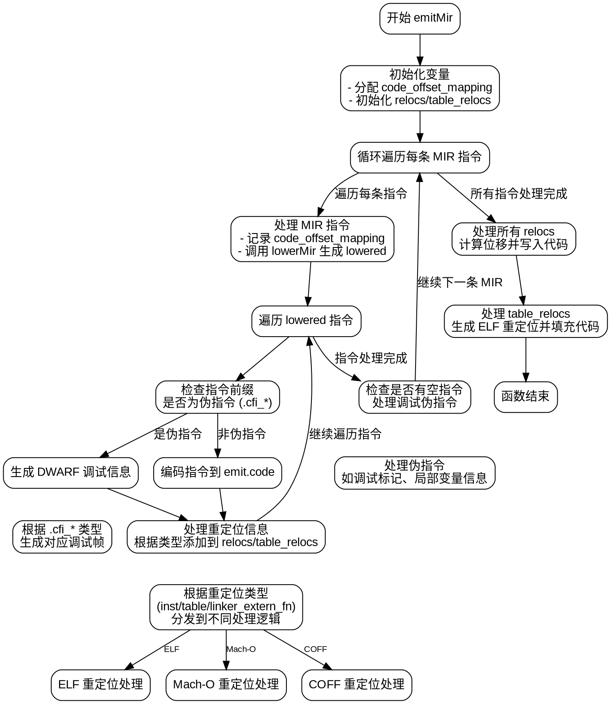

嗯，我需要分析这个Zig函数`emitMir`并画出它的流程图。首先，我得先理解这个函数的结构和各个部分的作用。看起来这个函数主要负责生成机器代码和处理相关的重定位信息。

首先，函数开始处分配了一些内存，比如`code_offset_mapping`，然后初始化了一些用于重定位的数组`relocs`和`table_relocs`。接下来，有一个循环遍历所有的MIR指令。对于每条指令，会调用`lower.lowerMir`进行处理，生成对应的低级指令`lowered`。

在处理每条低级指令时，首先检查是否是调试信息相关的伪指令（`.cfi_*`），如果是的话，根据不同的调试输出格式（如DWARF）生成相应的调试帧信息。如果不是伪指令，则对指令进行编码，写入到`emit.code`中。

然后处理重定位信息，根据不同的目标类型（如`.inst`、`.table`、`.linker_extern_fn`等），将重定位信息添加到对应的数组中。这里有很多条件判断，针对不同的二进制文件格式（ELF、Mach-O、COFF等）有不同的处理方式。

之后，处理没有生成实际指令的MIR伪指令，比如调试信息的开始和结束标记、局部变量的调试信息等。这些部分会根据不同的调试输出格式生成相应的调试信息。

在处理完所有指令后，处理之前收集的重定位信息`relocs`，计算位移并写入到代码缓冲区中。最后，处理表重定位`table_relocs`，针对ELF格式生成相应的重定位条目，并将填充对齐后的数据追加到代码缓冲区中。

现在，我需要将这些步骤转化为流程图。流程图的开始是函数的入口，然后按照顺序处理各个部分：初始化变量、循环处理每条MIR指令、处理伪指令和编码指令、处理重定位、处理表重定位等。每个判断条件需要分支，比如不同的调试输出格式、不同的二进制文件格式等。

需要注意的是，流程图中需要正确表示循环结构，比如遍历MIR指令的循环，以及处理重定位时的条件分支。同时，不同的重定位类型和文件格式处理需要不同的分支路径。

可能的结构如下：

1. 函数开始
2. 初始化变量（code_offset_mapping，relocs，table_relocs）
3. 循环遍历每条MIR指令
   a. 记录code_offset_mapping
   b. 调用lowerMir生成lowered指令
   c. 遍历lowered指令中的每个指令
      i. 处理伪指令（如.cfi_*）生成调试信息
      ii. 否则，编码指令到emit.code
      iii. 处理重定位信息，根据类型添加到relocs或table_relocs
   d. 处理没有生成指令的MIR伪指令（调试信息等）
4. 处理所有relocs，写入位移到代码
5. 处理table_relocs，生成ELF重定位并填充代码
6. 函数结束

需要确保每个条件分支都正确表示，比如不同的调试输出（dwarf, plan9, none）和不同的二进制文件类型（ELF、Mach-O、COFF等）。可能有些部分比较复杂，需要分层次来画，避免过于拥挤。

最终，流程图应清晰展示函数的执行流程，包括循环、条件判断和处理不同情况的子流程。
================================================
