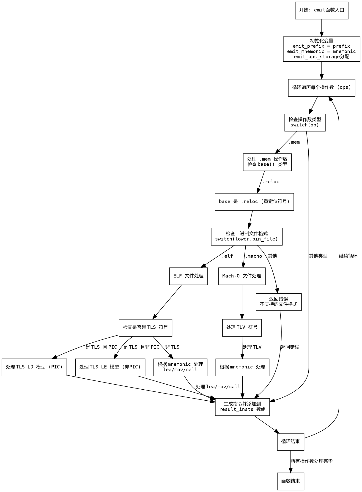

好的，我现在需要根据用户提供的Zig代码中的`emit`函数来绘制流程图。首先，我需要理解这个函数的结构和逻辑流程，这样才能准确地画出流程图。

首先，函数`emit`接收一个`Lower`结构体的指针，以及`prefix`、`mnemonic`和`ops`参数。函数的主要任务似乎是生成一些指令，并将它们添加到`lower.result_insts`数组中。整个流程可能涉及条件判断、循环以及不同的二进制文件格式处理（如ELF和Mach-O）。

让我逐步分析代码的结构：

1. **变量初始化**：首先，函数将传入的参数复制到局部变量`emit_prefix`、`emit_mnemonic`和`emit_ops_storage`中。这里有一个循环，遍历`ops`数组，处理每个操作数（Operand）。

2. **处理每个操作数**：对于每个操作数，代码使用`switch`语句检查其类型。当操作数是内存操作（`.mem`）时，进一步检查其基址（`base()`）。如果基址是重定位符号（`.reloc`），则进入复杂的处理逻辑。

3. **ELF文件处理**：如果二进制文件是ELF格式，处理线程本地存储（TLS）变量。根据是否启用位置无关代码（PIC），生成不同的指令和重定位条目。这里涉及多个条件分支，比如处理TLS的LD模型或LE模型，以及不同的指令（如`lea`、`mov`、`call`）。

4. **Mach-O文件处理**：如果是Mach-O格式，处理类似的逻辑，但具体实现有所不同，比如处理TLV（Thread-Local Variables）和生成相应的`mov`和`call`指令。

5. **其他二进制格式处理**：如果既不是ELF也不是Mach-O，则返回错误。

6. **生成最终指令**：在处理完所有操作数后，将生成的指令添加到`result_insts`数组中。

在绘制流程图时，需要注意以下几点：

- **主要分支**：根据不同的二进制格式（ELF、Mach-O）分支处理。
- **条件判断**：比如`lower.pic`的值影响生成的指令。
- **循环结构**：遍历`ops`数组的每个元素。
- **错误处理**：当遇到不支持的二进制格式时返回错误。

需要将每个判断点和循环结构清晰地表示出来，确保流程图的每个节点和边正确反映代码的执行路径。此外，注意处理重定位符号时的不同情况，以及不同指令（如`lea`变为`mov`）的变化。

可能会遇到的难点包括正确表示嵌套的switch语句和条件判断，以及确保所有可能的执行路径都被覆盖。需要仔细检查每个条件分支，并确保流程图的每个决策点都有对应的分支。

总结步骤：

1. **开始**：函数入口。
2. **初始化变量**。
3. **遍历操作数循环**。
4. **处理每个操作数的类型和基址**。
5. **根据二进制格式分支到ELF或Mach-O处理**。
6. **处理ELF的TLS逻辑**，包括PIC和非PIC情况。
7. **处理Mach-O的TLV逻辑**。
8. **处理其他格式的错误返回**。
9. **生成指令并添加到结果数组**。
10. **结束**：函数退出。

在绘制流程图时，使用菱形表示判断节点，矩形表示处理步骤，箭头表示流程方向。确保每个条件分支都有明确的“是”和“否”路径，循环结构正确闭合。
================================================
