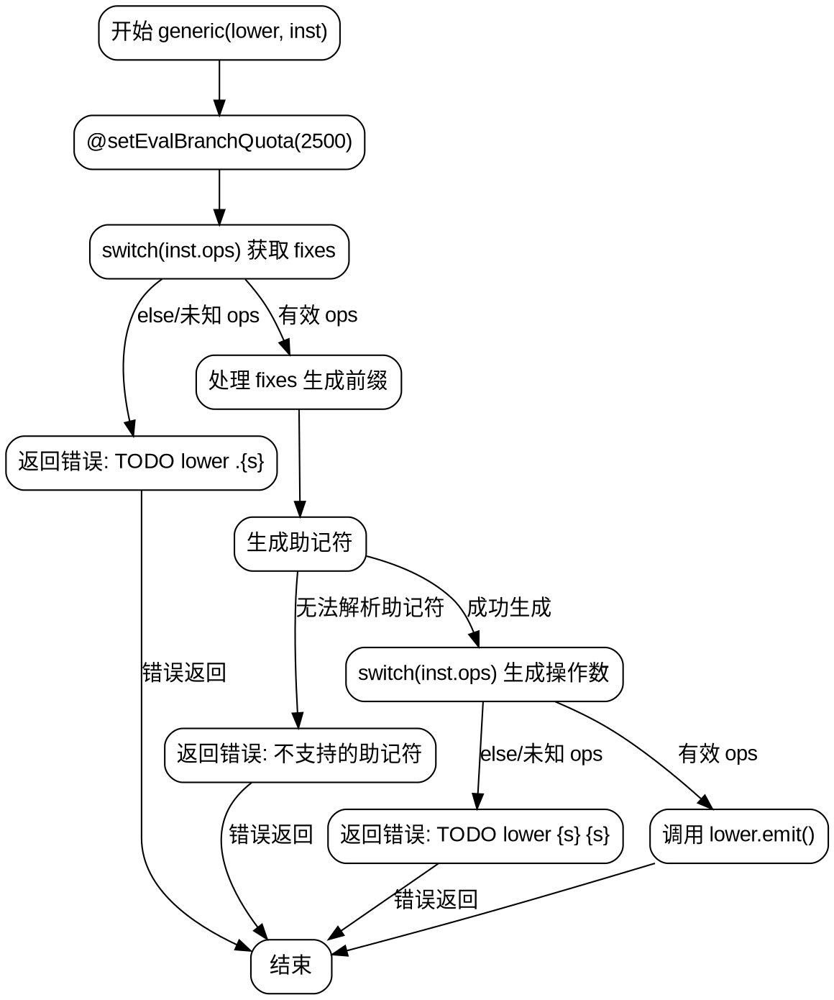

好的，我需要为给定的Zig函数绘制流程图。首先，我需要理解这个函数的结构和逻辑。

函数名为`generic`，参数是`lower`指针和`inst`。首先，设置了一个分支评估配额，然后根据`inst.ops`的不同值获取`fixes`。这里有一个大的switch语句处理各种`inst.ops`的情况，如果遇到未处理的类型，返回错误。

接下来，函数尝试调用`lower.emit`，传入三个参数：前缀、助记符和操作数。前缀部分通过另一个switch处理`fixes`，提取可能的空格前的部分作为前缀。助记符部分通过组合模式生成，如果找不到对应的枚举值，返回错误。操作数部分又是一个大的switch，根据不同的`inst.ops`生成不同的操作数数组。

整个函数的逻辑分为几个主要部分：
1. 处理`inst.ops`获取`fixes`。
2. 处理`fixes`生成前缀。
3. 生成助记符。
4. 根据`inst.ops`生成操作数数组。
5. 调用`lower.emit`。

对于流程图，我需要将这些步骤分解成节点，并根据条件分支连接它们。注意错误处理和返回路径。

可能的节点包括：
- 开始节点
- 设置分支配额
- 第一个switch处理`inst.ops`获取`fixes`
  - 各个case分支
  - 默认分支返回错误
- 处理`fixes`生成前缀的switch
- 生成助记符的逻辑，包括可能的错误返回
- 第二个switch生成操作数数组
  - 各个case分支
  - 默认返回错误
- 调用`lower.emit`
- 错误处理节点

需要注意条件判断和循环结构，比如生成助记符时使用了comptime变量和循环，但在流程图中可能需要简化表示，因为编译时执行的部分可能不需要运行时流程图。

另外，函数中有多个可能返回错误的地方，这些都需要在流程图中体现为终止节点或错误处理路径。

现在需要将这些步骤组织成graphviz的dot格式，使用节点和边表示流程，条件分支用不同的边标记。
================================================
