好的，我需要为提供的Zig函数`lowerMir`绘制一个流程图。首先，我需要理解这个函数的结构和逻辑流程。

函数`lowerMir`接受一个`Lower`结构体指针和一个`Mir.Inst.Index`参数，返回一个包含指令和重定位的结构体。函数的主要部分是一个大的switch语句，根据`inst.tag`和`inst.ops`来处理不同的伪指令（pseudo instructions），生成相应的机器指令和重定位信息。

首先，函数初始化一些结果变量，并在错误处理中使用`errdefer`来重置这些变量。然后，使用`defer`在函数返回前重置长度变量。接着，获取当前指令`inst`，并根据其`tag`进行分支处理。对于`.pseudo`标签，进一步根据`inst.ops`的值进入不同的处理分支，每个分支可能生成多个指令（如`cmovnz`, `cmovnp`, `setz`, `@"and"`等）。有些分支包含循环（如`.pseudo_probe_adjust_unrolled_ri_s`中的while循环），还有些处理CFI（Call Frame Information）指令和调试信息。

绘制流程图时，需要涵盖以下步骤：
1. 函数开始，初始化变量。
2. 错误处理部分。
3. 获取指令并进入主switch判断。
4. 根据不同的tag和ops处理各分支，包括条件判断、循环、指令生成等。
5. 返回结果。

需要注意各个分支的条件和处理逻辑，特别是循环结构和错误处理的位置。同时，确保所有可能的路径都被覆盖，包括默认情况和未处理的情况（如`else => unreachable`）。

接下来，我需要将这些逻辑步骤转化为Graphviz的节点和边。每个主要步骤作为一个节点，条件判断作为菱形节点，循环结构用循环箭头表示。确保流程图的逻辑清晰，正确反映代码的执行顺序和分支情况。
================================================

```dot
digraph flowchart {
    node [shape=rectangle, style="rounded", fontname="Arial"];
    edge [fontname="Arial"];

    start [label="开始 lowerMir 函数"];
    init_vars [label="初始化结果变量\n(lower.result_insts, lower.result_relocs)"];
    errdefer [label="设置错误处理 (errdefer)\n重置结果变量"];
    reset_lengths [label="defer 重置结果长度\n(lower.result_insts_len, lower.result_relocs_len)"];
    get_inst [label="获取当前指令\nconst inst = lower.mir.instructions.get(index)"];
    switch_tag [label="switch (inst.tag)", shape=diamond];
    pseudo_case [label="case .pseudo\n进入伪指令处理"];
    switch_ops [label="switch (inst.ops)", shape=diamond];
    handle_pseudo_cmov_z_and_np_rr [label="生成 cmovnz + cmovnp 指令"];
    handle_pseudo_cmov_nz_or_p_rr [label="生成 cmovnz + cmovp 指令"];
    handle_pseudo_cmov_nz_or_p_rm [label="生成 cmovnz + cmovp 内存操作"];
    handle_pseudo_set_z_and_np [label="生成 setz + setnp + and 指令"];
    handle_pseudo_set_nz_or_p [label="生成 setnz + setp + or 指令"];
    handle_pseudo_j_z_and_np [label="生成 jnz + jnp 跳转"];
    handle_pseudo_j_nz_or_p [label="生成 jnz + jp 跳转"];
    handle_probe_align [label="生成 test + jz + lea + test + jmp\n栈探针对齐"];
    handle_probe_unrolled [label="while 循环生成多组 test 指令\n栈探针展开调整"];
    handle_probe_setup [label="生成 mov + sub\n栈探针设置"];
    handle_probe_loop [label="生成 test + sub + jae\n栈探针循环调整"];
    handle_cfi_directives [label="处理 CFI 指令\n(.cfi_def_cfa, .cfi_offset 等)"];
    handle_dbg_directives [label="处理调试伪指令\n(dbg_prologue_end, dbg_line 等)"];
    default_case [label="其他情况\nunreachable 或空操作"];
    return_result [label="返回结果\n.insts 和 .relocs 切片"];

    start -> init_vars;
    init_vars -> errdefer;
    errdefer -> reset_lengths;
    reset_lengths -> get_inst;
    get_inst -> switch_tag;

    switch_tag -> pseudo_case [label=".pseudo"];
    switch_tag -> handle_generic [label="其他标签"];
    handle_generic [label="调用 lower.generic(inst)", shape=box];
    handle_generic -> return_result;

    pseudo_case -> switch_ops;
    switch_ops -> handle_pseudo_cmov_z_and_np_rr [label=".pseudo_cmov_z_and_np_rr"];
    switch_ops -> handle_pseudo_cmov_nz_or_p_rr [label=".pseudo_cmov_nz_or_p_rr"];
    switch_ops -> handle_pseudo_cmov_nz_or_p_rm [label=".pseudo_cmov_nz_or_p_rm"];
    switch_ops -> handle_pseudo_set_z_and_np [label=".pseudo_set_z_and_np_r/m"];
    switch_ops -> handle_pseudo_set_nz_or_p [label=".pseudo_set_nz_or_p_r/m"];
    switch_ops -> handle_pseudo_j_z_and_np [label=".pseudo_j_z_and_np_inst"];
    switch_ops -> handle_pseudo_j_nz_or_p [label=".pseudo_j_nz_or_p_inst"];
    switch_ops -> handle_probe_align [label=".pseudo_probe_align_ri_s"];
    switch_ops -> handle_probe_unrolled [label=".pseudo_probe_adjust_unrolled_ri_s"];
    switch_ops -> handle_probe_setup [label=".pseudo_probe_adjust_setup_rri_s"];
    switch_ops -> handle_probe_loop [label=".pseudo_probe_adjust_loop_rr"];
    switch_ops -> handle_cfi_directives [label=".pseudo_cfi_*"];
    switch_ops -> handle_dbg_directives [label=".pseudo_dbg_*"];
    switch_ops -> default_case [label="其他 .pseudo 分支"];

    handle_pseudo_cmov_z_and_np_rr -> return_result;
    handle_pseudo_cmov_nz_or_p_rr -> return_result;
    handle_pseudo_cmov_nz_or_p_rm -> return_result;
    handle_pseudo_set_z_and_np -> return_result;
    handle_pseudo_set_nz_or_p -> return_result;
    handle_pseudo_j_z_and_np -> return_result;
    handle_pseudo_j_nz_or_p -> return_result;
    handle_probe_align -> return_result;
    handle_probe_unrolled -> return_result;
    handle_probe_setup -> return_result;
    handle_probe_loop -> return_result;
    handle_cfi_directives -> return_result;
    handle_dbg_directives -> return_result;
    default_case -> return_result;

    // 特殊结构：循环处理
    handle_probe_unrolled -> handle_probe_unrolled [label="offset += page_size", style=dashed];
}
```
