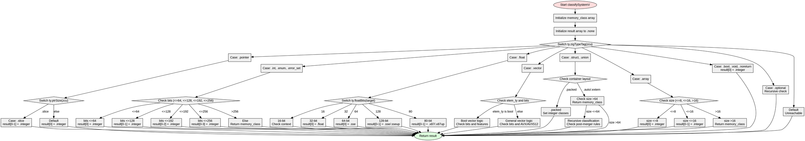

嗯，我需要为这个Zig函数`classifySystemV`绘制一个流程图。首先，我得仔细阅读代码，理解它的逻辑结构。这个函数似乎根据不同的类型（如指针、整数、浮点数等）对参数进行分类，返回一个包含8个`Class`元素的数组。

首先，函数开始处初始化了一个`memory_class`数组，大部分是`.none`，只有第一个是`.memory`。然后声明了一个结果数组`result`，初始化为8个`.none`。接下来是一个大的switch语句，根据不同的类型标签（`ty.zigTypeTag(zcu)`）处理不同的情况。

比如，处理指针类型时，如果是切片类型（slice），则设置前两个元素为`.integer`；否则只设置第一个。对于整数、枚举、错误集合类型，根据位数不同，设置不同数量的`.integer`类。浮点数类型根据位数不同，分配到不同的类别，如`.float`、`.sse`等。向量类型（vector）的处理更复杂，涉及元素类型、位数以及目标CPU的特性（如AVX支持）来判断。

结构体和联合体的处理需要考虑大小、对齐和布局，如果超过一定大小或不符合对齐要求，就返回`memory_class`。数组类型根据大小分配不同的类，超过16字节则返回内存类。

在绘制流程图时，需要将每个分支条件清晰地表示出来。例如，主switch的分支对应不同的类型标签，每个分支内部又有子条件判断。对于结构体和联合体，还需要处理它们的子元素分类，并检查最终的分类是否符合规则（如是否有`.memory`或无效的`.x87up`出现）。

需要注意循环和递归的情况，比如结构体和联合体可能递归调用`classifySystemV`来处理其成员。此外，某些条件依赖于目标CPU的特性（如AVX、AVX512F），这需要在流程图中作为条件分支标注。

最后，确保所有可能的路径都被覆盖，并且流程图的连接正确，没有遗漏任何条件或返回点。可能需要将复杂的条件拆分为多个节点，以保持图表的清晰度。
================================================
