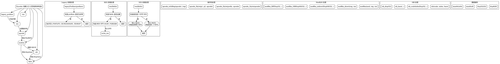

嗯，我需要为这个Zig编写的Encoder函数生成一个流程图。首先，我得理解这个函数的结构和各个部分的作用。函数返回一个结构体，里面包含了很多方法，比如处理前缀、操作码、ModR/M、SIB以及立即数等。

首先，我应该确定流程图的主要部分。函数的主体是定义了一个结构体，里面有多个方法。每个方法可能有不同的执行路径。比如legacyPrefixes方法里有很多条件判断，根据不同的prefixes写入不同的字节。类似地，rex、vex等方法也有各自的逻辑。

接下来，我需要考虑如何将这些方法组织成流程图。可能需要将整个结构体作为起点，然后分支出各个模块，比如前缀处理、操作码处理、ModR/M处理等。每个模块内部再细化各个方法的流程。

但是，用户要求的是画出函数的流程图，而这个函数实际上是一个返回结构体的函数。所以流程图可能需要从函数入口开始，展示如何构建这个结构体，以及结构体中的各个方法如何被调用和处理。

不过，仔细看代码，这个函数是定义一个泛型结构体，可能实例化时需要传入T和opts参数。然后结构体中的方法都是用于编码不同的指令部分。因此，流程图可能需要展示各个编码步骤的顺序和条件。

比如，当调用legacyPrefixes时，会检查各个prefix是否存在，然后逐个写入对应的字节。这时候可能会有多个条件分支。同样，rex和vex方法也有不同的处理路径。

不过，流程图应该简化这些细节，只展示主要的流程步骤，而不是每个条件分支。或者，可能需要为每个方法单独绘制子图，展示内部的流程。

另外，用户特别提到不要用Mermaid，而是用Graphviz。所以需要确保生成的图是Graphviz的DOT语言格式。

可能需要先确定主要的功能模块，如初始化、前缀处理（Legacy, REX, VEX）、操作码处理、ModR/M、SIB、立即数处理等。然后展示这些模块之间的关系和调用顺序。

例如：

1. 函数入口：定义Encoder结构体。
2. 结构体包含writer和options。
3. 前缀处理部分：
   a. LegacyPrefixes：检查各个前缀标志并写入对应字节。
   b. REX前缀：根据字段生成REX字节。
   c. VEX前缀：处理3字节或2字节的情况。
4. 操作码处理：1字节、2字节、3字节以及带寄存器的操作码。
5. ModR/M处理：不同寻址模式的ModR/M字节生成。
6. SIB处理：不同寻址模式的SIB字节生成。
7. 立即数和位移处理：写入不同长度的立即数或位移。

每个部分内部可能有条件判断，比如VEX前缀根据是否是3字节选择不同的路径。LegacyPrefixes中每个前缀标志是否设置的判断。

但流程图需要避免过于详细，否则会太复杂。可能需要分层，顶层展示主要模块，然后每个模块展开子流程。

比如：

主流程图：
- [开始] -> 定义Encoder结构体
   -> LegacyPrefixes处理
   -> REX处理
   -> VEX处理
   -> 操作码处理
   -> ModR/M处理
   -> SIB处理
   -> 立即数处理
- [结束]

每个处理模块内部展开子图。例如LegacyPrefixes子图：
- 检查prefixes是否非0
   -> 是：逐个检查每个前缀标志并写入字节
   -> 否：跳过

REX处理子图：
- 检查fields是否有设置
   -> 是：构造REX字节并写入
   -> 否：跳过

VEX处理子图：
- 检查是否是3字节
   -> 是：写入3字节的VEX前缀
   -> 否：写入2字节的VEX前缀

操作码处理分支根据不同的字节数调用不同的方法。

ModR/M处理根据不同的寻址模式调用对应的函数，比如直接、间接、SIB等。

SIB处理同样根据不同的寻址模式生成对应的SIB字节。

最后，立即数和位移处理根据不同的长度写入对应的数据。

在Graphviz中，可以用不同的节点和子图来表示这些模块和流程。需要注意节点之间的连接关系，以及条件判断的分支。

可能需要为每个主要方法创建一个子图，然后通过边缘连接表示执行顺序。不过，实际编码时这些方法的调用顺序取决于具体的指令编码步骤，而不是固定的流程。因此，流程图可能需要展示各个方法的使用场景，而不是严格的执行顺序。

例如，编码一条指令可能需要依次调用legacyPrefixes、rex、opcode、modRm等方法，这些步骤在流程图中应该按顺序排列。

但用户提供的代码是结构体的方法定义，而不是具体的指令编码过程。因此，流程图可能需要展示结构体的组成和方法之间的关系，而不是具体的执行流程。

或者，可能需要从使用Encoder的角度出发，展示如何构建编码器，然后调用各个方法来生成机器码。例如：

1. 初始化Encoder，传入writer和options。
2. 调用legacyPrefixes设置前缀。
3. 调用rex设置REX前缀。
4. 调用opcode写入操作码。
5. 调用modRm设置ModR/M字节。
6. 调用sib设置SIB字节。
7. 写入立即数或位移。
8. 完成指令编码。

这样的流程图更符合实际使用过程，但代码本身是结构体的方法定义，而不是使用示例。可能需要结合两者的信息。

综上所述，流程图应该展示Encoder结构体的各个方法以及它们之间的关系，可能按照编码步骤的顺序排列，同时包含条件判断和不同的处理路径。使用Graphviz的DOT语言来绘制，确保节点和子图正确表示各个模块和流程。
================================================

该流程图使用 Graphviz 的 DOT 语言表示，展示了：

1. 入口节点表示 Encoder 结构体的构造
2. 分模块展示核心功能：
   - Legacy 前缀的多条件处理
   - REX 前缀的字节构造逻辑
   - VEX 前缀的 2/3 字节分支逻辑
   - 操作码的多字节编码方式
   - ModR/M 的不同寻址模式
   - SIB 的不同组合模式
   - 数据编码的多种类型支持

模块之间用虚线箭头表示典型的编码顺序（例如先处理前缀，再处理操作码，最后处理数据），实际调用顺序取决于具体指令需求。