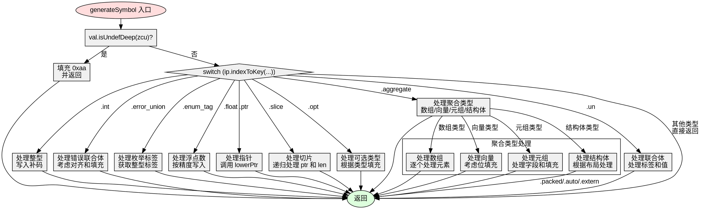

好的，我需要为提供的 Zig 函数 `generateSymbol` 绘制一个流程图。首先，我需要理解这个函数的结构和逻辑分支。

函数开始处，处理了一些基本的初始化和日志记录。然后检查值是否为未定义（`isUndefDeep`），如果是，填充特定字节并返回。接下来是一个大的 `switch` 语句，处理不同类型的值，比如整数、错误联合体、枚举、浮点数、指针、切片、可选类型、聚合类型（数组、向量、元组、结构体）、联合体等。

每个 `case` 分支都有不同的处理逻辑，例如处理整数时写入补码，处理错误联合体时考虑对齐和填充，处理结构体时根据布局（打包、自动、外部）进行不同的内存布局处理等。

为了绘制流程图，我需要将这些分支逐一转化为流程图的节点和判断框。可能的结构如下：

1. 开始节点：函数入口。
2. 检查 `val.isUndefDeep`，如果是，填充 0xaa 并结束。
3. 进入主 `switch`，根据不同的类型进入不同的处理分支。
4. 每个分支处理完后，可能会有子函数调用（如 `generateSymbol` 递归调用）或直接操作 `code` 数组。
5. 处理完所有情况后，结束节点。

需要注意递归调用的情况，比如在处理切片、结构体字段、联合体时，会再次调用 `generateSymbol`，这在流程图中可能需要表示为子流程或循环结构。

由于代码中存在多个嵌套的 `switch` 和条件判断，流程图可能会比较复杂，需要分层次展示。例如，处理聚合类型时，根据不同的类型（数组、向量、元组、结构体）有不同的处理逻辑，每个子类型又有自己的分支。

此外，错误处理（如返回 `error.Overflow`）也需要在流程图中体现，可能作为终止分支。

最后，确保流程图的箭头正确连接各个判断和处理步骤，避免遗漏分支或逻辑错误。
================================================
