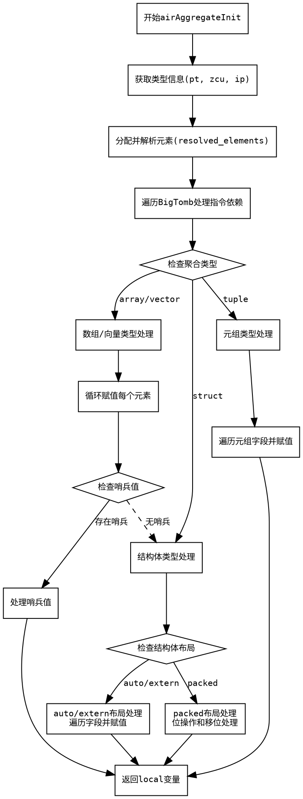

嗯，我需要帮用户用Graphviz画出这个Zig函数的流程图。首先，我得仔细看看这个函数的代码结构。这个函数叫做airAggregateInit，看起来是处理聚合类型（如数组、结构体、元组等）的初始化。

首先，函数开始的时候获取了一些类型信息和元素长度，然后分配了内存给resolved_elements。接着用循环处理每个元素，解析它们的值。之后有一个iterateBigTomb的部分，可能是处理指令依赖？这部分需要记录到流程图中。

然后根据不同的类型（数组、向量、结构体、元组等）有不同的处理逻辑。比如对于数组类型，会逐个赋值元素，如果有哨兵值的话还要处理哨兵。结构体的话，分为自动布局和打包布局，打包布局涉及位操作和移位，这部分逻辑比较复杂，需要分开处理。

我需要确定每个条件分支和循环的位置。比如，switch语句根据不同的类型进入不同的分支，每个分支内部又有循环和条件判断。例如结构体的处理中，有auto/extern布局和packed布局两种不同的处理方式，这需要两个不同的子流程。

在画流程图时，应该用菱形表示条件判断，矩形表示处理步骤，箭头连接各个步骤。需要确保每个分支都正确表示，尤其是嵌套的条件和循环。例如，处理数组时的循环赋值元素，结构体中的字段迭代，以及packed布局时的位操作处理。

另外，要注意代码中的错误处理和defer语句，比如gpa.alloc和defer gpa.free，这在流程图中可能需要表示资源分配和释放的步骤。

可能遗漏的地方是某些细节步骤，比如Assignment结构的操作，或者具体的位运算处理，但用户可能只需要主要逻辑的流程图，不需要深入到每个函数调用。所以需要保持流程图的高层次，避免过于复杂。

最后，生成Graphviz的DOT代码时，要正确使用节点和边的连接，确保逻辑顺序正确，条件分支清晰，循环结构合理。可能需要将大的switch分支拆分为多个子图，或者使用不同的颜色来区分不同的处理路径。
================================================


该流程图使用以下约定：
1. 矩形框表示操作步骤
2. 菱形表示条件判断
3. 箭头上的文字描述判断条件或跳转逻辑
4. 主要分支：
   - 数组/向量类型的元素赋值和哨兵处理
   - 结构体的两种布局处理路径
   - 元组类型的字段赋值
5. 最终都会收敛到返回local变量节点
6. 使用Courier字体保持代码风格一致性

可以通过Graphviz工具（如dot命令）渲染为PNG/SVG格式：
```bash
dot -Tpng flowchart.dot -o flowchart.png
```