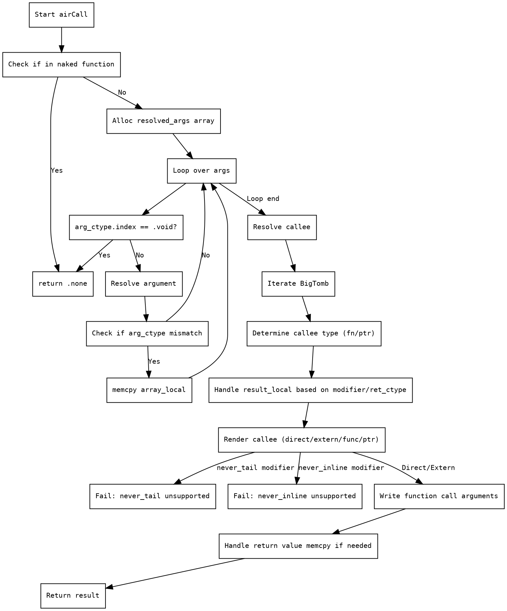

好的，我现在需要帮助用户为提供的Zig代码生成一个Graphviz的流程图。首先，我需要理解这段代码的功能。这段代码是一个函数`airCall`，处理函数调用，生成相应的C代码。看起来它处理各种情况，比如参数解析、内存拷贝、函数调用修饰符、返回值处理等。

接下来，我需要将这段代码的逻辑分解成不同的步骤，以便绘制流程图。流程图通常包括开始、结束、判断、处理步骤等节点。我需要识别代码中的主要流程和控制结构。

首先，函数开始时检查是否在“naked”函数中，如果是，直接返回.none。这是一个判断节点。接着，分配解析后的参数数组，然后遍历每个参数，处理可能的类型转换，使用memcpy如果需要的话。这部分可能是一个循环结构。

然后处理调用者（callee），包括解析其值，判断是否是函数指针，处理不同的调用修饰符（如always_tail、never_tail等）。这里可能涉及多个条件判断，比如callee的类型、修饰符的类型等。

接下来处理返回值，根据返回类型是否为void或是否被使用来决定是否分配本地变量。这里也有条件判断。最后，生成函数调用语句，处理参数，并处理返回值的拷贝（如果需要的话）。

需要注意的是，代码中有多个条件分支，例如判断modifier的类型（always_tail、never_tail等），callee的类型（是否是函数指针），以及是否需要类型转换等。每个条件分支都需要在流程图中体现。

另外，代码中有一些错误处理的情况，比如返回fail，这些也应该作为流程图的结束节点或者错误处理节点。

在绘制流程图时，需要确保每个判断节点都有两个或多个出口，每个处理步骤用矩形框表示，箭头表示流程方向。同时，循环结构（如遍历参数）需要用适当的循环表示，可能在流程图中用判断节点和返回箭头来表示循环。

最后，确保流程图的结构清晰，每个步骤和判断都正确对应代码中的逻辑，没有遗漏重要的分支或步骤。需要特别注意代码中的异常情况处理，如内存分配失败等，是否在流程图中体现。

现在，根据上述分析，可以开始绘制Graphviz的流程图。使用digraph结构，定义各个节点和它们之间的关系。确保节点标签明确，逻辑正确。
================================================
