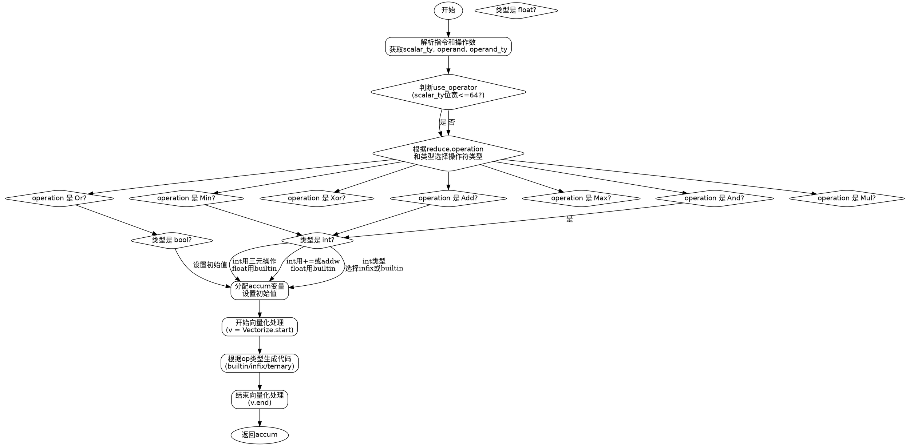

好，我需要帮用户用Graphviz画出一个Zig函数的流程图。首先，我得仔细看看这个函数的结构。函数是airReduce，属于代码生成的一部分，处理不同的归约操作，比如And、Or、Add等。看起来函数的主要逻辑是根据不同的操作类型选择不同的代码生成策略，然后生成相应的C代码。

首先，我得确定函数的主要流程步骤。函数开始部分获取了一些上下文信息，比如pt、zcu、reduce等。接着解析操作数，确定操作类型，根据不同的条件和类型选择操作符（builtin、infix或ternary）。然后初始化accum变量，根据不同的操作设置初始值。之后进入向量化处理部分，生成相应的赋值和操作代码，最后返回accum。

接下来，我需要将这些步骤转化为流程图的结构。通常流程图会有开始节点、判断节点、处理节点和结束节点。可能的判断点包括：use_operator的判断，reduce.operation的不同分支，scalar_ty的类型判断等。不过流程图中需要将这些条件分支清晰地表示出来。

需要注意的是，这个函数中有多个条件判断，比如switch (reduce.operation)和switch (scalar_zy.zigTypeTag(zcu))，这些都需要在流程图中用菱形判断节点来表示。每个条件分支后会有不同的处理步骤，比如选择不同的操作符类型（builtin、infix、ternary），或者不同的初始值设置。

另外，函数中有循环处理向量元素的步骤，由Vectorize.start和v.elem等处理。这部分可能需要一个循环结构的表示，不过具体实现可能被封装在Vectorize的方法中，所以在流程图中可能需要简化为一个处理步骤。

在绘制Graphviz图时，节点用形状表示不同的类型，如矩形表示处理步骤，菱形表示判断，椭圆形可能用于开始和结束。边上的标签需要标明条件或操作类型。

可能的流程步骤分解如下：
1. 开始
2. 解析指令和操作数
3. 确定use_operator（根据标量类型的位宽）
4. 根据reduce.operation和类型选择操作符类型（op）
5. 分配accum变量并设置初始值
6. 进入向量化处理循环
7. 根据op类型生成对应的C代码
8. 结束向量化处理
9. 返回accum

在处理步骤4时，会有多个嵌套的switch语句，需要分别处理每个条件分支。例如，对于.Min操作，会根据标量类型是int还是float选择不同的处理方式。这些都需要在流程图中展开。

需要注意的是，Graphviz的dot语言需要明确节点之间的连接关系，避免循环或重叠。可能需要将复杂的条件分支拆分为多个判断节点，确保流程清晰。

最后，生成Graphviz代码时，要确保节点名称唯一，箭头正确连接，每个判断分支都有对应的标签，如“operation是And？”等。
================================================

该流程图使用Graphviz的DOT语言绘制，展示了以下关键逻辑：

1. **初始解析**：从指令中提取类型和操作数信息
2. **操作符选择**：通过多级条件判断选择：
   - 根据位宽决定使用运算符还是内置函数
   - 根据操作类型（AND/OR/ADD等）分流处理
   - 根据标量类型（int/float/bool）二次分流
3. **累加器初始化**：根据不同操作设置初始值（如Add用0，Mul用1）
4. **向量化处理**：包含代码生成的核心循环逻辑
5. **结果返回**：最终返回累加器值

每个菱形节点表示条件判断，矩形节点表示操作步骤，椭圆形为开始/结束节点。实际使用时可配合Graphviz工具生成矢量图。