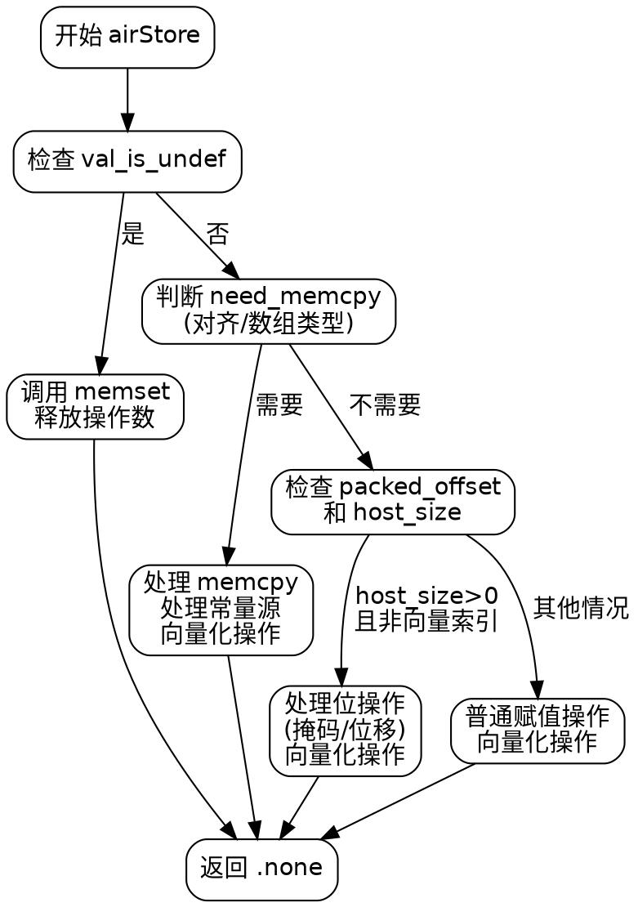

嗯，我需要为这个Zig函数`airStore`绘制一个流程图。首先，我应该通读代码，理解它的结构和逻辑分支。这个函数看起来处理的是存储操作，可能涉及到内存复制、位操作以及不同的情况处理。

首先，函数开始部分获取了一些类型信息和操作数。然后检查值是否是未定义的（`val_is_undef`）。如果是，处理未定义的情况，可能需要使用`memset`。如果不是未定义，继续判断是否需要内存拷贝（`need_memcpy`），这可能取决于对齐和数组类型。

接下来，如果`need_memcpy`为真，则使用`memcpy`进行内存复制，处理常量源的情况可能需要创建临时变量。如果不需要内存拷贝，但存在打包偏移（`packed_offset`），则处理位操作，比如掩码和位移。否则，进行普通的赋值操作。

过程中需要考虑不同的条件分支，比如`safety`标志、对齐检查、是否是数组、是否有打包偏移等。每个分支可能有不同的处理步骤，比如调用不同的函数或生成不同的C代码。

我需要将这些逻辑步骤转化为流程图节点，包括判断条件和对应的操作。确保每个条件分支正确连接，处理所有可能的情况。同时，注意函数中的循环或向量化部分，比如`Vectorize.start`和`v.end`，可能在流程图中表现为循环结构。

可能的结构是：开始 -> 检查val_is_undef -> 是则处理memset，否则检查need_memcpy -> 是则处理memcpy，否则检查packed_offset -> 处理位操作或普通赋值。每个步骤后可能有资源释放或结束。

需要确认每个条件判断的顺序和逻辑是否正确，确保流程图准确反映代码的执行路径。此外，注意处理各种边缘情况，例如常量的处理、类型转换等。
================================================
