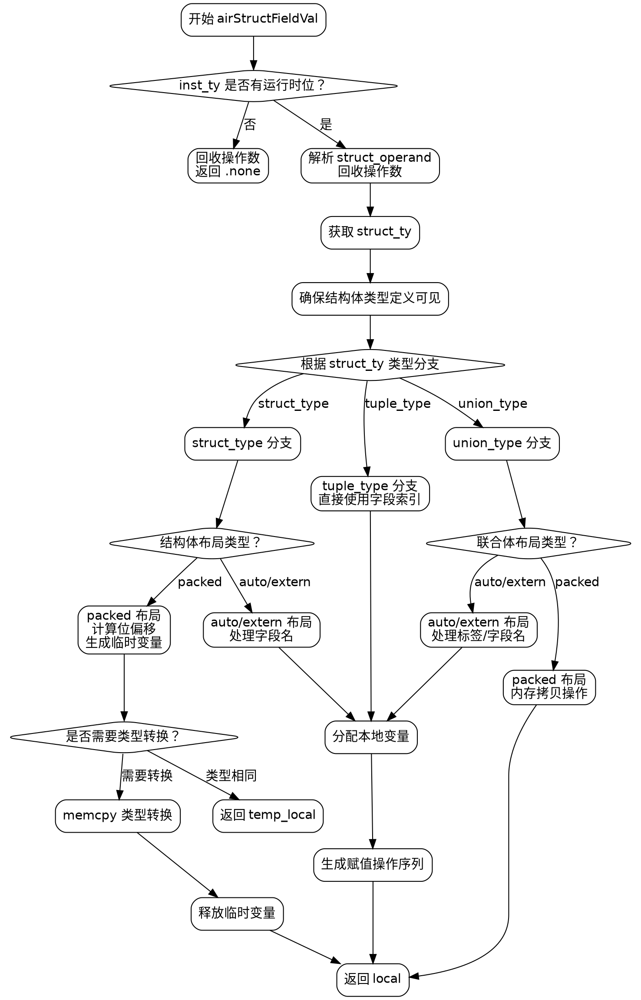

好的，我现在需要为给定的Zig函数`airStructFieldVal`生成一个Graphviz流程图。首先，我需要理解这个函数的结构和逻辑流程。

首先，我会通读代码，了解各个部分的功能。这个函数似乎处理结构体字段值的生成，根据不同的类型（结构体、元组、联合体）有不同的处理逻辑。特别是对于不同布局（auto、extern、packed）的结构体，处理方式不同。

接下来，我需要识别主要的条件分支和循环。例如，函数开始时检查`inst_ty`是否有运行时位，如果没有，则直接返回`.none`。然后处理`struct_byval`，并根据`struct_ty`的类型（struct_type、tuple_type、union_type）进入不同的分支。每个分支内部还有进一步的判断，比如结构体的布局类型，联合体的布局类型等。

对于Graphviz流程图，我需要将这些条件分支和操作步骤转化为节点和边。每个决策点（如if语句、switch语句）会成为菱形节点，操作步骤成为矩形节点，流程箭头显示执行路径。

需要注意的几个关键点：
1. 函数开始时的`if (!inst_ty.hasRuntimeBits...)`分支。
2. 处理`struct_ty`时的不同情况（struct_type、tuple_type、union_type）。
3. 结构体类型中不同布局（auto/extern vs packed）的处理差异。
4. 联合体类型中的不同布局处理。
5. 各分支中的内存分配、写入操作和返回逻辑。

可能的错误点包括：
- 错误识别条件分支的结构，导致流程图结构不正确。
- 遗漏某些条件分支或操作步骤。
- 节点之间的连接错误，比如某个分支的出口指向错误的下一个节点。

为确保准确性，我需要逐步跟踪代码的执行路径，确认每个可能的流程路径，并将它们正确地映射到流程图节点和边。同时，要注意不同情况下的返回点，如直接返回temp_local或local，或者在packed结构体中提前返回的情况。

最后，使用Graphviz的DOT语言来构建流程图，确保语法正确，节点和边正确连接。
================================================
