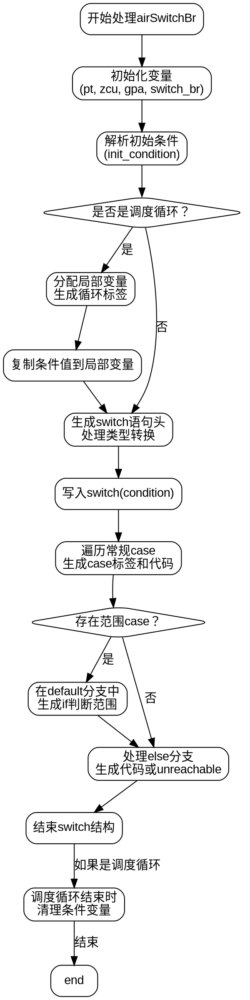

好的，我需要根据提供的Zig代码生成一个流程图。首先，我得仔细阅读并理解这段代码的功能。这个函数`airSwitchBr`似乎负责处理带有分支的switch语句，可能是在代码生成阶段将Zig的switch结构转换为C代码。

首先，函数开始部分初始化了一些变量，比如`pt`、`zcu`、`gpa`等。然后解析了`switch_br`的指令，并获取初始条件`init_condition`。接下来处理条件值的类型，根据是否是调度循环（`is_dispatch_loop`）来决定是否需要分配局部变量。如果是调度循环，会生成一个循环标签，并将条件值存储在局部变量中。

接下来是switch语句的生成，处理各个case。这里分为两种情况：常规的case和带有范围（range）的case。常规的case直接生成对应的C代码，而带有范围的case则在默认分支中使用if语句来处理范围判断。此外，还存在处理else分支的逻辑，如果存在else分支则生成对应的代码，否则生成`zig_unreachable()`。

在绘制流程图时，我需要将这些步骤分解成不同的节点。可能的节点包括初始化变量、处理条件值、生成switch结构、处理各个case、处理范围case、处理else分支等。需要注意条件判断，比如是否是调度循环、是否存在范围case、是否有else分支等，这些会影响流程的分支。

此外，代码中使用了`defer`来确保在调度循环结束时移除条件变量，这需要在流程图中体现出来。还有错误处理的部分，比如`try`语句可能引发错误，但流程图中是否需要体现错误处理路径呢？根据用户需求，可能主要关注正常流程，暂时忽略错误处理。

最后，生成流程图的结构，可能需要使用条件判断节点、循环节点、处理步骤节点等。确保每个步骤之间的逻辑关系正确，尤其是分支和循环部分。
================================================
