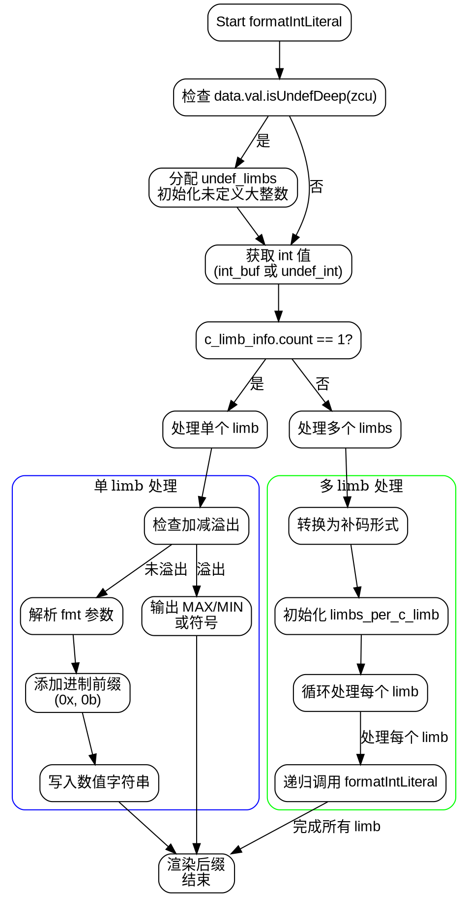

嗯，我需要为这个Zig函数`formatIntLiteral`绘制一个流程图。首先，我得仔细阅读代码，理解它的结构和逻辑流程。函数的主要目的是格式化整数字面量，处理不同的进制、符号、大小端等问题。

首先，函数开始部分定义了一些变量，比如`pt`、`zcu`、`target`、`ctype_pool`，这些都是上下文相关的数据。接下来有一个内部结构`ExpectedContents`，用于存储一些计算所需的临时数据。然后使用`std.heap.stackFallback`分配栈空间，获取分配器`allocator`。

然后处理`undef_limbs`，如果值是未定义的（`isUndefDeep`），则分配并初始化一个未定义的大整数，否则转换为大整数。接下来检查是否适合指定的位宽。

接下来是处理`c_bits`，计算C类型的位数。然后根据`data.ctype`的类型（基本类型、数组等）确定`c_limb_info`，包括类型、数量、字节序等。

如果`c_limb_info.count`为1，处理单个肢（limb）的情况。这里需要处理溢出，并输出对应的最大值或最小值，或者根据格式（二进制、八进制、十进制、十六进制）添加前缀，并写入数值。如果`count`不为1，则处理多个肢的情况，可能需要处理大端或小端排列，逐个处理每个肢，递归调用`formatIntLiteral`。

最后，添加字面量的后缀。

在绘制流程图时，应该从函数入口开始，按照条件分支逐步展开。主要的条件分支包括：

1. 判断`data.val.isUndefDeep(zcu)`，处理未定义值的情况。
2. 根据`c_limb_info.count`是否为1，分两个大分支。
3. 在`count`为1的分支中，处理可能的溢出，以及不同的格式（`fmt`参数）。
4. 在`count`不为1的分支中，处理多个肢的转换和递归调用。

需要注意递归调用的情况，即在处理多个肢时，每个肢可能需要再次调用`formatIntLiteral`，这会在流程图中形成一个循环结构。

另外，错误处理和内存管理部分（如`defer allocator.free`）也需要在流程中体现，但可能不需要单独的节点，而是作为步骤的一部分。

综上所述，流程图应该包括开始节点、各个条件判断节点、处理不同情况的子流程、循环结构以及结束节点。需要确保每个条件分支都正确连接，并且步骤顺序符合代码逻辑。
================================================
