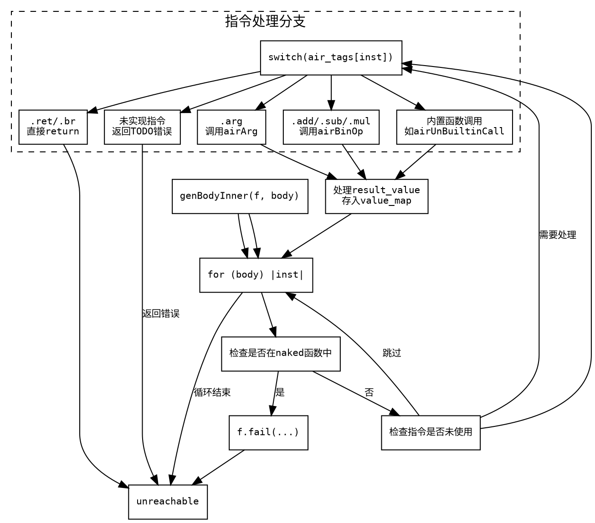

好的，我需要帮用户用Graphviz画出他们提供的Zig代码中的genBodyInner函数的流程图。首先，我需要仔细阅读这段代码，理解它的结构和逻辑流程。

首先，函数genBodyInner的参数是一个Function指针f和一个body切片。函数返回一个错误联合类型，可能抛出AnalysisFail或OutOfMemory错误。函数的主要逻辑是遍历body中的每个指令（inst），并根据不同的指令类型执行相应的操作。

接下来，代码中有一个大的for循环，遍历body的每个inst。循环内部首先检查是否在naked函数中不允许运行时代码，如果是则失败。然后检查指令是否未被使用且不需要强制生成，如果是则跳过。

然后，根据air_tags中的指令类型，使用switch语句处理不同的情况。每个case调用不同的函数，例如airArg、airBreakpoint等，并将结果赋值给result_value。之后，将result_value存入value_map中。

在流程图中，应该从函数入口开始，画出循环结构，循环内的条件判断，以及各个switch分支。由于switch有大量分支，可能需要简化处理，避免图表过于复杂。比如，可以将每个case作为一个处理节点，但可能太多，可以合并同类项或用注释表示主要分支。

需要注意错误处理和返回点，例如循环中的return语句，以及最后的unreachable语句。此外，函数的结束点是在循环之后，但代码中有一个unreachable，这可能意味着循环必须处理所有情况，或者存在未覆盖的情况导致无法到达此处。

还需要考虑函数中的控制流，例如某些case中可能直接返回（如.br、.repeat等指令），这些会导致流程提前退出循环。这些情况应该在流程图中用箭头表示不同的退出路径。

总结步骤：
1. 确定函数入口点。
2. 画出循环结构，遍历body中的每个inst。
3. 在循环内部，处理条件判断（如naked函数检查、liveness检查）。
4. 对于每个inst，根据air_tags进入不同的处理分支。
5. 处理各个分支后的结果存储到value_map。
6. 处理可能提前返回的情况（如某些指令直接return）。
7. 结束循环后的unreachable节点。

需要注意，Graphviz的节点和边需要合理布局，避免交叉过多。可能将循环体作为一个子图，内部包含条件和switch分支。对于大量的switch case，可以用一个节点表示，内部用注释说明不同的处理方式，以保持图表清晰。
================================================
