嗯，我需要为这个Zig函数生成一个Graphviz的流程图。首先，我得仔细读一遍代码，理解它的结构和逻辑。

函数名为`info`，接收`CType`和`Pool`参数，返回`Info`结构。首先检查`ctype.toPoolIndex()`，如果返回`null`，就直接返回一个基本类型的Info。否则，从pool中获取对应的item，然后根据item的tag进行不同的处理。

接下来，每个case分支都会返回不同的Info结构。比如`.pointer`、`.array_small`、`.function`等，每个分支的处理方式不同，有的需要从pool获取额外数据，有的直接构造返回。

流程图应该从函数入口开始，判断`toPoolIndex()`是否为null，然后根据不同的tag分支处理。每个分支对应一个节点，最后返回相应的结果。需要注意的是，有些分支可能会调用`getExtra`或`getExtraTrail`来获取更多数据，这些步骤也应该在流程图中体现。

可能的结构是：

1. 开始节点：函数入口。
2. 判断`ctype.toPoolIndex()`是否为null，是则返回基本类型。
3. 否则获取item，进入switch分支。
4. 每个tag对应一个处理节点，处理完后返回对应的Info。
5. 结束节点。

需要注意循环或条件分支的正确连接，尤其是switch中的多个case。可能需要将每个case作为独立的分支，用菱形判断节点表示switch的选择。不过Graphviz中通常用节点和边来表示流程，switch可以用多个分支边来表示不同的tag情况。

可能需要将每个tag处理简化为一个节点，然后连接到对应的返回步骤。此外，处理如`getExtra`等函数调用可能需要作为子流程，但为了简化，可能直接在节点描述中包含这些操作。

最后，确保所有可能的路径都被覆盖，比如每个tag都有对应的处理，以及默认情况（但代码中用到了所有可能的tag，所以没有default）。
================================================

```dot
digraph flowchart {
    node [shape=rectangle, fontname="Courier", fontsize=10];
    edge [fontname="Courier", fontsize=10];

    start [label="开始: info(ctype, pool)"];
    check_pool_index [label="检查 ctype.toPoolIndex()"];
    return_basic [label="返回 .{ .basic = ctype.index }"];
    get_item [label="从 pool.items 获取 item"];
    switch_tag [label="根据 item.tag 分支", shape=diamond];

    // 主流程
    start -> check_pool_index;
    check_pool_index -> return_basic [label="为 null"];
    check_pool_index -> get_item [label="有值"];
    get_item -> switch_tag;

    // 定义公共样式
    subgraph cluster_switches {
        label="处理 item.tag 分支";
        labelloc=b;

        // 指针类分支
        pointer [label="构造指针类型\n设置 elem_ctype"];
        pointer_const [label="构造常量指针\n设置 elem_ctype 和 const"];
        pointer_volatile [label="构造易变指针\n设置 elem_ctype 和 volatile"];
        pointer_const_volatile [label="构造常量易变指针\n设置 elem_ctype、const 和 volatile"];

        // 数组/向量分支
        array_small [label="解析小数组\n设置 elem_ctype 和长度"];
        array_large [label="解析大数组\n设置 elem_ctype 和动态长度"];
        vector [label="解析向量\n设置 elem_ctype 和长度"];

        // 对齐分支
        aligned [label="解析对齐类型\n设置 ctype 和 alignas"];

        // 前向声明分支
        fwd_decl_struct_anon [label="匿名结构体前向声明\n设置名称和字段信息"];
        fwd_decl_union_anon [label="匿名联合体前向声明\n设置名称和字段信息"];
        fwd_decl_struct [label="结构体前向声明\n设置名称索引"];
        fwd_decl_union [label="联合体前向声明\n设置名称索引"];

        // 聚合类型分支
        aggregate_struct_anon [label="匿名结构体聚合\n设置名称和字段"];
        aggregate_union_anon [label="匿名联合体聚合\n设置名称和字段"];
        aggregate_struct_packed_anon [label="紧凑匿名结构体聚合\n设置 packed 标志"];
        aggregate_union_packed_anon [label="紧凑匿名联合体聚合\n设置 packed 标志"];
        aggregate_struct [label="结构体聚合\n设置名称和字段"];
        aggregate_union [label="联合体聚合\n设置名称和字段"];
        aggregate_struct_packed [label="紧凑结构体聚合\n设置 packed 标志"];
        aggregate_union_packed [label="紧凑联合体聚合\n设置 packed 标志"];

        // 函数分支
        function [label="解析函数\n设置返回类型和参数"];
        function_varargs [label="解析可变参数函数\n设置 varargs 标志"];
    }

    // 连接所有分支到 switch_tag
    switch_tag -> pointer [label=".pointer"];
    switch_tag -> pointer_const [label=".pointer_const"];
    switch_tag -> pointer_volatile [label=".pointer_volatile"];
    switch_tag -> pointer_const_volatile [label=".pointer_const_volatile"];
    switch_tag -> aligned [label=".aligned"];
    switch_tag -> array_small [label=".array_small"];
    switch_tag -> array_large [label=".array_large"];
    switch_tag -> vector [label=".vector"];
    switch_tag -> fwd_decl_struct_anon [label=".fwd_decl_struct_anon"];
    switch_tag -> fwd_decl_union_anon [label=".fwd_decl_union_anon"];
    switch_tag -> fwd_decl_struct [label=".fwd_decl_struct"];
    switch_tag -> fwd_decl_union [label=".fwd_decl_union"];
    switch_tag -> aggregate_struct_anon [label=".aggregate_struct_anon"];
    switch_tag -> aggregate_union_anon [label=".aggregate_union_anon"];
    switch_tag -> aggregate_struct_packed_anon [label=".aggregate_struct_packed_anon"];
    switch_tag -> aggregate_union_packed_anon [label=".aggregate_union_packed_anon"];
    switch_tag -> aggregate_struct [label=".aggregate_struct"];
    switch_tag -> aggregate_union [label=".aggregate_union"];
    switch_tag -> aggregate_struct_packed [label=".aggregate_struct_packed"];
    switch_tag -> aggregate_union_packed [label=".aggregate_union_packed"];
    switch_tag -> function [label=".function"];
    switch_tag -> function_varargs [label=".function_varargs"];

    // 公共返回路径
    return [label="返回构造的 Info 结构", shape=ellipse];
    
    // 所有分支最终指向返回节点
    pointer -> return;
    pointer_const -> return;
    pointer_volatile -> return;
    pointer_const_volatile -> return;
    aligned -> return;
    array_small -> return;
    array_large -> return;
    vector -> return;
    fwd_decl_struct_anon -> return;
    fwd_decl_union_anon -> return;
    fwd_decl_struct -> return;
    fwd_decl_union -> return;
    aggregate_struct_anon -> return;
    aggregate_union_anon -> return;
    aggregate_struct_packed_anon -> return;
    aggregate_union_packed_anon -> return;
    aggregate_struct -> return;
    aggregate_union -> return;
    aggregate_struct_packed -> return;
    aggregate_union_packed -> return;
    function -> return;
    function_varargs -> return;

    // 初始分支的返回路径
    return_basic -> return;
}
```
