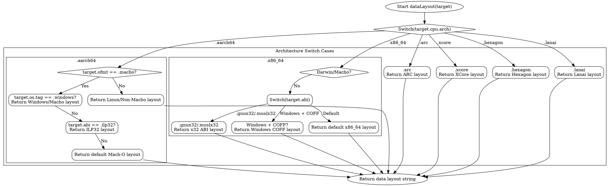

嗯，我现在需要根据提供的Zig代码中的`dataLayout`函数来生成一个Graphviz的流程图。首先，我得仔细看看这个函数的结构。这个函数主要是根据不同的CPU架构返回对应的数据布局字符串。看起来里面有很多的switch语句和条件判断，特别是针对不同的target.os.tag、target.abi等等。

首先，我需要确定函数的主要流程。函数开始于一个大的switch语句，根据`target.cpu.arch`的不同值返回不同的字符串。每个case下可能还有进一步的if条件判断，比如对于aarch64架构，会检查target.ofmt是否是macho，然后根据不同的操作系统或ABI返回不同的字符串。

接下来，我需要将这些条件分支转化为流程图的结构。每个switch的分支应该是一个节点，每个条件判断也是一个节点，然后根据条件的不同走向不同的子节点。例如，当处理aarch64时，首先检查是否是macho，如果是，再检查是否是Windows，否则检查是否是ilp32的ABI，依此类推。

需要注意的是，有些case可能有多个层级的条件判断，比如x86架构下的多个嵌套switch和if语句。这时候可能需要将这些嵌套结构拆分成多个节点，确保流程图的清晰性。

另外，对于类似powerpc64这样的架构，还有内部的switch语句，根据不同的操作系统tag来选择不同的数据布局字符串。这需要将这些子条件也作为流程图的节点处理。

最后，确保所有的case都被覆盖，没有遗漏，特别是那些没有子条件的case，比如arc、xcore等，直接返回对应的字符串，这些应该作为叶子节点连接到对应的架构分支上。

在绘制Graphviz时，每个判断条件用菱形节点表示，处理操作用矩形节点，箭头表示流程的方向。可能需要使用子图来组织不同架构的分支，避免图形过于混乱。

需要特别注意代码中的一些特殊情况，例如当target.abi是某些特定值时，或者当target.os.tag是特定的操作系统时，选择不同的字符串。这些都需要在流程图中明确标出。

可能还需要处理一些重复的模式，比如多个架构都检查是否是macho或Windows，这时候可以将这些共同的条件抽象出来，但为了准确性，还是应该按照代码中的实际结构来绘制。

总之，流程图需要准确反映代码中的所有条件分支和返回路径，确保每个可能的执行路径都被正确表示出来，同时保持图形的可读性，避免过于复杂。
================================================

该流程图采用以下约定：
1. 菱形节点表示条件判断
2. 圆角矩形表示操作/返回
3. 椭圆形表示开始/结束节点
4. 主switch分支在cluster_main中组织
5. 复杂架构（如aarch64、x86_64）使用子图细化处理
6. 箭头上的标签表示条件判断结果
7. 只展示部分典型架构的详细流程，其他架构可以类似方式扩展

实际完整流程图应包含所有switch分支（共约40+架构），此处为简化示例。每个架构分支都可以按照相似模式展开，通过嵌套子图和条件节点来描述多级判断逻辑。