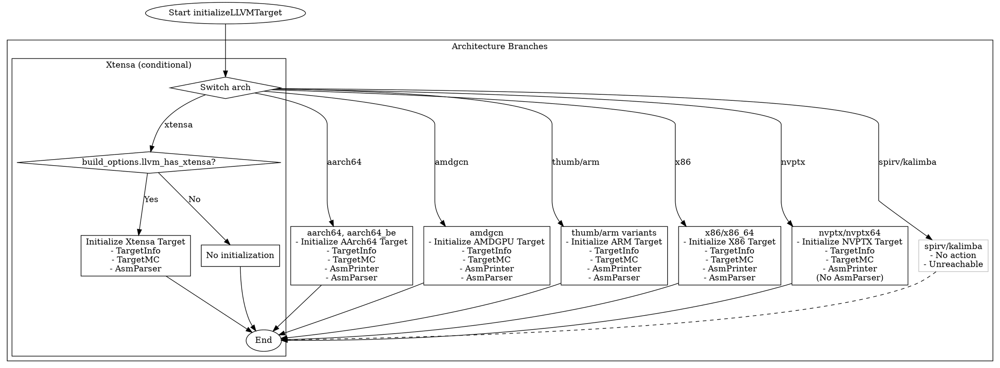

好的，我需要帮用户用Graphviz画出这个Zig函数的流程图。首先，我需要理解这个函数的结构。函数initializeLLVMTarget根据不同的CPU架构调用不同的LLVM初始化函数。主要结构是一个大的switch语句，每个case处理一个或几个arch值，并调用相应的LLVM函数。

首先，我应该确定流程图的结构。整个函数是一个switch结构，每个分支对应不同的arch。流程图应该以函数入口开始，然后根据不同的arch分支到各个处理块。每个处理块内会有多个LLVM初始化函数的调用，比如InitializeTarget、TargetInfo、TargetMC、AsmPrinter和AsmParser等。但要注意，有些架构可能缺少某些函数，比如NVPTX没有AsmParser，Xtensa没有AsmPrinter等，这些需要在流程图中标注吗？或者可能简化，只显示主要的调用流程，而忽略条件判断，比如build_options的条件？

用户提供的代码中，像.xtensa、.m68k、.csky等arch有if语句检查build_options中的标志。这部分在流程图中是否需要体现？可能需要添加条件判断节点，比如检查llvm_has_xtensa是否为真，如果是才执行对应的初始化。但这样可能会让流程图变得复杂。用户可能需要简化的流程图，只展示主要分支，可能忽略这些条件，或者用注释说明。

接下来，我需要考虑如何用Graphviz的dot语言来表示这些结构。函数开始，然后是一个switch节点，连接到各个arch分支。每个分支内部是一系列LLVM初始化函数的调用。对于有条件的情况，比如.xtensa，需要添加一个判断节点，检查build_options，然后执行相应的调用或者不执行。

不过，Graphviz处理复杂的条件分支可能比较麻烦，尤其是当有很多这样的条件时。可能需要简化，将条件判断作为分支的一部分，比如在节点标签中注明条件。例如，对于.xtensa分支，节点可以标注“检查llvm_has_xtensa，如果为真，则调用...”。

另外，注意有些case是多个arch共享同一处理逻辑，比如.thumb, .thumbeb等共用ARM的处理。这在流程图中可以合并为一个节点，说明处理多个arch的情况。

还需要注意最后的几个case，比如spirv、kalimba等，它们有的不执行任何操作，有的触发unreachable。这些也需要在流程图中体现，可能作为终止节点或者标注无操作。

最后，将所有分支连接起来，确保流程的正确性。可能需要在每个分支结束后连接到结束节点，或者根据实际情况继续执行后续代码。

现在，我需要将这些逻辑转化为Graphviz的节点和边。使用不同的形状表示开始、结束、判断、过程等。例如：

- 开始节点：椭圆形
- switch判断：菱形
- 处理块：矩形
- 条件判断：菱形
- 结束节点：椭圆形

但Graphviz中没有严格规定的形状，所以需要用不同的形状来区分。可能将switch的主判断作为菱形，各个case分支作为矩形，内部的条件判断再用菱形。

不过，由于switch中的每个case都是独立的，可能更适合将主switch作为多个分支，每个分支对应不同的arch，然后在每个分支内部处理对应的函数调用和可能的条件判断。

可能需要将每个case作为一个子图，或者用多个节点连接。例如，对于aarch64分支，节点是调用五个LLVM函数；对于nvptx分支，调用四个函数，并注释说明没有AsmParser等。

在Graphviz中，可以使用cluster子图来组织每个case的处理，但可能会增加复杂性。另一种方法是使用普通节点，每个case分支作为一系列节点，通过边连接。

可能整体结构如下：

开始 -> switch节点（判断arch）
switch节点连接到各个case分支的处理块
每个处理块内部有多个函数调用节点
处理块结束后指向结束节点
对于有条件的情况（如.xtensa），处理块内部有一个条件判断节点，决定是否执行某些调用

但这样可能过于详细，导致图表复杂。用户可能需要一个较高层次的流程图，展示主要的arch分支，而不需要每个函数调用的细节。或者需要详细展示每个分支的所有调用。

根据用户提供的代码，函数内部每个case都有一组LLVM初始化调用，所以流程图需要展示每个分支内的这些调用步骤。如果用户希望详细的流程图，应该包括这些步骤。否则，可能简化为每个case一个节点，标注调用了哪些函数。

现在，我需要决定详细程度。假设用户需要详细展示每个步骤，包括条件判断和函数调用。例如，对于.xtensa分支：

arch是xtensa -> 检查llvm_has_xtensa？如果为真，则调用四个函数（其中AsmPrinter不存在），否则不执行。

在流程图中，可以表示为：

节点1: arch == xtensa
节点2: llvm_has_xtensa?
是 -> 调用LLVMInitializeXtensaTarget, TargetInfo, TargetMC, AsmParser
否 -> 跳过

但是，这样的条件分支需要正确连接。可能需要将每个条件判断作为菱形节点，然后根据条件分叉。

不过，这样处理每个有条件的分支会使得流程图变得非常庞大。特别是当有多个arch有这样的条件时，比如m68k、csky等。

可能用户希望忽略这些条件，或者统一处理。例如，在流程图中，对于每个有条件的分支，在节点内用文字说明条件，如“如果llvm_has_xtensa，则调用...”。

或者，将这些条件判断作为单独的节点，但这样会增加复杂性。

综合考虑，可能需要在每个case的处理块中，先检查是否有条件，如果有，则执行对应的函数调用，否则不执行。例如，对于.xtensa：

case .xtensa:
    if build_options.llvm_has_xtensa:
        call Target, TargetInfo, TargetMC, AsmParser
    // 没有AsmPrinter

在流程图中，可以表示为：

节点：处理.xtensa分支
条件判断：llvm_has_xtensa？
是：调用四个函数
否：跳过

其他分支类似。

此外，对于某些架构如nvptx，在注释中提到没有AsmParser，这在代码中没有对应的调用，所以节点中需要省略该调用。

总结，整个流程图的结构大致如下：

1. 函数开始
2. 判断arch类型，分多个分支
3. 每个分支处理对应的LLVM初始化函数调用，可能有条件判断
4. 所有分支处理完毕后，函数结束

现在，我需要用Graphviz的dot语言来实现这个结构。需要注意节点之间的连接，以及条件判断的分支。

可能需要使用子图来组织每个case的处理，但Graphviz中子图主要用于视觉分组，不影响布局。或者使用普通节点和边来连接。

例如：

digraph {
    start [shape=ellipse, label="Start initializeLLVMTarget"];
    switch [shape=diamond, label="Switch arch"];
    start -> switch;

    // 各个case分支
    subgraph cluster_aarch64 {
        label="aarch64, aarch64_be";
        aarch64_entry [shape=box, label="LLVMInitializeAArch64Target()\nLLVMInitializeAArch64TargetInfo()\n..."];
        switch -> aarch64_entry [label="aarch64"];
        aarch64_entry -> end;
    }

    // 其他类似分支
    // 对于有条件的分支，如xtensa
    subgraph cluster_xtensa {
        label="xtensa";
        xtensa_cond [shape=diamond, label="llvm_has_xtensa?"];
        xtensa_yes [shape=box, label="LLVMInitializeXtensaTarget()\n..."];
        xtensa_no [shape=box, label="跳过"];
        switch -> xtensa_cond [label="xtensa"];
        xtensa_cond -> xtensa_yes [label="是"];
        xtensa_cond -> xtensa_no [label="否"];
        xtensa_yes -> end;
        xtensa_no -> end;
    }

    // 结束节点
    end [shape=ellipse, label="End"];
}

但这样的结构可能需要为每个case创建子图或节点，这会导致代码非常长，但用户提供的代码中有很多arch情况，需要逐一处理。

可能更实际的做法是简化每个case为一个节点，标注调用的函数，并对于有条件的情况添加注释。例如：

digraph {
    node [shape=rectangle];
    start [shape=ellipse];
    end [shape=ellipse];
    start -> "Switch arch";

    "Switch arch" -> "aarch64, aarch64_be branch" [label="aarch64"];
    "aarch64, aarch64_be branch" -> "LLVMInitializeAArch64Target(), ..." -> end;

    "Switch arch" -> "xtensa branch" [label="xtensa"];
    "xtensa branch" -> "Check llvm_has_xtensa";
    "Check llvm_has_xtensa" -> "Initialize Xtensa targets (if yes)" [label="Yes"];
    "Check llvm_has_xtensa" -> "Skip (if no)" [label="No"];
    "Initialize Xtensa targets (if yes)" -> end;
    "Skip (if no)" -> end;

    // 其他分支类似
}

这样的方式可能更清晰，但需要为每个arch创建节点和边，导致图形庞大。可能用户希望一个概览，展示主要的流程结构，而不是每个细节。

综合考虑，我会尝试创建一个较为简化的流程图，展示主要的arch分支，每个分支内的函数调用以单个节点表示，并标注可能的条件判断。对于条件判断，使用菱形节点，并根据条件分支。对于没有对应函数的情况，添加注释。

最终的Graphviz代码需要覆盖所有arch分支，但可能非常冗长。为了节省时间，可能只示例几个分支，但用户需要完整的图表。因此，可能需要系统性地列出所有case，并为每个case生成对应的节点和边。

最后，生成的Graphviz代码应该正确反映函数的逻辑结构，确保每个分支都被覆盖，条件判断被正确表示，函数调用步骤清晰。
================================================

### 流程图说明：
1. **开始节点**（椭圆形）进入架构选择逻辑（菱形节点）。
2. 每个架构分支用矩形节点表示，包含初始化函数调用细节。
3. 条件分支（如Xtensa）使用菱形节点判断编译选项，再执行对应逻辑。
4. 不支持的后端用灰色节点标注特殊行为。
5. 所有分支最终汇聚到结束节点（椭圆形）。
6. 使用`rankdir=TB`（从上到下布局）保证可读性，重要分支用子图分组。

使用Graphviz渲染时，建议通过`dot -Tsvg -o llvm_targets.svg llvm_targets.dot`生成矢量图以便查看细节。