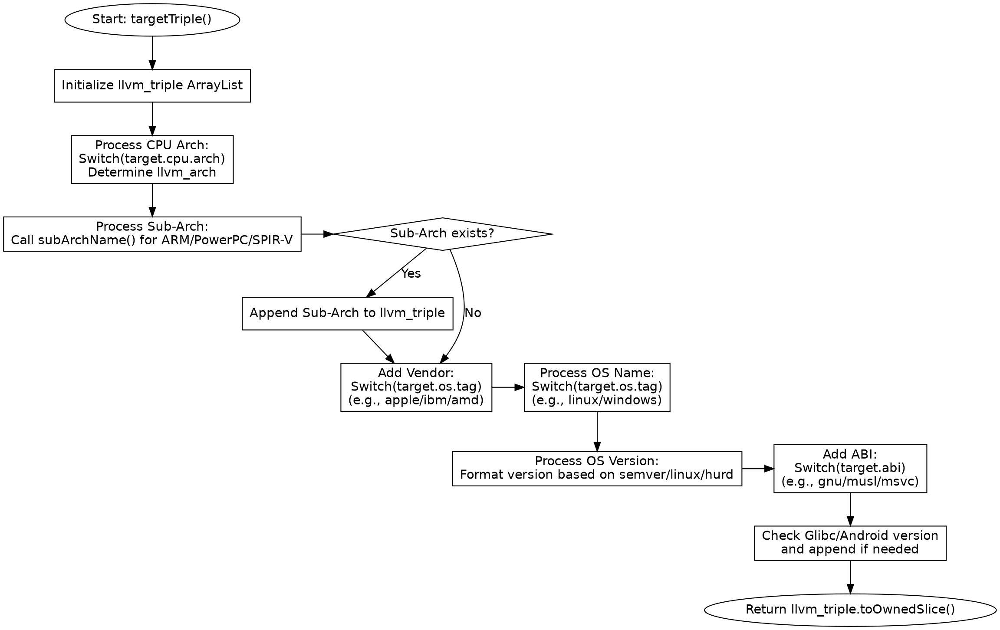

嗯，我现在需要分析这个Zig函数targetTriple，并用Graphviz画出它的流程图。首先，我得先理解这个函数是做什么的。看起来，这个函数是用来生成LLVM的目标三元组的，也就是像x86_64-linux-gnu这样的字符串。函数接收一个分配器和目标参数，返回一个字符串或者错误。

首先，函数开始初始化了一个ArrayList叫做llvm_triple，用来构建最终的字符串。然后通过switch语句处理不同的CPU架构，将对应的LLVM架构名称赋值给llvm_arch。这里有很多不同的架构分支，比如arm、aarch64、mips等等，每个分支可能有不同的条件判断，比如检查是否有特定的CPU特性。

接下来是处理子架构的部分，也就是llvm_sub_arch。这部分主要针对ARM、PowerPC、SPIR-V等架构，调用subArchName函数来获取子架构名称。如果存在子架构名，就添加到llvm_triple中，然后加上分隔符'-'。

然后是处理操作系统供应商的部分，比如apple、ibm、amd等，根据不同的操作系统标签来决定。之后是处理具体的操作系统名称，比如linux、windows、macosx等，同样用switch语句处理不同的OS标签。

接下来是处理操作系统的版本范围，根据不同的情况，比如semver、linux版本、hurd版本等，格式化版本号并添加到字符串中。然后加上分隔符'-'，处理ABI部分，比如gnu、musl、msvc等。

最后，再次处理OS版本范围中的特定情况，比如glibc版本或Android版本，并将这些信息添加到三元组中。最终，函数返回构建好的字符串。

现在需要将这些步骤转化为流程图。流程图应该从函数入口开始，每个主要步骤作为一个节点，条件判断用菱形框表示，不同的分支用箭头连接。可能的结构包括：

1. 初始化llvm_triple。
2. 处理CPU架构（llvm_arch）。
3. 处理子架构（llvm_sub_arch）。
4. 添加供应商部分。
5. 处理操作系统名称。
6. 处理操作系统版本。
7. 处理ABI。
8. 处理特定版本信息。
9. 返回结果。

需要注意的是，每个switch语句可能会有多个分支，比如处理不同CPU架构时有多个case，这些可以用条件判断节点来表示。同时，有些步骤可能存在条件判断，比如是否存在子架构，是否处理特定版本等。

可能需要将整个流程分成几个大的模块，每个模块对应函数中的一个主要部分，然后用箭头连接这些模块，并在条件判断处分叉。例如，处理CPU架构的部分有很多分支，但可以简化为一个选择节点，指向不同的架构处理流程，但由于代码中是switch语句，可能不需要在流程图中详细展开每个case，而是作为一个整体步骤。

可能遇到的困难是如何简洁地表示大量的switch case，而不让流程图变得过于复杂。这时候可能需要将这些case汇总为一个步骤，比如“根据target.cpu.arch选择llvm_arch”，而不展开每个具体的case。同样，子架构处理部分也可以简化为一个步骤，调用subArchName函数，并根据结果决定是否添加子架构。

另外，处理操作系统版本的部分可能涉及到不同的版本范围类型，比如semver、windows、linux等，需要不同的处理逻辑。这些可以在流程图中用条件判断节点来表示不同的分支。

总结下来，流程图的大致结构应该是：

开始 -> 初始化llvm_triple -> 处理CPU架构 -> 处理子架构（条件判断是否存在）-> 添加供应商 -> 处理OS名称 -> 处理OS版本（条件判断不同类型）-> 处理ABI -> 处理特定版本信息（条件判断）-> 返回结果。

在绘制时，使用Graphviz的节点和边来表示这些步骤，条件判断使用菱形节点，不同的分支用不同的边连接。例如，处理子架构时，如果存在，则添加，否则跳过。类似地，处理OS版本时，根据不同的版本类型执行不同的格式化操作。

需要确保每个步骤的顺序正确，并且条件判断的分支清晰。可能需要多次调整结构，以确保流程图既准确又简洁。
================================================

该流程图清晰地展示了函数的执行流程：
1. **初始化**字符串缓冲区
2. **处理CPU架构**（通过大型switch语句匹配LLVM架构名称）
3. **处理子架构**（针对ARM等架构的特殊逻辑）
4. **添加供应商标识**（如apple/ibm）
5. **处理操作系统名称**（如linux/windows）
6. **格式化操作系统版本**（根据semver/glibc等规则）
7. **添加ABI信息**（如gnu/musl）
8. **最终处理Glibc/Android版本号**
9. **返回生成的三元组字符串**

条件判断（如子架构是否存在、版本类型）用菱形节点表示，关键操作（如字符串追加）用矩形节点表示。箭头方向严格遵循代码逻辑顺序。