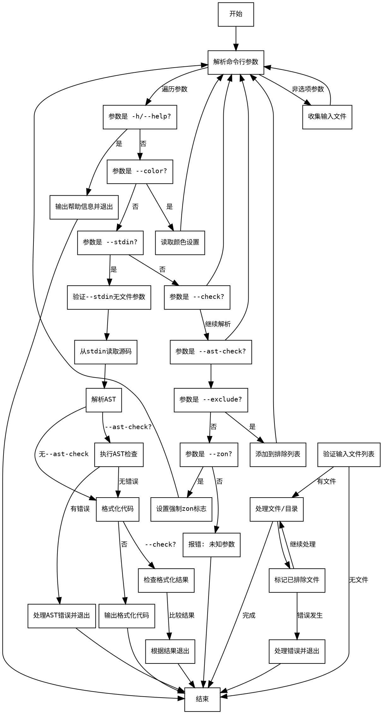

好，我现在需要帮用户用Graphviz画出他们提供的Zig函数`run`的流程图。首先，我需要仔细阅读并理解这个函数的逻辑。这个函数似乎是处理命令行参数，进行文件格式检查或者格式化，可能还涉及解析和生成AST（抽象语法树）等步骤。

首先，函数开始处理参数，比如`--color`、`--stdin`、`--check`等，根据不同的参数设置相应的标志变量。然后，如果有`--stdin`标志，会读取标准输入的内容，解析并检查错误，根据不同的条件生成格式化后的代码或者进行AST检查。如果没有`--stdin`，则处理输入的文件列表，排除指定的文件，最后进行路径处理。

接下来，我需要确定如何将这个过程转化为流程图。流程图通常包括开始、结束、判断节点、处理步骤等。需要注意各个条件分支，比如参数的不同选项，处理标准输入和文件的不同路径，错误处理等。

可能的步骤：
1. **开始**节点。
2. 解析命令行参数，处理各种标志，比如`--help`、`--color`、`--stdin`等。这里会有多个判断分支，比如是否遇到`-h`或`--help`，如果是，输出帮助信息并退出。
3. 处理`--stdin`的情况：检查是否有输入文件，读取标准输入，解析内容，进行AST检查或格式化，然后根据`--check`标志决定是检查格式还是输出结果。
4. 如果没有`--stdin`，则检查输入文件列表是否为空，为空则报错。否则，初始化格式化结构，处理排除文件，遍历输入文件进行处理。
5. 错误处理部分，比如遇到致命错误时退出。
6. 结束节点，根据是否有错误决定退出码。

需要注意各个条件之间的连接，比如参数处理循环中的每个选项，以及处理标准输入和文件的不同流程。同时，错误处理如`fatal`函数的调用会导致直接退出，这也需要在流程图中体现。

可能的结构：
- 主流程分为参数解析和处理输入两部分。
- 参数解析部分有多个条件判断，每个参数对应不同的处理逻辑。
- 输入处理分为标准输入和文件处理两个分支。
- 每个分支内部还有进一步的判断，比如是否进行AST检查，是否强制使用zon格式等。

需要确保所有的条件分支都被覆盖，并且流程图的箭头正确指向下一个步骤。例如，当处理`--stdin`时，如果没有输入文件，继续解析标准输入；否则报错。在解析标准输入后，根据不同的检查标志进入不同的处理流程。

可能的问题点：
- 参数处理循环中的`i`变量递增是否正确，可能导致循环处理错误。
- 各种错误情况的处理是否正确，比如文件不存在、读取错误等。
- AST检查和格式检查的逻辑是否有重叠或冲突。
- 排除文件的处理是否在遍历输入文件之前正确标记。

需要确保流程图中的每个判断节点都有两个出口（是/否），并且处理步骤清晰。对于复杂的逻辑，可能需要拆分成多个子流程，但考虑到Graphviz的流程图可能较为扁平，需要合理组织节点和连接线，避免过于拥挤。

总结，流程图的大致结构应该是从开始到参数解析，根据不同的参数进入不同的处理分支，然后分别处理标准输入或文件列表，最后根据结果退出。中间的各种错误处理需要直接指向退出节点，并标明错误状态。
================================================


这个流程图使用Graphviz的DOT语言编写，具有以下特点：

1. 使用菱形节点表示条件判断（虽然没有严格遵循形状规范，但通过标签区分）
2. 完整覆盖了参数解析、stdin处理和文件处理两条主要路径
3. 展示了错误处理流程和提前退出的情况
4. 保持了与原始Zig代码相似的逻辑结构
5. 使用清晰的箭头标签说明判断条件

可以通过Graphviz工具（如dot命令）渲染为PNG/SVG等格式：
```bash
dot -Tpng flowchart.dot -o flowchart.png
```