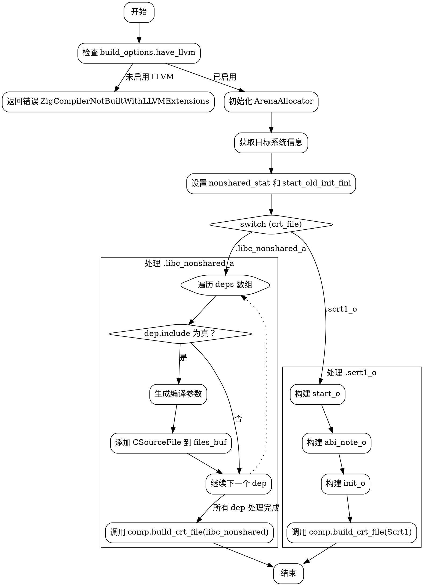

嗯，用户希望我根据提供的Zig代码中的`buildCrtFile`函数，用Graphviz画出流程图。首先，我需要理解这个函数的结构和逻辑流程，然后才能转化为流程图。

首先，我注意到函数一开始检查`build_options.have_llvm`，如果不满足则返回错误。接着初始化一些分配器，获取目标系统的信息，比如版本号，并设置了一些条件变量，如`nonshared_stat`和`start_old_init_fini`。

然后，函数根据`crt_file`的不同值执行不同的分支。这里有`switch (crt_file)`，分为`.scrt1_o`和`.libc_nonshared_a`两个case。每个case内部都有复杂的逻辑，包括构建不同的源文件、添加编译参数、处理依赖项等。

对于`.scrt1_o`的情况，它处理三个源文件：`start_o`、`abi_note_o`、`init_o`，然后调用`comp.build_crt_file`生成目标文件。对于`.libc_nonshared_a`，它处理一系列依赖项，根据条件过滤需要包含的文件，并为每个文件设置编译参数，最后同样调用`comp.build_crt_file`生成库文件。

在绘制流程图时，需要从函数入口开始，分支出两个主要的处理路径。每个路径内部可能还有多个步骤，比如条件判断、循环处理依赖项等。需要注意的是，`.libc_nonshared_a`部分有一个循环遍历`deps`数组，根据`dep.include`决定是否包含该文件，并生成对应的`CSourceFile`。

可能遇到的困难是如何将复杂的条件判断和循环结构清晰地用流程图表示。例如，在`.libc_nonshared_a`分支中，需要表示循环处理每个`dep`，并根据条件跳过某些项。此外，每个分支中的参数设置和文件构建步骤也需要分解成不同的节点。

另外，要注意流程图的节点和箭头需要正确反映代码的执行顺序和条件分支。比如，函数开始时的错误检查、初始化步骤，然后根据`crt_file`的值分支，每个分支内部的具体处理流程，以及最后的`comp.build_crt_file`调用。

需要确保所有的条件判断（如`if (nonshared_stat)`、循环`for (deps)`等）都在流程图中正确体现，避免遗漏关键步骤。同时，保持流程图的简洁性，避免节点过多导致混乱。

最后，使用Graphviz的DOT语言来编写流程图，定义各个节点和它们之间的连接关系，使用条件判断的分支节点，循环结构可能需要用子图或注释来表示。
================================================
