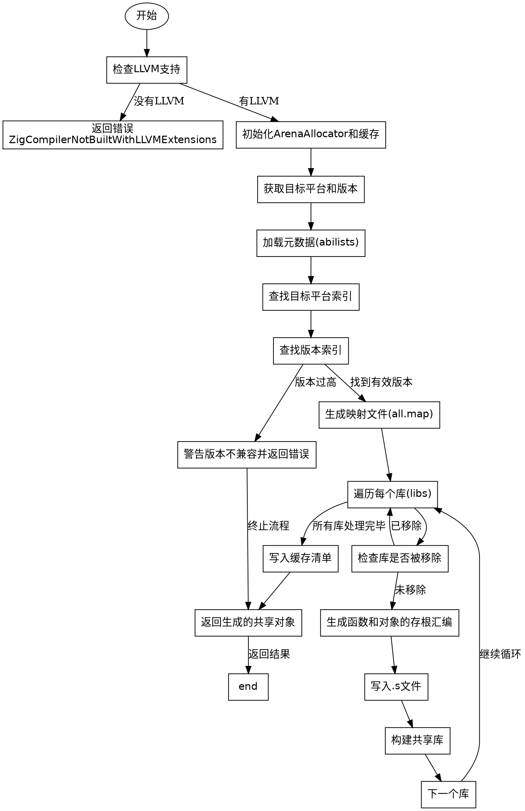

嗯，我需要帮用户用Graphviz画出这个Zig函数的流程图。首先，我要仔细阅读这个函数，理解它的主要步骤和逻辑结构。

函数名是buildSharedObjects，看起来是用于构建共享对象的。首先检查是否有LLVM支持，如果没有就返回错误。然后初始化一些内存分配器和缓存目录。接着处理目标平台的版本信息，加载元数据，找到对应的目标版本。然后生成一些汇编代码，处理符号版本，最后写入文件并构建共享库。

接下来，我需要将这个过程分解成不同的步骤，每个步骤对应流程图中的一个节点。可能的步骤包括：

1. 检查LLVM支持
2. 初始化Arena和缓存
3. 获取目标版本
4. 加载元数据
5. 确定目标版本索引
6. 生成映射文件内容
7. 处理函数和对象的包含项
8. 生成汇编代码
9. 写入汇编文件
10. 构建共享库
11. 处理缓存清单
12. 返回结果

需要注意条件判断，比如检查LLVM是否存在，处理版本选择时的条件分支。同时，循环结构比如处理多个库和符号的部分也需要在流程图中体现。

可能遇到的难点是正确识别所有的条件分支和循环，以及它们之间的连接关系。例如，在加载元数据后，需要确定目标版本是否存在，否则触发警告或错误。此外，生成汇编代码的部分可能涉及多个嵌套循环，需要正确表示。

另外，要注意异常处理和资源释放，比如defer语句关闭文件句柄或释放内存，这些可能需要在流程图中标出。

现在需要将这些步骤转化为Graphviz的节点和边。使用不同的形状表示开始/结束、操作步骤、条件判断等。例如，菱形表示条件判断，矩形表示操作步骤，椭圆形表示开始和结束。

可能的流程如下：

开始 -> 检查LLVM支持？ -> 是 -> 初始化Arena和缓存 -> 获取目标版本 -> 加载元数据 -> 确定目标版本索引 -> 生成映射文件 -> 处理库循环 -> 处理符号循环 -> 生成汇编代码 -> 写入文件 -> 构建共享库 -> 处理下一个库 -> 处理缓存清单 -> 返回结果

如果检查LLVM失败，直接返回错误。在确定目标版本索引时，如果找不到合适的版本，可能有警告或错误处理分支。处理符号时可能有条件判断选择默认版本等。

需要确保所有可能的路径都被覆盖，包括错误处理和循环退出条件。

最后，将这些步骤用Graphviz的DOT语言描述出来，确保节点之间的连接正确，条件分支用箭头标注条件结果。
================================================
