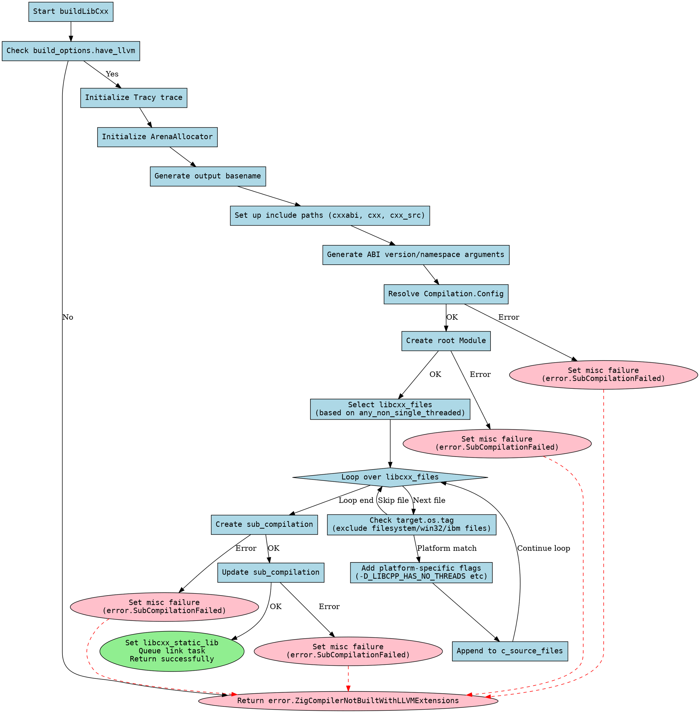

嗯，我现在需要根据提供的Zig代码文件`libcxx.zig`中的`buildLibCxx`函数，用Graphviz画出它的流程图。首先，我需要仔细阅读并理解这段代码的结构和逻辑流程。

首先，函数开始检查`build_options.have_llvm`，如果没有，就返回错误。然后初始化一些跟踪和内存分配器。接着处理目标平台相关的配置，生成输出文件名。之后设置包含路径和各种编译参数，比如ABI版本、优化模式等。然后创建模块配置，处理源文件列表，根据不同的平台条件排除或包含特定的源文件，并添加相应的编译标志。之后创建子编译实例，处理可能的错误，最后更新编译结果并链接静态库。

接下来，我需要将这些步骤转化为流程图中的节点和判断条件。每个主要操作应该是一个节点，条件判断（如if语句）会导致分支。例如，检查`have_llvm`会导致成功或错误退出分支。处理不同平台的部分可能会有多个条件分支，比如检查目标操作系统是否为Windows、WASI或ZOS，从而决定是否包含某些文件或添加特定编译标志。

需要注意的是，代码中有多个循环，比如遍历`libcxx_files`，向`c_source_files`添加条目。循环在流程图中通常表示为循环结构，但为了简化，可能需要将其表示为处理每个文件的一个节点，或者用条件判断来表示循环的开始和结束。

另外，错误处理部分需要特别关注，比如`try`表达式可能引发错误，导致跳转到错误处理节点。每个可能出错的地方都应该有一个错误处理的出口。

最后，函数结束时将生成的静态库添加到链接任务队列中。这应该是流程图的结束节点。

在绘制流程图时，需要确保所有可能的执行路径都被覆盖，包括正常流程和错误退出的情况。每个节点之间的箭头应正确反映代码的执行顺序和条件分支。可能需要将复杂的条件拆分成多个判断节点，以保持流程图的清晰性。

总结步骤：
1. 开始节点：函数入口。
2. 检查LLVM支持，不满足则错误退出。
3. 初始化跟踪和内存分配器。
4. 生成输出文件名。
5. 配置编译参数和包含路径。
6. 处理不同平台的条件判断，排除或包含特定文件。
7. 添加编译标志，处理ABI版本、优化选项等。
8. 创建模块配置，可能失败并处理错误。
9. 遍历源文件，处理每个文件的编译选项。
10. 创建子编译实例，处理可能的创建错误。
11. 更新子编译结果，处理可能的错误。
12. 成功生成静态库，添加到链接队列。
13. 结束节点：函数完成。

需要注意条件分支之间的连接，以及错误处理流程的正确表示。可能需要多次调整节点位置和连接，以确保流程图准确反映代码逻辑。
================================================

将此Graphviz代码渲染为流程图时，主要特点包括：
1. 菱形节点表示条件分支/循环控制
2. 粉红色椭圆节点表示错误退出路径
3. 绿色椭圆节点表示成功退出
4. 虚线红边表示所有错误最终汇聚到统一的错误退出
5. 详细展示了平台条件过滤、编译标志添加等关键步骤
6. 使用嵌套结构清晰表达了文件遍历循环
7. 保留了原始代码中的关键函数调用顺序和错误处理逻辑