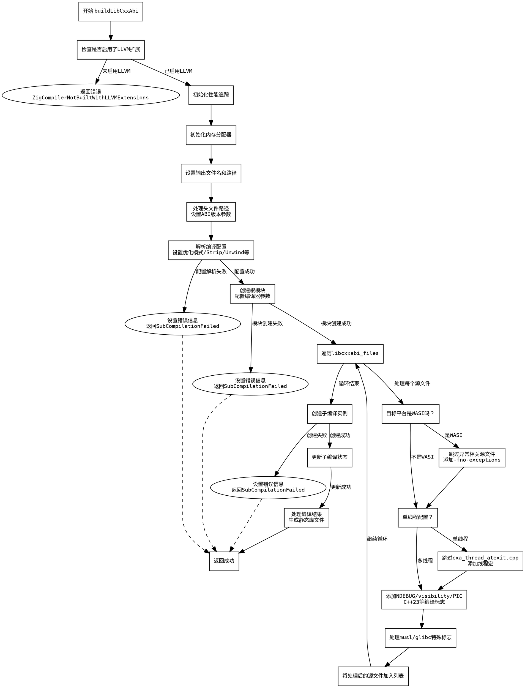

嗯，我现在需要根据提供的Zig代码文件`libcxx.zig`中的`buildLibCxxAbi`函数来生成一个Graphviz的流程图。首先，我需要仔细阅读这段代码，理解它的结构和各个部分的功能，然后才能正确地将其转化为流程图。

首先，这个函数的主要目的是构建libc++abi库。函数开始时检查是否启用了LLVM扩展，如果没有，则返回错误。接着，初始化一些跟踪和内存分配器，设置输出文件名和目标信息。然后处理各种编译配置，比如优化模式、链接模式等。之后，配置模块和源文件，添加各种编译标志，处理不同平台的特定情况，比如WASI不支持异常，因此排除相关源文件。最后创建子编译实例，处理可能的错误，并生成静态库文件。

接下来，我需要确定流程图的各个节点和它们之间的关系。流程图的起点是函数入口，然后是各个条件判断和错误处理，接着是配置步骤，循环处理源文件，设置编译参数，最后创建子编译并处理结果。

需要注意的地方包括：
1. 函数的错误处理部分，比如检查LLVM是否存在，以及后续可能的错误设置。
2. 循环处理`libcxxabi_files`中的每个源文件，这里可能需要用循环结构表示。
3. 条件判断，比如针对不同操作系统（如WASI、Linux）或ABI（如musl、glibc）的不同处理逻辑。
4. 子编译的创建和错误处理分支。

在绘制流程图时，需要将这些步骤用合适的图形符号表示，例如矩形框表示处理步骤，菱形表示条件判断，箭头表示流程方向。同时，要确保条件分支的每个可能路径都有正确的连接。

可能存在一些复杂的部分，比如嵌套的条件判断和循环结构，需要仔细处理以避免遗漏步骤。此外，函数中涉及多个资源分配和错误处理，这些也需要在流程图中体现出来。

现在，我需要将这些步骤转化为Graphviz的DOT语言结构。确保每个主要步骤对应一个节点，条件判断对应分支节点，循环结构使用适当的连接方式。同时，注意错误处理的路径，例如当条件不满足时跳转到错误节点或返回错误。

最后，检查流程图是否覆盖了所有关键步骤，逻辑是否正确，没有遗漏重要的处理流程。
================================================
