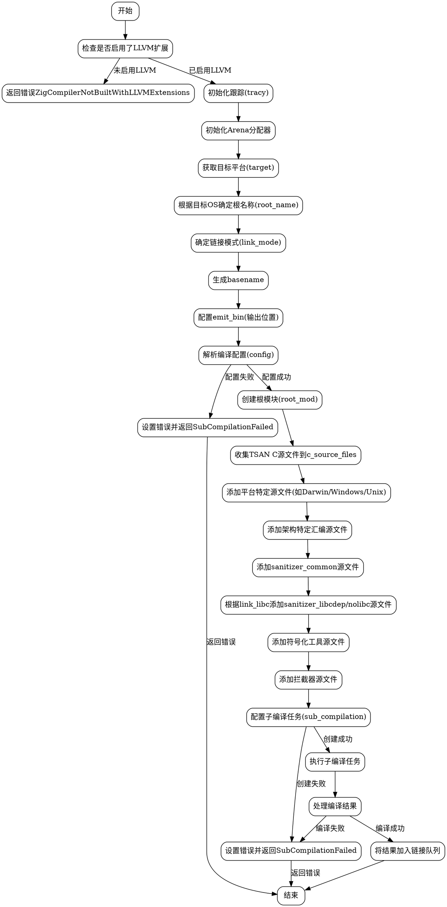

好的，我需要为给定的Zig函数`buildTsan`生成一个Graphviz的流程图。首先，我需要理解这个函数的结构和逻辑流程。

首先，函数开始检查是否有LLVM扩展，如果没有则返回错误。接着，初始化一些资源，比如跟踪和内存分配器。然后根据目标操作系统确定根名称和链接模式。接下来，处理各种配置参数，创建模块，收集C源文件，并根据不同的平台和架构添加相应的源文件和编译标志。最后，创建子编译任务并处理可能的错误。

我需要将这些步骤分解成不同的节点，并用箭头表示它们之间的流程。需要注意条件判断，比如不同操作系统和架构的处理，以及错误处理路径。每个主要操作应该是一个节点，例如检查LLVM、初始化资源、确定根名称、处理配置、添加源文件等。错误处理节点需要连接到相应的检查步骤。

另外，要注意函数中的循环结构，比如`for`循环添加源文件，这在流程图中可能需要表示为循环节点或简化为一个处理步骤。考虑到流程图的可读性，可能需要将这些循环合并成一个节点，说明“处理每个源文件”。

最后，确保所有可能的路径都被覆盖，包括正常流程和错误返回。每个错误返回都应该连接到对应的错误处理节点，可能还需要合并一些错误处理步骤以避免图表过于复杂。
================================================
