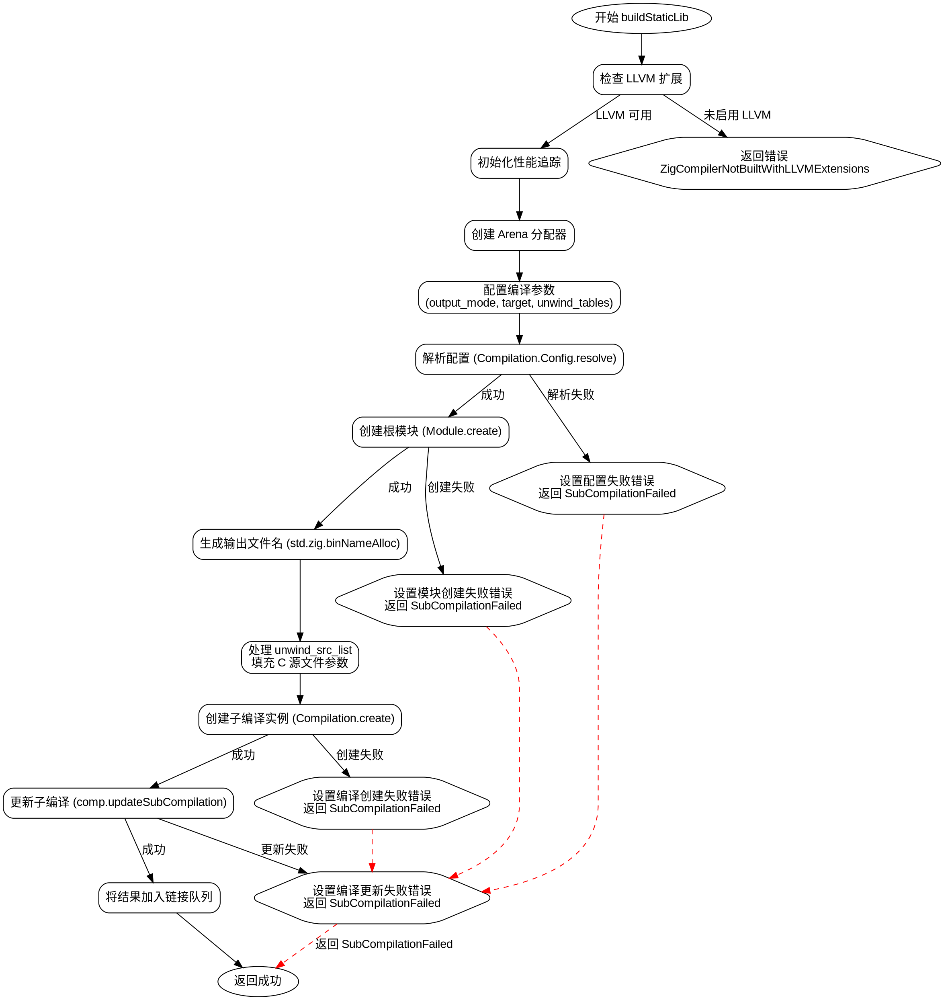

嗯，用户让我用Graphviz来画这个Zig函数的流程图。首先，我需要理解这个函数的结构。看起来这个函数是用于构建静态库的，可能涉及到编译配置、模块创建、源文件处理等步骤。

首先，函数开始检查是否有LLVM扩展，如果没有就返回错误。然后初始化一些跟踪和内存分配器。接着设置输出模式和目标平台，处理一些解表配置。之后创建根模块，配置各种编译参数，比如优化模式、代码模型等。然后生成输出文件名，处理C源文件，包括添加各种编译标志。接着创建子编译实例，处理可能的错误，最后将生成的库文件加入链接任务。

接下来，我需要将这些步骤转化为流程图中的节点和边。每个主要的操作或条件判断都应该是一个节点。例如，检查LLVM是否存在是一个条件节点，返回错误是一个终止节点。初始化跟踪和分配器是操作节点。然后配置编译选项、创建模块、处理源文件、创建子编译实例等步骤都是操作节点。错误处理部分可能需要分支，比如在创建模块或子编译失败时跳转到错误处理节点。

需要注意的是，函数中有多个可能的错误路径，每个错误都应该有一个对应的处理步骤，并最终返回SubCompilationFailed。同时，函数末尾将生成的库文件加入队列，这也是一个重要的步骤。

我需要确保流程图的逻辑正确，特别是条件判断和循环部分。例如，处理unwind_src_list的循环，可能需要用子图来表示循环结构，或者简化为一个操作节点，表示循环处理所有源文件。

另外，Graphviz使用DOT语言，所以要正确使用节点和边的语法。每个节点可以用矩形表示操作，菱形表示条件判断，椭圆形表示开始和结束。边上的标签可以注明条件或操作结果。

可能遇到的挑战是如何简化复杂的错误处理流程，以及如何处理循环结构。考虑到流程图的可读性，可能需要将循环处理C源文件的部分概括为一个步骤，而不是详细展开每个循环迭代。

最后，确保所有可能的执行路径都被覆盖，没有遗漏任何重要的步骤或条件分支。
================================================
