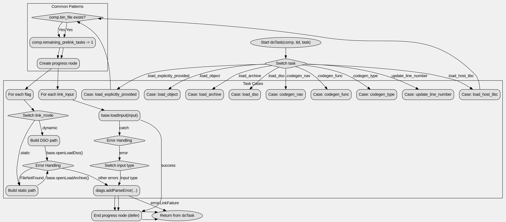

好的，我需要帮用户用Graphviz画出这个Zig函数的流程图。首先，我得仔细看看这个函数的结构。函数名为doTask，接受comp、tid和task作为参数。函数内部根据不同的task类型执行不同的操作。

首先，函数内部有一个switch语句，根据task的不同情况来处理。每个case对应不同的任务类型，比如.load_explicitly_provided、.load_host_libc等。每个case里可能有条件判断、循环、错误处理等结构。

我需要确定每个case的结构，比如是否有条件判断（if语句）、循环（for循环）、错误处理（catch块）等。例如，在.load_explicitly_provided这个case中，有一个if语句检查comp.bin_file是否存在，然后执行一些操作，包括减少remaining_prelink_tasks，启动进度节点，处理输入，错误处理等。

接下来，我需要将这些逻辑结构转化为Graphviz的节点和边。每个主要的处理步骤可以作为一个节点，条件分支需要用菱形节点表示，流程中的顺序用箭头连接。

需要注意的是，错误处理部分（catch块）可能会有多个分支，每个错误类型对应不同的处理方式。这些也需要在流程图中体现出来，比如不同的错误路径。

另外，有些case内部有嵌套的switch语句，比如在处理input时，根据不同的输入类型（dso、object等）添加不同的错误信息。这需要进一步分解，可能需要子图或者更多的节点来表示这些分支。

还要考虑函数中的defer语句，比如prog_node.end()会在函数返回前执行，这在流程图中可能需要表示为一个节点，放在相应处理步骤之后。

对于循环结构，比如for (comp.link_inputs) |input|，需要在流程图中表示循环的开始、循环体和结束。

最后，需要确保所有可能的执行路径都被覆盖，包括正常流程和错误处理流程。例如，当发生错误时，可能会直接return，或者记录错误信息后继续执行。

总结一下，步骤应该是：
1. 确定每个task case的结构。
2. 将每个case分解为节点和条件判断。
3. 处理循环和错误处理的分支。
4. 使用Graphviz语法将这些元素连接起来。
5. 检查是否有遗漏的分支或节点，确保流程图的准确性。
================================================
