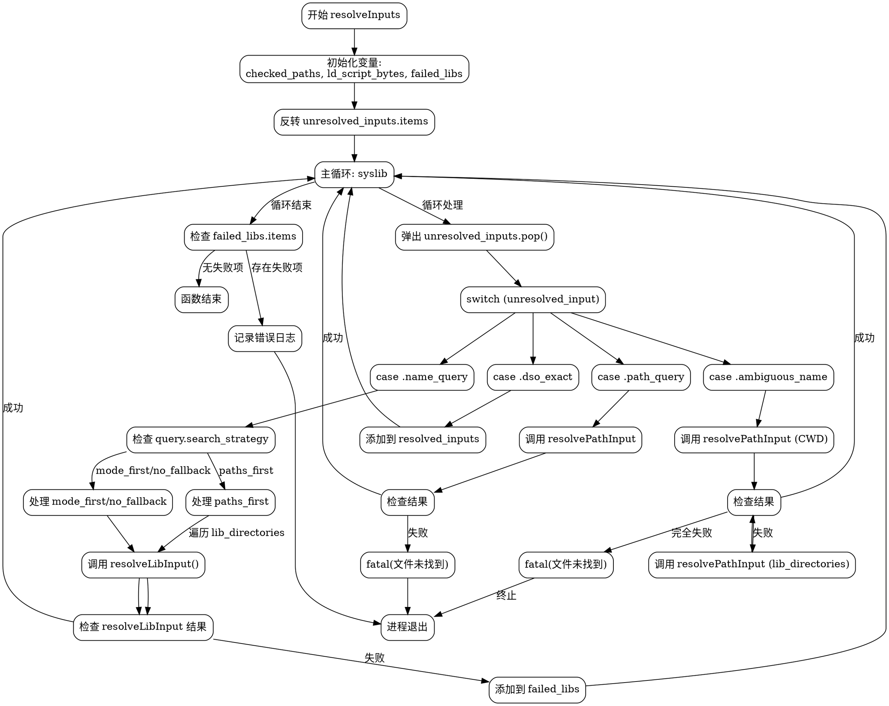

好的，我现在要处理用户的要求，他们提供了一个Zig语言的函数`resolveInputs`，并要求用Graphviz生成这个函数的流程图。首先，我需要理解这个函数的结构和逻辑流程，然后将其转化为流程图的结构。

首先，我会通读代码，了解函数的主要逻辑。函数`resolveInputs`的作用是解析未解决的输入（可能是库文件或其他资源），处理不同的输入类型，如名称查询、路径查询、DSO精确匹配等。函数中有一个主循环`syslib`，处理`unresolved_inputs`列表中的每一个输入项。

接下来，我注意到函数内部有多个条件分支，比如`switch (unresolved_input)`处理不同的输入类型，每个case下有各自的处理逻辑。例如，`.name_query`分支处理库名称查询，`.ambiguous_name`处理路径不明确的输入，`.path_query`处理路径明确的输入，`.dso_exact`处理精确的DSO匹配。

然后，每个分支中又有不同的处理步骤，比如`.name_query`下会根据搜索策略（mode_first, no_fallback, paths_first）进行不同的处理，检查库目录，处理可能的回退模式，添加失败信息等。此外，还存在递归或循环处理的情况，例如处理链接脚本可能生成新的未解析输入，需要重新压入栈中处理。

在绘制流程图时，需要将这些条件分支和循环结构清晰地表示出来。开始于函数入口，处理`unresolved_inputs`的循环，每个输入项进入不同的处理分支，每个分支内部的条件判断和可能的错误处理，以及最终的失败情况收集和退出。

需要注意的是，Graphviz使用DOT语言，所以要正确使用节点和边来表示流程。例如，主循环开始节点，然后根据不同的case分支连接到相应的处理节点，每个处理节点内部的子流程可能需要分解成子图或更多的节点和边。同时，错误处理路径和成功继续循环的路径也要明确标出。

可能遇到的挑战是代码中的嵌套条件较多，需要合理组织节点避免过于复杂。例如，`.name_query`中的不同搜索策略可能需要多个判断步骤，每个策略的处理流程需要详细展开。此外，处理失败的情况（如`failed_libs`的收集和最终的错误输出）也需要在流程图中体现。

总结步骤：
1. 确定函数的主要流程节点：初始化变量，进入主循环，处理每个输入项的不同类型。
2. 对每个输入类型（如name_query、ambiguous_name等）创建分支节点。
3. 细化每个分支的内部逻辑，包括条件判断、循环处理、可能的递归调用等。
4. 处理错误和失败情况，如收集失败信息并最终退出。
5. 使用Graphviz的语法将这些节点和连接关系结构化，确保流程清晰可读。

需要特别注意循环结构（如`syslib`标签的continue）、递归处理（如将新输入压栈）以及错误处理路径。此外，函数中的`fatal`调用和错误日志输出也是流程的重要部分，需要在流程图中明确表示。
================================================

该流程图使用 Graphviz DOT 语言表示，包含以下关键特征：

1. 主循环结构用 `syslib_loop` 节点表示
2. 使用 switch-case 结构处理不同输入类型
3. 详细展示了 `.name_query` 的两种搜索策略处理路径
4. 包含错误处理路径和 fatal 终止流程
5. 使用菱形节点表示条件判断分支
6. 最终错误检查和处理逻辑清晰可见
7. 保持了与原始代码结构的高度对应性

可以通过 Graphviz 工具（如 dot 命令）生成 PNG/SVG 等格式的流程图。