嗯，我需要用Graphviz来画出这个Zig函数的流程图。首先，我需要仔细阅读这个函数的代码，理解每个步骤的作用和流程。这个函数的名字是flushModule，看起来是处理模块的刷新或者写入操作。

首先，函数开始的时候有一些初始化的步骤，比如使用tracy进行跟踪，创建子进度节点sub_prog_node。然后获取了一些上下文变量，比如comp、diags、gpa、zcu、ip等。接着激活了PerThread的pt，并在最后defer了pt.deactivate()，这部分应该对应流程图的开始和结束节点。

接下来有一个循环，遍历self.uavs.count()，每次调用self.updateUav(pt, i)。这部分应该是一个循环结构，在流程图中表示为一个循环节点，循环体内调用updateUav。

然后初始化了一个Flush结构体f，并defer了它的deinit。之后处理了abi_defines，并确保all_buffers有足够的容量。接着将abi_defines.items和zig_h添加到缓冲区。这里可能对应几个步骤，比如分配缓冲区、添加内容等。

接着处理了ctypes_index和lazy_index，分别增加了all_buffers的长度。之后有一个生成全局汇编代码的部分，调用codegen.genGlobalAsm，并将结果添加到缓冲区。这部分可能需要一个生成代码的节点，然后添加到缓冲区的步骤。

然后处理了lazy_fwd_decl_buf和lazy_code_buf，初始化了lazy_ctype_pool，并调用flushErrDecls。这里可能涉及几个步骤，比如清空缓冲区、初始化池、处理错误声明。

接下来是关于导出名称的处理，遍历了zcu的single_exports和multi_exports，将导出的名称存入export_names哈希表中。然后再次遍历uavs和navs，调用flushAvBlock处理每个av_block。这部分可能有两个循环结构，分别处理uavs和navs，每个循环内部调用flushAvBlock。

然后是处理CTypes的部分，首先初始化ctype_pool，调用flushCTypes处理lazy_ctype_pool，之后再次遍历uavs和navs，分别处理它们的ctype_pool。这部分可能涉及多个循环，每个循环内部调用flushCTypes。

接下来更新了all_buffers中的ctypes_index和lazy_index对应的缓冲区内容，并更新了file_size。之后将lazy_code_buf的内容和各个av_block的代码添加到all_buffers中，这里可能有一个循环结构，遍历uavs和navs，分别处理它们的代码。

最后，处理文件写入部分，设置文件结束位置，并执行pwritevAll写入所有缓冲区内容。这部分可能对应文件操作的节点，包括设置位置和写入数据。

总结整个流程，大概的步骤是：初始化、处理UAVs循环、准备缓冲区、处理ABI定义和全局汇编、处理导出名称和AV块、处理CTypes、填充缓冲区、写入文件。每个步骤之间可能存在顺序和分支，需要正确连接。

在绘制流程图时，需要注意各个步骤的顺序，循环和条件分支的结构，以及各个函数调用之间的关系。可能需要使用Graphviz的节点、边、子图来表示这些结构，比如矩形节点表示操作，菱形表示条件判断，循环结构用循环子图表示等。

需要注意的是，有些步骤可能涉及到错误处理，比如try语句，但在流程图中可能不需要详细画出错误处理的路径，除非特别重要。此外，defer语句的内容可能需要在流程图的适当位置体现，比如资源释放操作。

最后，确保流程图的结构清晰，层次分明，每个步骤之间的流向正确无误，没有遗漏关键步骤。
================================================

```dot
digraph flushModule {
    node [shape=rectangle, style=rounded];

    start [label="开始"];
    end [label="结束"];

    subgraph cluster_init {
        label="初始化";
        init_tracy [label="启动Tracy跟踪"];
        init_sub_prog [label="创建子进度节点sub_prog_node"];
        get_context [label="获取comp, diags, gpa, zcu, ip等上下文"];
        activate_pt [label="激活PerThread(pt)"];
        defer_pt_deactivate [label="defer pt.deactivate()"];
    }

    subgraph cluster_loop_uavs {
        label="处理UAVs循环";
        loop_uavs_start [label="i = 0"];
        loop_condition [label="i < self.uavs.count()?" shape=diamond];
        update_uav [label="调用self.updateUav(pt, i)"];
        increment_i [label="i += 1"];
    }

    subgraph cluster_flush_init {
        label="初始化Flush结构";
        init_flush [label="初始化Flush结构f"];
        defer_deinit [label="defer f.deinit(gpa)"];
    }

    subgraph cluster_abi_defines {
        label="处理ABI定义";
        gen_abi_defines [label="生成abi_defines"];
        ensure_buffers [label="确保all_buffers容量"];
        append_abi [label="添加abi_defines和zig_h到缓冲区"];
    }

    subgraph cluster_asm {
        label="生成全局汇编";
        gen_global_asm [label="调用codegen.genGlobalAsm"];
        append_asm [label="将汇编代码加入缓冲区"];
    }

    subgraph cluster_lazy {
        label="处理延迟声明";
        init_lazy_pool [label="初始化lazy_ctype_pool"];
        flush_err_decls [label="调用flushErrDecls"];
        clear_buffers [label="清空lazy_fwd_decl_buf和lazy_code_buf"];
    }

    subgraph cluster_exports {
        label="处理导出名称";
        init_export_names [label="初始化export_names哈希表"];
        collect_single_exports [label="收集single_exports名称"];
        collect_multi_exports [label="收集multi_exports名称"];
        process_uavs_navs [label="遍历uavs和navs调用flushAvBlock"];
    }

    subgraph cluster_ctypes {
        label="处理CTypes";
        init_ctype_pool [label="初始化ctype_pool"];
        flush_lazy_ctypes [label="调用flushCTypes处理lazy_ctype_pool"];
        loop_uavs_ctypes [label="遍历uavs处理ctype_pool"];
        loop_navs_ctypes [label="遍历navs处理ctype_pool"];
    }

    subgraph cluster_final_buffers {
        label="填充最终缓冲区";
        update_ctypes_index [label="更新ctypes_index缓冲区"];
        update_lazy_index [label="更新lazy_index缓冲区"];
        append_lazy_code [label="添加lazy_code_buf内容"];
        loop_append_uavs_code [label="遍历uavs添加代码"];
        loop_append_navs_code [label="遍历navs添加代码"];
    }

    subgraph cluster_file_write {
        label="写入文件";
        set_file_pos [label="设置文件结束位置"];
        pwritev_all [label="执行pwritevAll写入数据"];
    }

    start -> init_tracy -> init_sub_prog -> get_context -> activate_pt -> defer_pt_deactivate;

    defer_pt_deactivate -> loop_uavs_start;
    loop_uavs_start -> loop_condition;
    loop_condition -> update_uav [label="是"];
    update_uav -> increment_i -> loop_condition;
    loop_condition -> init_flush [label="否"];

    init_flush -> defer_deinit -> gen_abi_defines;
    gen_abi_defines -> ensure_buffers -> append_abi;
    append_abi -> gen_global_asm;
    gen_global_asm -> append_asm -> init_lazy_pool;
    init_lazy_pool -> flush_err_decls -> clear_buffers;

    clear_buffers -> init_export_names;
    init_export_names -> collect_single_exports -> collect_multi_exports -> process_uavs_navs;

    process_uavs_navs -> init_ctype_pool;
    init_ctype_pool -> flush_lazy_ctypes -> loop_uavs_ctypes -> loop_navs_ctypes;

    loop_navs_ctypes -> update_ctypes_index -> update_lazy_index;
    update_lazy_index -> append_lazy_code -> loop_append_uavs_code -> loop_append_navs_code;

    loop_append_navs_code -> set_file_pos -> pwritev_all -> end;
}
``` 

这个流程图使用Graphviz的DOT语言描述，通过以下步骤清晰展示了函数逻辑：

1. **初始化阶段**：启动性能跟踪、创建进度节点、获取上下文变量。
2. **UAV循环处理**：遍历所有UAV并进行更新操作。
3. **缓冲区初始化**：初始化Flush结构，生成ABI定义和全局汇编代码。
4. **延迟声明处理**：初始化类型池并处理错误声明。
5. **导出名称收集**：收集所有需要导出的符号名称。
6. **类型系统处理**：初始化类型池并填充所有必要的C类型定义。
7. **最终缓冲区填充**：将所有生成的代码段按顺序填充到缓冲区。
8. **文件写入**：设置文件大小并将所有缓冲区内容写入磁盘。

每个子图用虚线框划分逻辑块，箭头表示执行顺序，菱形节点表示循环条件判断。