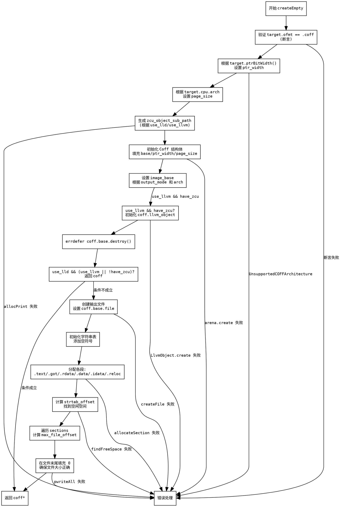

好的，我需要帮助用户根据提供的Zig代码生成一个流程图，使用Graphviz。首先，我需要仔细阅读并理解这段代码的功能和结构。

函数名为createEmpty，属于Coff模块。主要功能是创建一个COFF文件的结构，处理不同的配置选项和目标平台设置。代码中涉及条件判断、内存分配、错误处理等步骤。

首先，我会确定函数的主要步骤：

1. 参数验证和目标检查。
2. 根据目标架构设置指针宽度和页面大小。
3. 处理LLVM和LLD的配置，生成对象文件路径。
4. 初始化Coff结构体，填充各种配置选项。
5. 处理不同的段（如.text, .got, .rdata等）的分配。
6. 处理字符串表和其他数据结构。
7. 处理文件写入和偏移量计算。
8. 错误处理和资源释放。

接下来，需要将这些步骤转化为流程图节点，并确定它们之间的逻辑流向。例如：

- 开始于函数入口。
- 检查target.ofmt是否为.coff，若否则断言失败。
- 根据指针宽度设置ptr_width。
- 根据是否使用LLVM或LLD生成zcu_object_sub_path。
- 初始化coff结构体，填充字段。
- 分配各个段，如.text、.got等，每个分配可能涉及条件判断。
- 处理字符串表和临时字符串表。
- 写入文件内容，计算最大文件偏移。
- 最终返回coff对象或错误。

需要注意条件分支，比如if (use_llvm && comp.config.have_zcu)等，这些需要分支节点。同时，错误处理部分如errdefer也需要体现。

可能遇到的难点是如何正确表达循环结构（例如循环遍历sections计算max_file_offset），但根据代码，这里是一个简单的遍历，可以简化为一个处理步骤。

需要确保每个步骤的逻辑顺序正确，并且条件分支明确。最后，使用Graphviz的语法将节点和边连接起来，形成完整的流程图。
================================================
