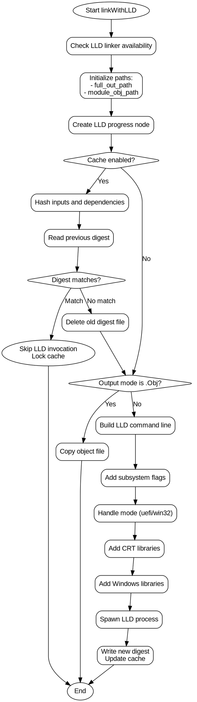

嗯，用户让我用Graphviz来画这个Zig函数的流程图。首先，我需要仔细看看这个函数的代码结构，然后理清楚各个步骤之间的流程关系。这个函数叫做linkWithLLD，看起来是处理COFF格式的链接过程，使用LLD作为链接器。

首先，函数开始处有一些初始化的步骤，比如检查LLD链接器是否可用，获取一些路径信息，处理模块对象路径。然后根据配置决定是生成库还是可执行文件，接着处理入口点、子系统版本、缓存等。中间有很多条件判断，比如是否禁用缓存，是否是对象文件输出，是否需要调用LLD进行链接等等。

接下来，我需要把整个函数分解成主要的步骤。可能的分支包括：

1. 检查是否使用LLD链接器，初始化变量。
2. 处理模块对象路径，可能需要刷新模块。
3. 配置链接选项，比如子系统、入口点、库路径、符号等。
4. 处理缓存机制，计算哈希，检查是否需要重新链接。
5. 如果是对象文件模式，直接复制文件。
6. 否则，构建LLD的命令行参数，调用LLD进行链接。
7. 处理不同目标平台和ABI的特定选项，比如Windows库、CRT文件等。
8. 最后更新缓存信息，处理锁文件。

流程图需要涵盖这些主要步骤，并展示各个条件分支，比如是否禁用缓存、输出模式是否为Obj、是否是动态库等。要注意各个条件判断的分支，以及可能的错误处理路径，比如缓存未命中时的处理。

需要确定每个判断点的条件和对应的流程走向。例如，在检查是否禁用缓存时，如果不禁用，则计算哈希并检查缓存命中；如果命中则直接返回，否则继续链接过程。另一个例子是输出模式是否为Obj，如果是则复制文件，否则构建LLD命令。

另外，函数中有很多子过程，比如spawnLld，这些可能需要作为单独的节点或者子流程处理。但由于流程图主要是展示主函数的流程，可能不需要深入到每个子函数的细节，而是作为步骤节点。

最后，确保流程图的结构清晰，节点之间的箭头正确表示执行顺序和条件分支。可能需要使用不同的形状来表示开始/结束、过程、判断点等。例如，矩形表示过程，菱形表示判断，椭圆形表示开始和结束。

现在需要将这些步骤转化为Graphviz的DOT语言，用正确的节点和边连接起来，确保逻辑正确，没有遗漏重要的分支或步骤。
================================================
