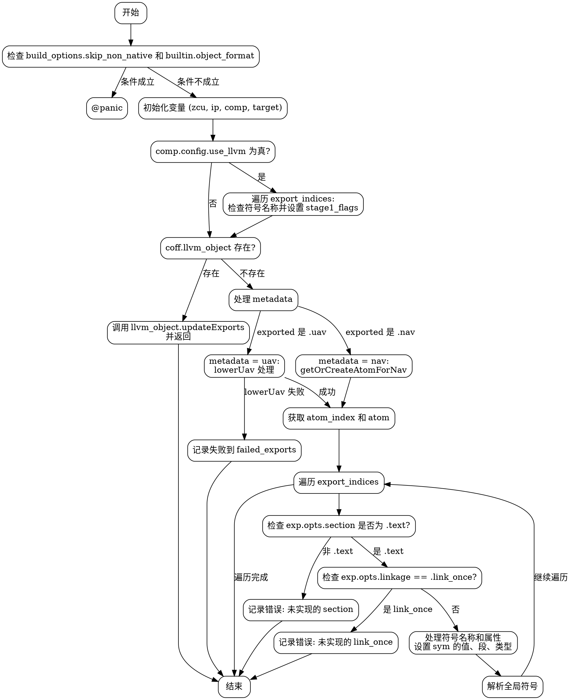

好的，我需要为给定的 Zig 函数 `updateExports` 生成一个流程图。首先，我需要理解这个函数的结构和逻辑流程。让我先通读一下代码，看看主要的控制流是怎样的。

函数开始处有一个检查，如果 `build_options.skip_non_native` 为真且 `builtin.object_format` 不是 `.coff`，就会 panic。然后，获取一些上下文变量，比如 `zcu`、`ip`、`comp` 和 `target`。

接下来，如果 `comp.config.use_llvm` 为真，会遍历 `export_indices`，处理每个导出项，检查特定的符号名称（如 `main`、`WinMain` 等），并设置相应的标志位。这部分主要是条件判断和循环处理。

然后，如果 `coff.llvm_object` 存在，就调用 `llvm_object.updateExports` 并返回。否则，继续处理元数据（`metadata`），根据 `exported` 的类型（`.nav` 或 `.uav`）进行不同的处理。对于 `.uav` 的情况，可能需要调用 `lowerUav` 并处理可能的失败。

之后，获取 `atom_index` 和 `atom`，并遍历 `export_indices`，处理每个导出项的设置，包括检查段名称、链接方式等，最终设置符号的相关属性，并解析全局符号。

现在，我需要将这些步骤转化为流程图。需要注意条件分支（如 `if` 语句）、循环（如 `for` 循环）、错误处理（如 `try` 和错误返回）以及函数调用。同时，要确保流程图的节点和箭头正确反映代码的执行顺序和逻辑分支。

可能的步骤包括：
1. 开始节点。
2. 检查 `skip_non_native` 和 `object_format`，导致 panic 或继续。
3. 初始化变量。
4. 检查 `use_llvm`，处理符号名称设置标志位。
5. 检查 `llvm_object` 是否存在，调用相应方法或继续。
6. 处理 `metadata` 的获取，区分 `.nav` 和 `.uav`。
7. 对于 `.uav`，处理 `lowerUav` 的结果，可能的错误处理。
8. 获取 `atom` 和遍历导出项。
9. 检查段名称、链接方式，处理错误或继续设置符号属性。
10. 结束节点。

需要确保每个条件分支都有正确的箭头指向，循环结构也要正确表示。例如，`for (export_indices)` 需要表示为循环节点，内部处理每个导出项。同时，错误处理部分（如 `try zcu.failed_exports.putNoClobber`）需要作为分支处理。

还要注意函数中的多个错误处理点，比如在 `lowerUav` 失败时如何处理，或者在设置符号时遇到未实现的选项时记录错误。这些都需要在流程图中体现出来。

可能遇到的挑战是如何简洁地表示复杂的条件嵌套和循环，同时保持流程图的可读性。可能需要将某些部分合并或简化，但必须确保逻辑的正确性。

最后，生成 Graphviz 的 DOT 语言代码，正确使用节点、边、条件判断等元素，确保流程图准确反映函数的执行流程。
================================================
