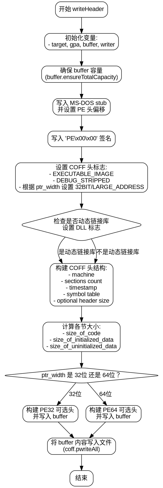

好的，我需要为这个Zig函数`writeHeader`绘制流程图。首先，我要理解函数的结构和逻辑流程。

函数开头声明了一些变量，比如`target`、`gpa`、`buffer`和`writer`。然后确保buffer的容量，写入MS-DOS stub，并设置PE头的位置。接下来是PE头的标志设置，根据指针宽度（32或64位）调整不同的标志。然后处理时间戳、COFF头的各个字段，比如machine类型、节数量、时间戳等。

之后，处理DLL标志、子系统类型、计算各节的大小（代码、初始化数据、未初始化数据）。根据指针宽度分成了32位和64位两种情况，分别构造不同的可选头结构（OptionalHeaderPE32和OptionalHeaderPE64），并将这些结构写入buffer。最后，将buffer的内容写入COFF文件。

流程图需要涵盖主要的步骤，包括初始化、写入MS-DOS stub、处理PE头标志、构建COFF头、处理可选头（分32和64位）、最后写入文件。要注意条件判断，比如指针宽度不同导致的不同处理路径，以及是否是动态链接库等条件。

可能需要用分支来表示不同的情况，比如32位和64位的处理分支，以及动态链接库标志的设置。每个步骤用矩形框表示，判断用菱形框，箭头表示流程方向。确保每个重要操作都包含在内，比如变量初始化、写入数据、计算大小、构造结构体等。

另外，错误处理和defer语句可能需要考虑，但函数中的错误处理似乎通过try和catch unreachable处理，可能在流程图中不需要特别标注错误路径，除非有显式的错误分支。

最后，使用Graphviz的DOT语言来绘制流程图，确保结构清晰，节点和边正确对应代码的逻辑流程。
================================================
