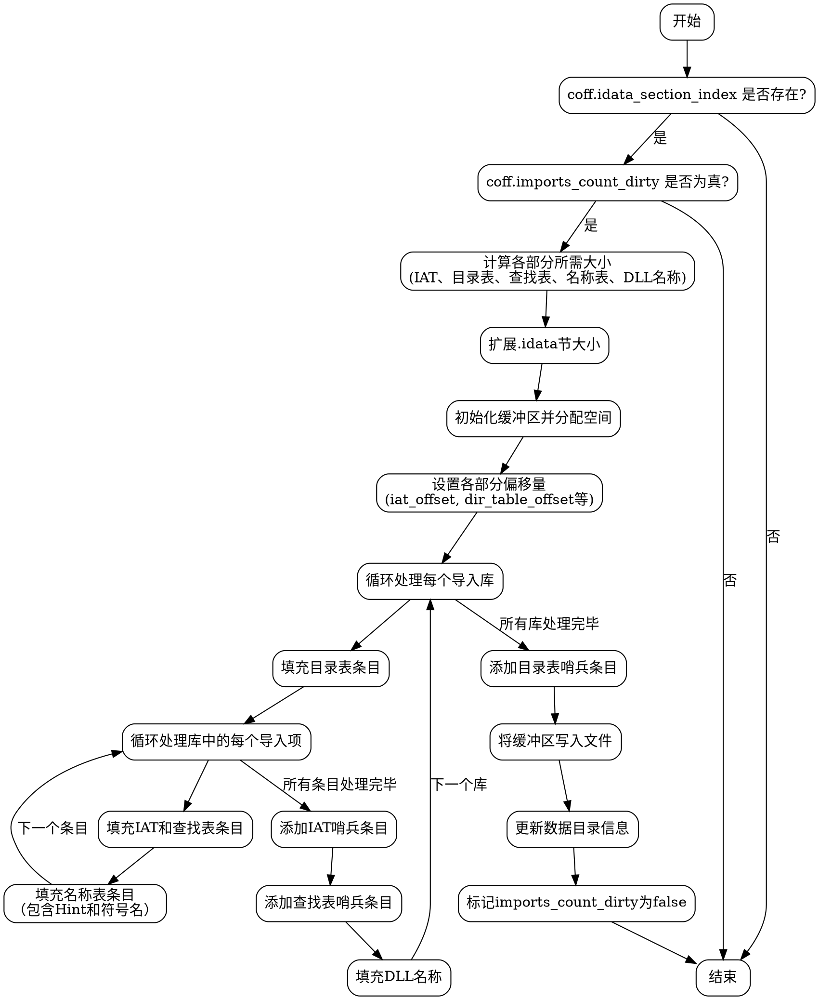

好的，我需要为给定的Zig函数`writeImportTables`绘制一个流程图。首先，我得仔细阅读代码，理解它的逻辑结构。这个函数的主要功能是处理COFF文件的导入表，包括计算需要的各个部分的大小，调整节的大小，然后写入数据。

首先，函数开始时会检查`coff.idata_section_index`是否存在，以及`coff.imports_count_dirty`是否为真。如果任一条件不满足，函数直接返回。否则，继续执行。

接下来是计算各个部分所需的大小：IAT、目录表、查找表、名称表和DLL名称的总大小。这里有一个循环遍历所有导入表项，累加各部分的大小。需要注意到每个导入项的处理，包括符号名称的对齐等。

然后，函数尝试调整对应的节的大小，以确保有足够的空间。之后，初始化一个缓冲区，并按照计算好的偏移依次写入各个部分的数据，包括目录条目、查找表条目、IAT条目、名称表条目以及DLL名称。每个循环迭代处理一个导入库，填充相应的数据，并在最后添加哨兵条目。

最后，更新COFF的数据目录，并标记`imports_count_dirty`为false，表示已经处理完毕。

绘制流程图时，需要将这些步骤分解成不同的节点，并用箭头连接表示流程。开始和结束节点，条件判断节点，循环处理节点，以及各个写入数据的步骤都需要明确标出。注意，在循环内部的处理步骤可能需要子流程，比如处理每个导入表项时涉及的各个计算和写入操作。

需要注意的是，不要使用Mermaid语法，而是Graphviz的DOT语言。需要确保流程图的每个步骤逻辑清晰，节点之间的连接正确，没有遗漏关键步骤或条件分支。
================================================
