好的，我需要为给定的Zig函数`flushModule`绘制一个流程图。首先，我得仔细阅读代码，理解其结构和各个部分的功能。

函数开始部分，处理`anyerror`类型，创建`WipNav`结构体，并生成调试信息。接着处理模块的根目录路径，更新`debug_line_str`。然后，处理多个调试段（如`debug_aranges`、`debug_frame`、`debug_info`等），每个段都有不同的处理逻辑，比如设置头部信息、处理单元数据、写入尾部等。最后，确保所有调试段都不再处于“dirty”状态。

接下来，我需要将这些步骤转化为流程图。每个主要代码块（用花括号包围的部分）可能代表一个流程节点。例如，第一个块处理类型信息，第二个处理模块路径，然后依次处理各个调试段。每个调试段的处理可能包括检查是否dirty、构建头部、写入数据等步骤。

需要注意条件判断，比如`if (dwarf.debug_aranges.section.dirty)`，这会导致不同的分支流程。每个条件判断对应一个判断节点，根据条件的结果执行不同的操作。

此外，函数中有多个循环结构，比如`for (dwarf.mods.keys(), dwarf.mods.values())`和`for (dwarf.debug_aranges.section.units.items, 0..)`，这些循环需要在流程图中用循环节点表示。

最后，确保所有步骤结束后，所有段都被标记为干净，并验证没有遗漏任何dirty段。

在绘制流程图时，应使用graphviz的语法，正确使用节点、边、条件判断和循环结构。需要确保每个处理块和条件分支都清晰表示，避免混淆。
================================================

```dot
digraph flushModule {
    node [shape=rectangle, style=rounded];

    start [label="开始 flushModule"];
    handle_anyerror_type [label="处理 anyerror 类型\n创建 WipNav 结构体\n生成调试信息"];
    process_mod_paths [label="处理模块路径\n解析根目录并更新 debug_line_str"];
    check_aranges [label="检查 debug_aranges 是否脏"];
    update_aranges [label="更新 debug_aranges 头部和尾部"];
    check_frame [label="检查 debug_frame 是否脏"];
    update_frame_x86_64 [label="针对 x86_64 架构更新 debug_frame"];
    check_info [label="检查 debug_info 是否脏"];
    update_info [label="填充 debug_info 单元数据\n处理模块和交叉引用"];
    check_abbrev [label="检查 debug_abbrev 是否脏"];
    update_abbrev [label="写入 debug_abbrev 尾部"];
    check_str [label="检查 debug_str 是否脏"];
    update_str [label="写入 debug_str 内容"];
    check_line [label="检查 debug_line 是否脏"];
    update_line [label="更新 debug_line 头部和文件信息"];
    check_line_str [label="检查 debug_line_str 是否脏"];
    update_line_str [label="写入 debug_line_str 内容"];
    check_loclists [label="检查 debug_loclists 是否脏"];
    check_rnglists [label="检查 debug_rnglists 是否脏"];
    update_rnglists [label="更新 debug_rnglists 头部"];
    final_assert [label="验证所有段已清理"];
    end [label="结束"];

    start -> handle_anyerror_type;
    handle_anyerror_type -> process_mod_paths;
    process_mod_paths -> check_aranges;

    check_aranges -> update_aranges [label="是"];
    check_aranges -> check_frame [label="否"];

    update_aranges -> check_frame;

    check_frame -> update_frame_x86_64 [label="是且架构为 x86_64"];
    check_frame -> check_info [label="否或其他架构"];

    update_frame_x86_64 -> check_info;

    check_info -> update_info [label="是"];
    check_info -> check_abbrev [label="否"];

    update_info -> check_abbrev;

    check_abbrev -> update_abbrev [label="是"];
    check_abbrev -> check_str [label="否"];

    update_abbrev -> check_str;

    check_str -> update_str [label="是"];
    check_str -> check_line [label="否"];

    update_str -> check_line;

    check_line -> update_line [label="是"];
    check_line -> check_line_str [label="否"];

    update_line -> check_line_str;

    check_line_str -> update_line_str [label="是"];
    check_line_str -> check_loclists [label="否"];

    update_line_str -> check_loclists;

    check_loclists -> check_rnglists [label="否"];
    check_loclists -> check_rnglists [label="是（标记为不脏）"];

    check_rnglists -> update_rnglists [label="是"];
    check_rnglists -> final_assert [label="否"];

    update_rnglists -> final_assert;

    final_assert -> end;
}
```
