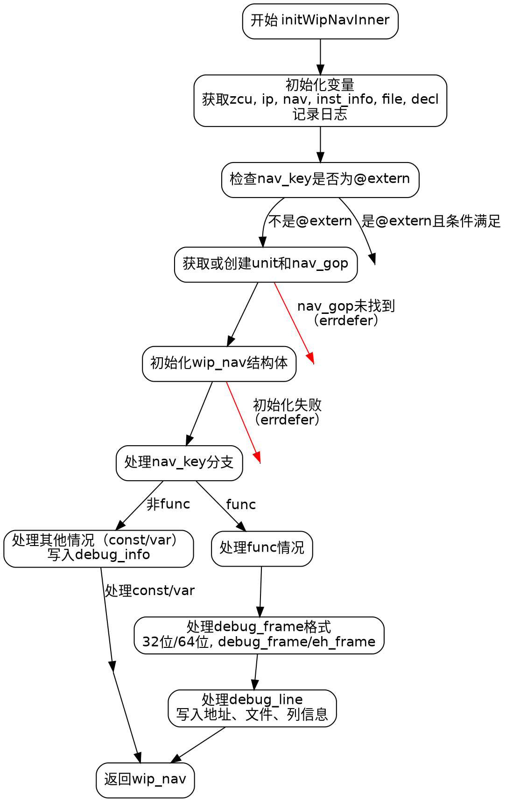

好的，我需要根据用户提供的Zig代码绘制一个流程图，使用Graphviz。首先，我需要理解这个函数的结构和逻辑流程。

首先，函数名是initWipNavInner，接受几个参数并返回一个可能的WipNav。代码中涉及到很多条件判断和分支，比如switch语句处理不同的nav_key情况，尤其是处理func的情况和其他情况。

接下来，我需要分解代码的主要步骤：

1. **初始化和日志记录**：获取zcu、ip、nav、inst_info、file、decl，并记录日志。
2. **处理nav_val和nav_key**：检查是否是extern，如果是则返回null，否则继续。
3. **获取或创建unit和nav_gop**：处理dwarf.navs的获取或插入，处理错误情况。
4. **初始化wip_nav结构体**：设置各个字段，包括不同的section如debug_info、debug_line等。
5. **处理不同的nav_key情况**：
   - **其他情况（else分支）**：处理常量或变量的声明，写入debug_info。
   - **func情况**：处理函数相关的逻辑，设置func的各个属性，处理debug_frame和debug_line的写入，处理不同格式（32/64位）和不同框架（debug_frame/eh_frame）。

我需要将这些步骤转化为流程图中的节点和决策点。注意错误处理（errdefer）和条件分支（switch case）。

可能的流程节点包括：
- 开始
- 初始化变量和日志
- 检查nav_key是否为extern
- 获取或创建unit和nav_gop
- 初始化wip_nav结构体
- 根据nav_key分支处理
  - 其他情况：处理const或var
  - func情况：处理函数相关逻辑
- 结束并返回wip_nav

需要注意条件分支后的不同处理路径，特别是func情况下的子分支（处理debug_frame的不同格式）。

现在，将这些步骤用Graphviz的dot语言表示出来，使用节点和边连接，正确表示条件判断和流程走向。
================================================

生成的流程图说明：
1. 函数从初始化变量和日志记录开始
2. 检查nav_key是否为@extern，如果是则提前返回null
3. 获取或创建unit和nav_gop，包含错误回退路径（红色）
4. 初始化wip_nav结构体，包含错误处理路径（红色）
5. 根据nav_key分支处理：
   - 普通声明（const/var）处理路径
   - 函数声明处理路径，包含子流程：
     * 处理debug_frame格式（32/64位，debug_frame/eh_frame）
     * 处理debug_line信息
6. 最终返回构造好的wip_nav结构体