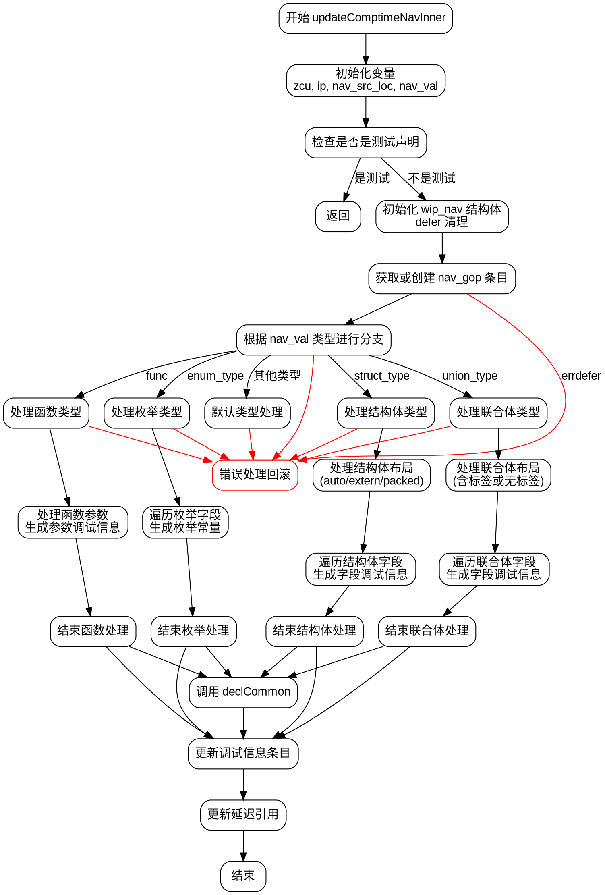

好的，我需要帮用户用Graphviz画出一个Zig函数的流程图。首先，我要仔细阅读并理解这个函数的结构。函数名是updateComptimeNavInner，看起来是用来处理调试信息生成的，尤其是与DWARF相关的部分。

首先，我需要确定函数的主要流程。函数开始于一些变量的初始化，比如获取zcu、ip、nav_src_loc和nav_val。然后根据不同的类型（如结构体、枚举、联合体、函数等）进行不同的处理。每个分支可能有不同的操作，比如处理结构体的字段、枚举的成员、联合体的布局等。

接下来，我需要识别函数中的条件分支和循环结构。例如，函数中有多个switch语句，根据不同的类型进入不同的处理分支。每个分支内部可能有循环遍历字段或参数。同时，函数中有错误处理（errdefer），需要将这些也体现在流程图中。

另外，要注意函数中使用的defer语句，比如defer wip_nav.deinit()，这表示在函数退出前需要执行某些清理操作。这在流程图中应该表示为函数结束前的步骤。

在处理每个分支时，需要注意是否有递归调用或跳转到其他标签的情况。例如，在.func分支中，如果条件满足，可能会返回或继续处理其他部分。此外，函数末尾的try语句需要正确连接到后续步骤。

最后，需要将整个流程结构化为Graphviz的节点和边。每个主要步骤作为一个节点，条件判断作为分支节点，循环结构用循环节点表示。确保所有可能的执行路径都被覆盖，包括错误处理路径。

可能需要将整个函数分解为多个子图，以处理不同的类型分支。例如，处理结构体、枚举、联合体等各自作为一个子流程。每个子流程内部有详细的步骤，如获取类型信息、处理字段、生成调试信息等。

需要注意的是，Graphviz的语法要求正确使用节点和边的定义，避免出现语法错误。同时，保持图的结构清晰，使用合适的布局（如自上而下或从左到右）来展示流程。

总结一下，步骤大致如下：
1. 函数入口，初始化变量。
2. 检查是否为测试，如果是则返回。
3. 初始化wip_nav结构体，并设置defer清理。
4. 根据不同的类型（struct、enum、union等）进入不同的处理分支。
5. 每个分支内部处理具体的类型信息，生成相应的调试条目。
6. 处理错误情况，可能跳转到错误处理步骤。
7. 最后更新调试信息，执行延迟清理。

在绘制流程图时，需要将这些步骤转换为节点，并根据条件连接相应的边。例如，在switch语句的每个case下创建分支，处理完每个case后汇聚到共同出口。对于错误处理路径，使用不同的边或颜色来区分。

可能需要使用子图来组织复杂的分支结构，使流程图更易读。例如，将struct处理、enum处理、union处理等作为独立的子图，然后在主流程中引用这些子图。

此外，注意函数中的递归或循环结构，如for循环处理字段，需要在流程图中用循环节点表示，确保循环的开始、结束和迭代步骤清晰。

最后，验证流程图的正确性，确保所有可能的执行路径都被正确表示，没有遗漏重要的条件或步骤。
================================================
