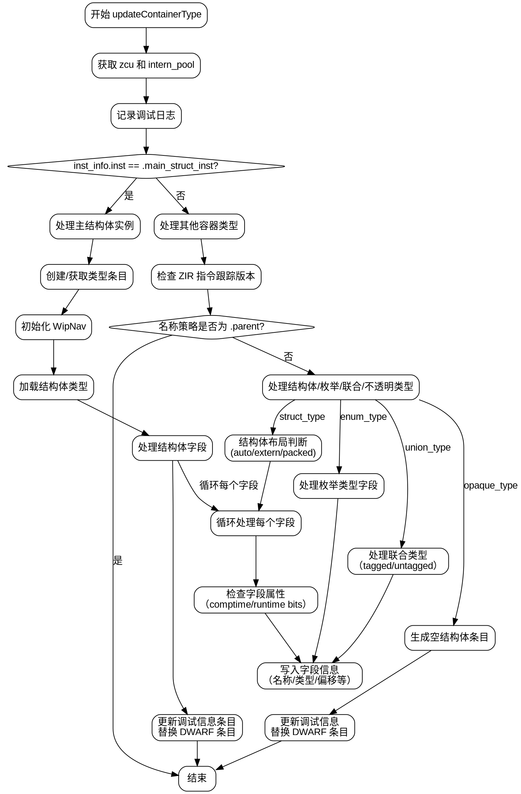

嗯，我需要为这个Zig函数`updateContainerType`绘制一个流程图。首先，我得仔细阅读代码，理解它的结构。函数的主要任务似乎是更新Dwarf调试信息中的容器类型，比如结构体、枚举、联合体等。

首先，函数接收一个`Dwarf`对象、一个线程局部存储`pt`和一个类型索引`type_index`。然后，它从`pt`中获取`zcu`和`intern_pool`，并创建类型`ty`。接着，记录调试日志。

接下来，函数检查`inst_info.inst`是否为`.main_struct_inst`。如果是，处理主结构体实例，创建或获取类型条目，初始化`WipNav`，处理结构体字段，生成调试信息。这部分有很多条件判断，比如处理不同类型的字段（comptime、runtime bits等），以及处理字段名称和类型引用。

如果不是`.main_struct_inst`，则进入另一个分支，处理不同类型的容器，如struct、enum、union、opaque等。每个类型有不同的处理逻辑，比如struct有auto/extern布局和packed布局，enum处理枚举常量，union处理有tag和无tag的情况，opaque类型则生成空结构体。

整个函数的结构可以分为两个主要分支：处理主结构体实例和其他类型的容器。每个分支内部又有多个子分支，处理不同的类型特性和调试信息的生成。

绘制流程图时，应该从函数入口开始，分成两个主要分支。每个分支内部分解为更详细的步骤，如初始化变量、条件判断、循环处理字段、生成调试信息条目等。需要注意条件判断的位置，如`if (inst_info.inst == .main_struct_inst)`，以及后续的类型检查（struct_type, enum_type等）。

可能还需要注意错误处理和资源释放，比如`defer wip_nav.deinit()`确保资源被正确释放。此外，函数中使用了多个辅助函数，如`uleb128`、`strp`、`refType`等，这些在流程图中可能需要简化为步骤节点，而不需要详细展开。

最后，需要确保流程图的正确性和完整性，覆盖所有可能的执行路径，包括各种条件分支和循环。可能需要多次检查代码，确保没有遗漏重要的逻辑分支。
================================================
