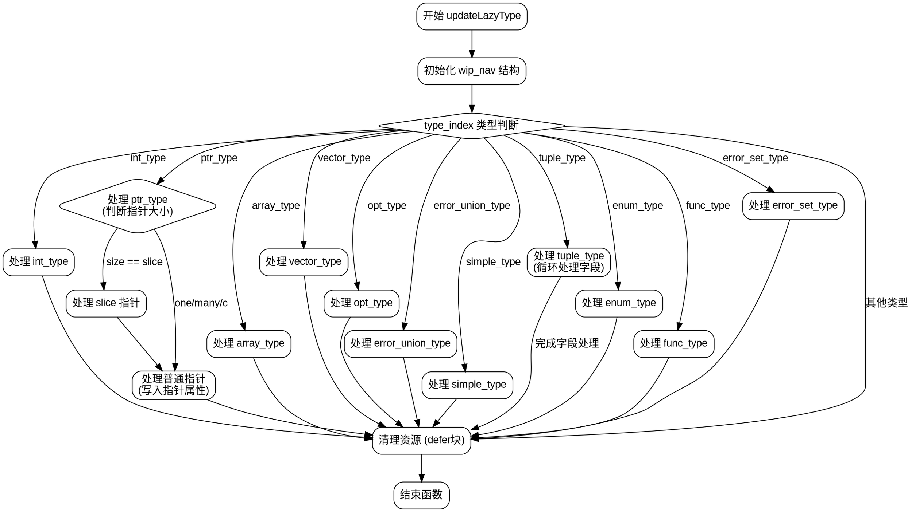

好的，我需要为提供的 Zig 函数 `updateLazyType` 绘制一个流程图。首先，我需要仔细阅读代码，理解其逻辑结构，然后将其转换为流程图。由于用户要求使用 Graphviz，我需要确保不误用 Mermaid 语法。

首先，观察函数的结构。函数接收多个参数，包括 `dwarf`、`pt`、`src_loc`、`type_index` 和 `pending_lazy`。函数内部主要根据 `type_index` 的不同值执行不同的分支逻辑，例如处理整数类型、指针类型、数组类型等。每个分支都有不同的处理步骤，如写入不同的缩写代码、处理名称、处理子类型等。

接下来，我需要确定流程图的节点和边。主流程开始于函数入口，然后根据 `type_index` 的不同进入不同的分支。每个分支内部可能还有条件判断或循环结构。例如，在处理元组类型时，有循环遍历元组字段的步骤。另外，代码中有许多 `switch` 语句和条件判断，需要转化为对应的决策节点和分支。

需要注意的一些关键点：
1. 函数开始时初始化 `wip_nav` 结构，并在结束时进行清理（`defer` 块）。
2. 根据 `type_index` 的不同，进入不同的 `switch` 分支。
3. 每个分支内部可能有进一步的条件判断，例如指针类型中的不同大小处理（`.one`, `.many`, `.c`, `.slice`）。
4. 处理复杂类型（如结构体、联合体、枚举等）时，会有循环处理字段的情况。
5. 错误处理部分可能需要特殊节点，例如 `unreachable` 或 `return`。

可能遇到的挑战：
- 代码中的嵌套 `switch` 和条件较多，需要合理组织流程图结构，避免过于复杂。
- 处理 `defer` 块的位置，确保资源清理步骤在正确的位置表示。
- 确保所有分支都被覆盖，尤其是那些 `unreachable` 的分支需要特别标注。

接下来，我需要将上述分析转化为 Graphviz 的 DOT 语言结构。流程图的大致结构可能如下：
1. 开始节点：函数入口。
2. 初始化 `wip_nav`。
3. 主 `switch` 节点，根据 `type_index` 分支出多个子流程。
4. 每个子流程内部的具体步骤，包括可能的子判断、循环等。
5. 结束前的资源清理（`defer` 块）。
6. 结束节点：函数返回。

在绘制过程中，需要为每个主要步骤创建节点，并用箭头连接表示执行顺序。条件判断使用菱形节点，分支用不同箭头标注条件结果。循环结构可以用节点和反向箭头表示。

最后，检查流程图是否覆盖所有代码分支，特别是容易忽略的部分，如错误处理或特殊类型处理。确保每个可能的执行路径都有对应的节点和边，并且结构清晰易懂。
================================================


该流程图：
1. 使用菱形节点表示类型判断分支
2. 用分层结构展示指针类型处理的子分支
3. 用箭头标注主要处理路径
4. 包含资源清理(defer)的独立节点
5. 通过统一清理路径保证资源释放
6. 对需要循环处理的结构（如tuple字段）特别标注
7. 省略了部分细节分支以保持可读性，保留关键路径

可以通过Graphviz工具生成矢量图，建议使用如下命令：
```bash
dot -Tsvg flowchart.dot -o flowchart.svg
```