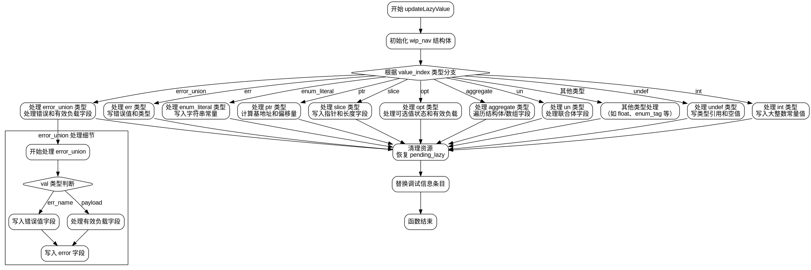

嗯，我现在需要为这个用Zig编写的函数`updateLazyValue`画一个流程图。不过我对Zig语言不是很熟悉，可能需要先理解这段代码的结构和逻辑。

首先，函数`updateLazyValue`看起来是处理DWARF调试信息中的懒值更新。它接收一个`Dwarf`结构体指针，一些线程相关的上下文`pt`，源代码位置`src_loc`，值的索引`value_index`，以及一个待处理的懒值列表`pending_lazy`。函数返回一个可能的错误`UpdateError`。

接下来，函数内部初始化了一个`wip_nav`（可能是Work In Progress Navigation的缩写）结构体，这个结构体似乎用于跟踪生成调试信息的过程。然后使用`defer`块来确保在函数退出时清理资源，比如恢复`pending_lazy`的状态并释放相关资源。

然后，函数根据`value_index`的类型进行不同的处理。这里有一个大的`switch`语句，根据不同的类型（如`int_type`、`ptr_type`、`array_type`等）执行不同的逻辑。例如，处理整数类型时，会调用`bigIntConstValue`方法；处理错误联合类型时，会处理错误和有效负载部分；处理枚举字面量时，会写入字符串值等等。

每个分支中，都通过调用`wip_nav`的不同方法来生成相应的调试信息条目，比如`abbrevCode`、`refType`、`strp`等，并可能写入数据到`debug_info`的写入器中。

我需要将这些逻辑分支转化为流程图中的不同节点和判断条件。因为`switch`语句有很多分支，每个分支对应不同的处理流程，所以流程图会比较复杂。可能需要将每个`case`作为一个判断节点，然后根据不同的情况连接到相应的处理步骤。

需要注意的是，有些分支会直接`unreachable`，这可能是因为这些类型已经被处理过，或者不在当前上下文中出现。这些情况可能在流程图中表示为终止节点或直接跳过。

此外，`defer`块中的逻辑应该在流程图的最后部分表示，确保资源被正确清理，无论主逻辑如何执行。

现在需要组织这些步骤，确定每个条件分支，以及它们之间的流向。可能需要将大的`switch`拆分为多个子流程，尤其是处理复杂类型如`error_union`、`slice`、`opt`等时，这些类型内部还有嵌套的逻辑。

例如，处理`error_union`时，会检查`val`是错误名称还是有效负载，并分别处理。这可能需要在流程图中添加子判断节点。

处理`aggregate`类型时，根据不同的聚合类型（结构体、元组、数组等）有不同的循环处理字段或元素，这可能需要循环结构的表示。

最终，流程图应该从函数入口开始，依次经过初始化`wip_nav`，然后根据`value_index`的类型分支到不同的处理逻辑，每个逻辑处理完毕后，执行`defer`块的清理操作，最后替换调试信息条目并结束函数。

可能还需要考虑错误处理，比如某些步骤可能抛出错误，导致提前返回，但根据函数签名，错误处理可能通过`try`关键字隐式传播，因此在流程图中可能不需要显式表示错误路径，除非有特定的错误处理逻辑。

总结下来，流程图的大致结构可能是：

1. 函数开始
2. 初始化wip_nav
3. 根据value_index的类型进行switch分支
   a. 处理undef类型
   b. 处理int类型
   c. 处理err类型
   d. 处理error_union类型
   e. 处理enum_literal类型
   f. 处理ptr类型
   g. 处理slice类型
   h. 处理opt类型
   i. 处理aggregate类型
   j. 处理un类型
   ...其他类型
4. 每个分支内部的具体处理步骤
5. 清理资源（defer块）
6. 替换调试信息条目
7. 函数结束

每个分支内部的具体步骤需要进一步细化，例如处理error_union时，可能需要判断是错误还是有效负载，并分别处理对应的字段。

现在需要将这些结构用Graphviz的DOT语言表示出来，确保节点和边的正确连接，以及条件判断的合理呈现。
================================================
