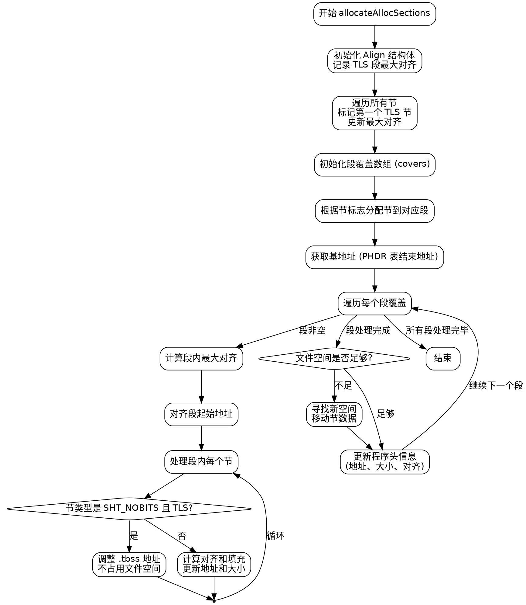

好的，我需要帮用户用Graphviz画出一个Zig函数的流程图。这个函数是allocateAllocSections，看起来是用来处理ELF文件中的段和节的分配。首先，我需要理解这个函数的逻辑流程，然后逐步转化为流程图的结构。

首先，函数开始部分定义了一个Align结构体，用来跟踪TLS（线程本地存储）段的最大对齐。然后遍历所有的节（sections），找到第一个TLS节并记录其索引和对齐要求。

接下来是计算段覆盖（segment covers），这部分根据节的标志将不同的节分配到不同的段（segment）中。使用一个数组covers来管理这些段，每个段包含符合特定标志的节的索引。

然后进入虚拟内存分配的阶段，以PHDR表的结束地址作为基地址。对于每个段，计算最大的对齐要求，并据此调整段的起始地址。接着处理每个节，特别是处理.tbss这样的特殊节，它们不需要占用文件空间，但需要调整内存地址。

在处理每个节时，需要考虑对齐和填充（padding），更新节的地址和段的大小。之后，处理段的文件偏移，如果现有空间不足，则寻找新的空间并移动数据。最后，更新程序头（phdr）的信息，如虚拟地址、内存大小、文件大小和对齐方式。

现在，我需要将这些步骤转化为流程图。流程图应该包括主要步骤、条件判断和循环结构。比如，遍历节、处理TLS节、分配地址、处理.tbss、调整段的位置等步骤。需要特别注意条件分支，如是否属于TLS节、是否是第一个TLS节、是否需要移动段的位置等。

可能的结构：

1. 开始
2. 初始化Align结构
3. 遍历所有节，找到TLS节并更新对齐信息
4. 初始化段覆盖（covers）
5. 根据节的标志将节分配到对应的段
6. 获取基地址（phdr_table的结束地址）
7. 遍历每个段：
   a. 计算段的最大对齐
   b. 调整段的起始地址
   c. 处理每个节：
      i. 如果是.tbss，调整地址但不占用文件空间
      ii. 否则，计算对齐和填充，更新地址和大小
   d. 检查文件空间是否足够，不足则移动段
   e. 更新程序头信息
8. 结束

需要注意循环和条件分支的结构，比如处理每个段的循环，内部处理每个节的循环，以及处理.tbss的特殊情况。

现在将这些步骤用Graphviz的节点和边表示出来，使用合适的形状（如矩形表示步骤，菱形表示条件判断）。确保流程图的逻辑清晰，步骤之间正确连接，条件分支正确指向不同的路径。
================================================
