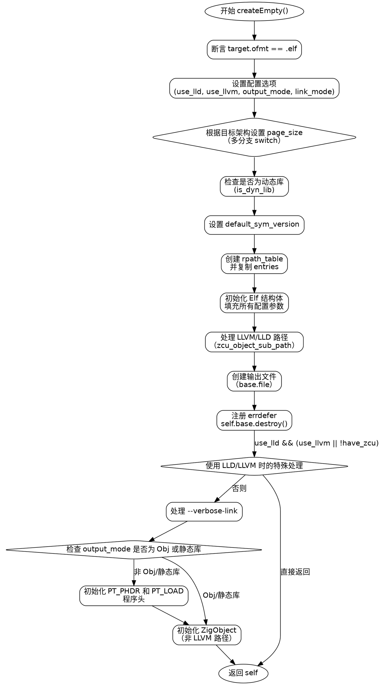

好，我需要帮用户把提供的Zig代码中的createEmpty函数画成流程图，使用Graphviz。首先，我需要理解这个函数的结构和逻辑流程。

首先，函数开始部分有一些参数检查，比如断言target.ofmt是.elf。接着，处理一些配置选项，比如use_lld和use_llvm。然后，根据不同的目标架构设置page_size，这部分有很多switch语句。之后，处理动态库的情况，确定default_sym_version。

接下来是创建rpath_table，初始化self结构体。这里有很多字段的赋值，可能需要分步骤处理。然后，根据是否使用LLVM或LLD，处理不同的路径和对象文件。

之后，处理文件创建和错误处理（errdefer）。根据不同的输出模式（Obj、Lib、Exe），设置不同的选项。例如，如果不是对象文件或静态库，需要初始化PT_PHDR程序头。

最后，处理Zig编译单元（zcu），如果没有使用LLVM，则创建ZigObject，并进行初始化。

在画流程图时，需要注意各个条件分支，比如if (use_lld)、if (use_llvm)、if (!is_obj_or_ar)等。每个分支可能有不同的处理步骤。此外，函数中有多个错误处理点，比如try语句和errdefer，需要在流程图中体现可能的错误路径。

可能需要将整个函数分解为几个主要步骤：
1. 参数验证和初始化变量。
2. 处理目标架构和页大小。
3. 配置符号版本和路径表。
4. 创建Elf结构体实例。
5. 处理LLVM和LLD的路径。
6. 创建输出文件。
7. 初始化段和节。
8. 处理Zig编译单元。

每个步骤中需要细化条件判断和循环，比如switch语句中的不同情况。对于复杂的switch，可能需要简化为几个主要分支，避免图表过于复杂。

需要注意的是，Graphviz使用DOT语言，所以需要正确使用节点和边来表示流程。每个处理步骤作为一个节点，条件判断作为分支节点，比如菱形框。同时，错误处理路径需要连接到错误处理节点。

可能遇到的挑战是代码中有多个嵌套的条件和错误处理，需要合理组织流程图的结构，使其清晰易懂。此外，代码中涉及的变量和结构体字段较多，但流程图应侧重于控制流程而非具体变量赋值。

总结，我需要将函数的逻辑分解成步骤，识别所有条件分支和循环，用Graphviz的节点和边表示出来，确保错误处理路径也被正确展示。
================================================

该流程图使用 Graphviz 的 DOT 语言绘制，主要特点：

1. 用菱形节点表示条件判断（switch/if）
2. 用圆角矩形表示操作步骤
3. 椭圆节点表示开始/结束
4. 箭头标注关键条件分支
5. 保留了代码中的核心逻辑：
   - 目标架构验证
   - 页大小设置的多分支
   - 动态库检查
   - LLVM/LLD 的特殊处理路径
   - 程序头的初始化
   - ZigObject 的初始化
   - 错误处理机制（errdefer）

流程图简化了部分细节（如具体字段赋值），聚焦于函数的主要控制流。复杂的分支结构（如页大小设置的 switch）用单个菱形节点表示以提高可读性。