好的，我现在需要为给定的Zig函数`flushModuleInner`绘制一个流程图。首先，我需要仔细阅读并理解这个函数的代码结构，识别出主要的步骤和逻辑分支。

首先，函数开始部分处理模块对象路径，检查是否存在`zig_object`并进行刷新。然后根据`output_mode`的不同处理不同的输出类型，如Obj、Lib、Exe。接着处理错误诊断，如果有错误则返回`LinkFailure`。

接下来，函数创建了一个链接器生成的输入文件，初始化符号，并解析符号。之后进行垃圾回收（GC）相关的处理，检查重复项，处理合并段，初始化输出段，扫描重定位，生成合成段，排序段和程序头，分配内存区域，处理动态段和哈希段等。

之后是写入阶段：写入程序头表、节头表、原子数据、合并段，以及合成段。最后处理入口点，写入ELF头部，并根据是否有错误返回结果。

在绘制流程图时，需要将这些步骤按顺序排列，注意条件判断（如`if`语句和`switch`语句）以及循环（如`for`循环）。每个主要操作应作为流程图的节点，条件判断作为分支节点，循环可能需要表示为重复的过程。

需要注意可能的错误处理路径，例如当`diags.hasErrors()`时直接返回错误。此外，函数中有多个可能抛出错误的地方，这些错误处理也应体现在流程图中。

可能需要将一些复杂的步骤简化，例如将多个初始化步骤合并为一个节点，以保持流程图的清晰。同时，确保各个分支和循环的正确表示，避免遗漏关键步骤。

最后，使用Graphviz的语法来组织这些节点和边，确保逻辑正确，结构清晰。
================================================

```graphviz
digraph flushModuleInner {
    node [shape=rectangle, style=rounded];

    start [label="开始"];
    handle_module_obj_path [label="处理模块对象路径"];
    flush_zig_object [label="刷新Zig对象"];
    open_parse_object [label="打开并解析对象文件"];
    output_mode_switch [label="根据output_mode处理输出"];
    check_diag_errors [label="检查诊断错误"];
    create_linker_defined [label="创建链接器定义的文件"];
    resolve_symbols [label="解析符号"];
    mark_eh_frame [label="标记EH帧原子为死亡"];
    resolve_merge_sections [label="解析合并段"];
    convert_common_symbols [label="转换通用符号"];
    mark_imports_exports [label="标记导入/导出"];
    gc_sections [label="GC段处理"];
    check_duplicates [label="检查重复项"];
    add_comment [label="添加注释字符串"];
    finalize_merge [label="完成合并段"];
    init_output_sections [label="初始化输出段"];
    init_start_stop [label="初始化起始/终止符号"];
    claim_unresolved [label="声明未解析符号"];
    scan_relocs [label="扫描重定位"];
    init_synthetic [label="初始化合成段"];
    sort_shdrs [label="排序节头"];
    dynamic_section [label="设置动态段"];
    sort_dynamic_symtab [label="排序动态符号表"];
    set_hash_version [label="设置哈希和版本段"];
    sort_init_fini [label="排序.init/.fini"];
    update_sections [label="更新段大小"];
    allocate_phdrs [label="分配程序头"];
    allocate_sections [label="分配段"];
    sort_phdrs [label="排序程序头"];
    allocate_special [label="分配特殊程序头"];
    dump_state [label="转储状态（调试）"];
    prepare_relocs [label="准备重定位"];
    resolve_write_code [label="解析并写入代码"];
    write_phdr_shdr [label="写入程序头和节头表"];
    write_atoms_merge [label="写入原子和合并段"];
    write_synthetic [label="写入合成段"];
    check_entry_point [label="检查入口点"];
    write_elf_header [label="写入ELF头部"];
    end [label="结束"];

    start -> handle_module_obj_path;
    handle_module_obj_path -> flush_zig_object [label="存在zig_object"];
    flush_zig_object -> open_parse_object [label="模块对象路径存在"];
    open_parse_object -> output_mode_switch;
    output_mode_switch -> check_diag_errors;
    check_diag_errors -> create_linker_defined [label="无错误"];
    create_linker_defined -> resolve_symbols;
    resolve_symbols -> mark_eh_frame;
    mark_eh_frame -> resolve_merge_sections;
    resolve_merge_sections -> convert_common_symbols;
    convert_common_symbols -> mark_imports_exports;
    mark_imports_exports -> gc_sections [label="启用GC"];
    gc_sections -> check_duplicates;
    check_duplicates -> add_comment;
    add_comment -> finalize_merge;
    finalize_merge -> init_output_sections;
    init_output_sections -> init_start_stop [label="存在链接器定义对象"];
    init_start_stop -> claim_unresolved;
    claim_unresolved -> scan_relocs;
    scan_relocs -> init_synthetic;
    init_synthetic -> sort_shdrs;
    sort_shdrs -> dynamic_section;
    dynamic_section -> sort_dynamic_symtab;
    sort_dynamic_symtab -> set_hash_version;
    set_hash_version -> sort_init_fini;
    sort_init_fini -> update_sections;
    update_sections -> allocate_phdrs;
    allocate_phdrs -> allocate_sections;
    allocate_sections -> sort_phdrs;
    sort_phdrs -> allocate_special;
    allocate_special -> dump_state [label="调试模式"];
    dump_state -> prepare_relocs;
    prepare_relocs -> resolve_write_code;
    resolve_write_code -> write_phdr_shdr;
    write_phdr_shdr -> write_atoms_merge;
    write_atoms_merge -> write_synthetic;
    write_synthetic -> check_entry_point;
    check_entry_point -> write_elf_header [label="存在入口点"];
    check_entry_point -> end [label="无入口点"];
    write_elf_header -> end;

    // 错误处理路径
    check_diag_errors -> end [label="存在错误" color=red];
    check_duplicates -> end [label="重复错误" color=red];
    resolve_write_code -> end [label="重定位错误" color=red];
    write_synthetic -> end [label="合成段错误" color=red];
}
```
