好的，我需要为这个名为initSyntheticSections的Zig函数绘制一个流程图。首先，我需要理解这个函数的结构和逻辑。

函数开头定义了一些变量，比如comp、target、ptr_size和shared_objects。接着，检查是否需要.eh_frame和.eh_frame_hdr节。这里有一个条件判断needs_eh_frame，它会根据是否有Zig对象或对象文件中的CIEs条目来决定是否创建这些节。

接下来是处理.got节和.got.plt节，如果存在相应的条目且未创建过，就添加这些节。然后检查是否需要.rela.dyn节，这涉及到多个条件，如got.flags、copy_rel的符号数量等。

然后是处理.plt和.rela.plt节，如果存在plt符号，则添加这些节。之后是.plt.got和.copyrel节的处理，同样根据条件判断。

接下来是处理.interp节，根据是否静态链接或是否存在动态链接器来决定是否需要。然后是动态库相关的节，如.dynstrtab、.dynamic、.dynsymtab、.hash、.gnu_hash等，这些在动态库或PIE时创建。

最后是处理版本相关的节，如.gnu.version和.gnu.version_r，根据符号的版本信息判断是否需要。函数末尾调用了initSymtab和initShStrtab。

我需要将这些步骤分解成流程图中的各个节点，并正确连接条件分支。需要注意的是，各个条件判断可能导致不同的路径，比如是否需要创建某个节。同时，有些步骤是并行的，比如处理.got和.plt节的部分。

在绘制流程图时，每个条件判断应作为菱形节点，操作步骤作为矩形节点，箭头表示流程方向。需要确保所有可能的路径都被覆盖，并且逻辑顺序正确。例如，首先处理.eh_frame，然后是.got，接着是.rela_dyn，依此类推。

可能需要注意的细节包括：条件判断之间的依赖关系，例如needs_rela_dyn的判断可能依赖于前面的一些操作。另外，最后的initSymtab和initShStrtab是必须执行的步骤，无论前面的条件如何。

现在，我需要将这些逻辑整理成一个结构清晰的流程图，使用Graphviz的语法来描述各个节点和连接。
================================================

```graphviz
digraph initSyntheticSections {
    node [shape=rectangle, fontname="Courier", fontsize=10];
    edge [fontname="Courier", fontsize=10];

    start [label="开始 initSyntheticSections"];
    end [label="结束 initSyntheticSections"];

    subgraph cluster_main {
        label = "initSyntheticSections 流程";

        start -> check_eh_frame;
        
        check_eh_frame [label="检查是否需要 .eh_frame"];
        check_eh_frame -> add_eh_frame [label="需要"];
        check_eh_frame -> check_eh_frame_hdr [label="不需要"];
        
        add_eh_frame [label="添加 .eh_frame 节"];
        add_eh_frame -> check_eh_frame_hdr;
        
        check_eh_frame_hdr [label="检查是否需要 .eh_frame_hdr"];
        check_eh_frame_hdr -> add_eh_frame_hdr [label="需要"];
        check_eh_frame_hdr -> check_got [label="不需要"];
        
        add_eh_frame_hdr [label="添加 .eh_frame_hdr 节"];
        add_eh_frame_hdr -> check_got;

        check_got [label="检查是否需要 .got 节"];
        check_got -> add_got [label="需要"];
        check_got -> check_got_plt [label="不需要"];
        
        add_got [label="添加 .got 节"];
        add_got -> check_got_plt;

        check_got_plt [label="检查是否需要 .got.plt 节"];
        check_got_plt -> add_got_plt [label="需要"];
        check_got_plt -> check_rela_dyn [label="不需要"];
        
        add_got_plt [label="添加 .got.plt 节"];
        add_got_plt -> check_rela_dyn;

        check_rela_dyn [label="检查是否需要 .rela.dyn 节"];
        check_rela_dyn -> add_rela_dyn [label="需要"];
        check_rela_dyn -> check_plt [label="不需要"];
        
        add_rela_dyn [label="添加 .rela.dyn 节"];
        add_rela_dyn -> check_plt;

        check_plt [label="检查是否需要 .plt 节"];
        check_plt -> add_plt [label="需要"];
        check_plt -> check_plt_got [label="不需要"];
        
        add_plt [label="添加 .plt 节"];
        add_plt -> check_plt_got;

        check_plt_got [label="检查是否需要 .plt.got 节"];
        check_plt_got -> add_plt_got [label="需要"];
        check_plt_got -> check_copy_rel [label="不需要"];
        
        add_plt_got [label="添加 .plt.got 节"];
        add_plt_got -> check_copy_rel;

        check_copy_rel [label="检查是否需要 .copyrel 节"];
        check_copy_rel -> add_copy_rel [label="需要"];
        check_copy_rel -> check_interp [label="不需要"];
        
        add_copy_rel [label="添加 .copyrel 节"];
        add_copy_rel -> check_interp;

        check_interp [label="检查是否需要 .interp 节"];
        check_interp -> add_interp [label="需要"];
        check_interp -> check_dynamic_sections [label="不需要"];
        
        add_interp [label="添加 .interp 节"];
        add_interp -> check_dynamic_sections;

        check_dynamic_sections [label="检查是否是动态库/PIE"];
        check_dynamic_sections -> add_dynstrtab [label="是"];
        check_dynamic_sections -> check_versions [label="否"];
        
        add_dynstrtab [label="添加 .dynstr/.dynamic/.dynsym 等节"];
        add_dynstrtab -> check_versions;

        check_versions [label="检查是否需要版本节"];
        check_versions -> add_versions [label="需要"];
        check_versions -> final_steps [label="不需要"];
        
        add_versions [label="添加 .gnu.version 等节"];
        add_versions -> final_steps;

        final_steps [label="执行 initSymtab 和 initShStrtab"];
        final_steps -> end;
    }
}
```
