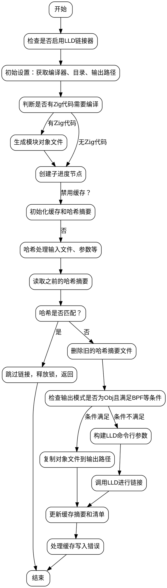

嗯，我需要为这个Zig函数`linkWithLLD`画一个流程图。首先，我应该仔细阅读代码，理解它的主要步骤和逻辑结构。

函数开始时检查是否启用了LLD链接器，然后处理一些初始设置，比如获取编译器和目录信息。接下来，判断是否有Zig代码需要编译，如果没有则跳过生成模块对象文件。然后创建一个子进度节点用于跟踪LLD链接过程。

之后，函数处理缓存机制，通过生成哈希摘要来检查是否需要重新链接。如果缓存有效，就直接返回，否则继续执行链接。这里需要注意缓存检查的条件和哈希生成的方式，包括各种输入文件和链接参数的哈希处理。

如果输出是对象文件且满足特定条件（如BPF架构），则执行文件复制操作，而不是调用LLD。否则，构建LLD的命令行参数，包括各种链接选项、输入文件、库路径等。然后调用LLD进行链接。

最后，更新缓存信息并处理可能的错误情况，比如写入缓存摘要失败时的日志记录。

在绘制流程图时，需要将这些主要步骤分解成不同的节点，并用箭头表示流程。每个判断点（如缓存是否有效、是否需要文件复制）需要分支结构。还要注意循环结构，例如遍历链接输入和库文件时的循环处理。

需要确保流程图的逻辑与代码结构一致，包括错误处理和资源释放（如释放锁、结束跟踪等）。可能还需要标注关键条件，例如是否禁用LLD缓存、输出模式是否为对象文件等。

最后，使用Graphviz的语法将各个步骤和判断点组织成流程图，确保结构清晰，节点和边正确对应代码的执行路径。
================================================
