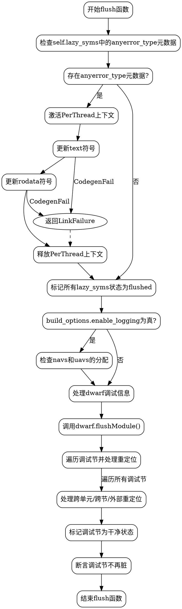

嗯，我现在需要为一个名为`flush`的Zig函数生成流程图。这个函数看起来处理ELF文件中的一些符号和调试信息。首先，我需要理解这个函数的结构和逻辑流程，这样才能准确地画出流程图。

首先，函数开始处理`lazy_syms`中的`anyerror_type`元数据。这里有一个条件判断，检查`text_state`和`rodata_state`是否为`.unused`，如果不是，就调用`updateLazySymbol`方法。这里可能会有错误处理，将`CodegenFail`转换为`LinkFailure`。然后，遍历所有`lazy_syms`的元数据，将非`.unused`的状态标记为`.flushed`。

接下来，如果启用了日志记录（`build_options.enable_logging`），函数会检查`navs`和`uavs`的分配情况。这部分可能涉及到验证某些数据结构是否正确。

然后，处理`dwarf`调试信息。这里调用了`dwarf.flushModule`，并遍历多个调试节（如`debug_info`、`debug_abbrev`等），处理重定位信息。这里有很多循环和嵌套的条件，处理不同种类的重定位项，比如跨单元、跨节和外部重定位。每个重定位项都需要计算偏移和类型，并将其添加到原子指针的重新定位列表中。

在处理完所有调试节之后，标记相关的调试节为干净状态（`dirty`标志设为`false`）。最后，函数使用断言确保这些调试节确实不再脏。

在画流程图时，需要注意各个条件分支和循环结构。比如，最开始的`if (self.lazy_syms.getPtr(.anyerror_type))`分支，然后的循环遍历`lazy_syms.values()`。接着是日志记录部分的循环检查，然后是处理`dwarf`的复杂流程，包含多层循环和条件判断。最后是断言部分。

可能遇到的挑战是正确表达嵌套的循环和条件，尤其是处理`dwarf`部分时的多重循环和不同的重定位类型。需要确保每个步骤的顺序和逻辑关系正确，避免遗漏任何分支。

另外，需要确定使用graphviz的语法来构建流程图，正确的节点和边的关系。可能需要使用子图来组织复杂的部分，比如将`dwarf`处理作为一个子流程展开。

现在，我需要将这些步骤分解成流程图中的各个节点，并用箭头连接它们，表示执行顺序和条件分支。需要特别注意错误处理的部分，比如`catch`块中的流程如何影响整体路径。
================================================
