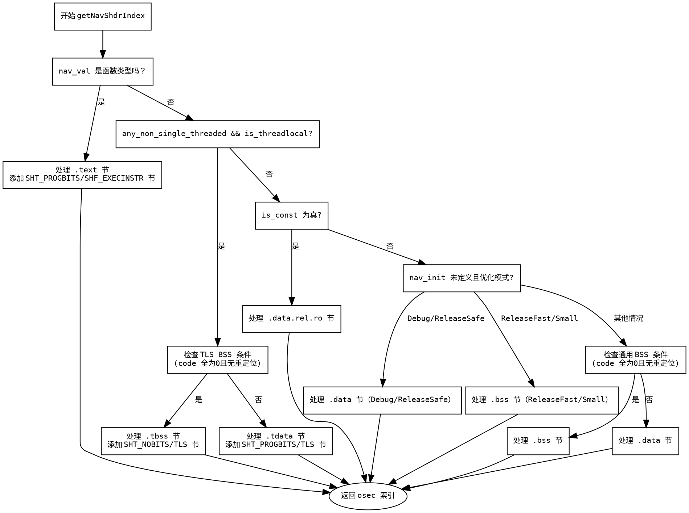

嗯，我需要为这个Zig函数生成一个流程图。首先，我要理解这个函数的结构和逻辑。函数名是getNavShdrIndex，看起来是获取某个ELF文件的节头索引。函数参数包括指向ZigObject、Elf、Zcu的指针，还有一些其他参数。

首先，函数开始部分声明了一些变量，比如gpa、ptr_size、ip、any_non_single_threaded、nav_val。然后判断nav_val的类型是否是函数类型，如果是的话，处理.text节的相关逻辑。这里可能涉及到添加.text节和符号。

接下来是处理不同类型的变量，比如variable、extern等。然后根据不同的条件判断是否属于线程局部存储（TLS），比如.tbss或.tdata节。如果any_non_single_threaded和is_threadlocal为真，会检查是否属于.bss类型的节，如果是的话，创建.tbss节，否则创建.tdata节。

之后是处理常量数据，可能会进入.data.rel.ro节。如果不是常量，根据初始化值是否为未定义，选择不同的节，如.data或.bss。最后，如果都没有匹配的条件，默认进入.data节。

需要注意的条件分支包括：函数类型、线程局部存储、常量数据、未初始化数据等。每个条件分支都可能创建不同的节，并设置对应的符号索引。

在画流程图时，应该从函数入口开始，逐步处理各个条件判断。每个判断节点对应不同的分支路径，比如是否为函数类型？如果是，处理.text节；否则继续检查是否为线程局部变量等。每个分支结束于返回对应的节索引。

需要注意循环部分，比如检查code是否全为零的循环，这在流程图中可能需要用判断节点来表示。例如，“code中所有字节都是0吗？”如果是，进入.bss节，否则继续其他判断。

另外，函数中有多个返回点，每个条件满足时直接返回对应的osec。因此，流程图会有多个终止节点，每个对应不同的节类型。

最后，确保流程图的节点和分支清晰，正确反映函数中的逻辑顺序和条件判断。可能需要使用菱形表示判断节点，矩形表示处理步骤，箭头表示流程方向。
================================================
